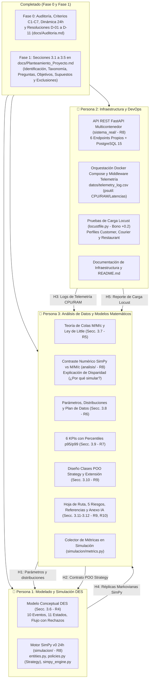

# MATRIZ OPERATIVA DE ASIGNACIONES Y CONTROL DE TAREAS — ENTREGA PARCIAL 1
## Proyecto de Aula: Gemelo Digital y Simulación Estocástica (*QuickDelivery Sim*)

> **Marco de Referencia y Gobernanza:**  
> Este documento establece la división formal, detallada e individualizada de las tareas pendientes de la **Entrega Parcial 1** para un equipo de **3 personas**, de acuerdo con las especificaciones del documento oficial de entrega (`docs/pdf_extracted_text.txt`), las directrices del [Master Plan (`docs/Planes de Accion/00_Master_Plan.md`)](Planes%20de%20Accion/00_Master_Plan.md), el compendio de parámetros y fuentes bibliográficas ([`docs/Fuentes.md`](Fuentes.md)), y el registro de decisiones arquitectónicas D-01 a D-11 ([`docs/Auditoria.md`](Auditoria.md)).
>
> **Ajuste Operativo Estratégico:**  
> La formulación analítica de Teoría de Colas ($M/M/c$) y el script de contraste numérico han sido asignados al **Responsable de Análisis de Datos y Calibración**, permitiendo que un único perfil centralice el análisis matemático comparativo, valide el error porcentual ($< 5\%$) y explique con rigor analítico la disparidad entre la teoría markoviana clásica y el comportamiento dinámico del gemelo digital en SimPy.
>
> **Meta del Equipo:** Obtener la calificación máxima de **5.0 / 5.0** en la rúbrica oficial (Criterios R1 a R10) más el **Bono de Carga Sintética (+0.2 pts)** con Locust.

---

## 1. Diagnóstico de Estado y Flujo de Trabajo Reestructurado



---

## 2. Asignación Individual de Responsabilidades y Tareas

A continuación se detalla el paquete de trabajo para cada integrante, estructurado según los roles de **Modelos**, **Infraestructura** y **Análisis de Datos**.

---

### INTEGRANTE 1: Responsable de Modelos y Simulación Estocástica
* **Rol Oficial en la Entrega:** Líder de Modelado y Simulación Estocástica (DES, SimPy, Eventos, Proceso 24h).
* **Criterios de Rúbrica Asignados:** **R4** (Modelo Conceptual DES, 0.8 pts) y componente SimPy de **R8** (Prototipo Técnico, 0.7 pts).
* **Peso Total en Rúbrica bajo su Liderazgo:** **1.15 / 5.0 puntos**.
* **Archivos y Entregables a su Cargo:**
  * `docs/Planteamiento_Proyecto.md` (Redacción formal de la Sección 3.6).
  * `simulacion/entities.py`
  * `simulacion/policies.py`
  * `simulacion/simpy_engine.py`

#### Matriz de Tareas Específicas:
- [ ] **T1.1 (Doc - Secc. 3.6): Formalizar el Modelo Conceptual DES (Criterio R4 - 0.8 pts):**
  - Redactar la especificación completa de la entidad principal `Order` con sus 11 estados (`CREADO`, `EN_COLA_COCINA`, `EN_PREPARACION`, `LISTO_EN_MOSTRADOR`, `OFERTADO`, `ASIGNADO`, `EN_TRANSITO_CLIENTE`, `ENTREGADO`, `CANCELADO_POR_CLIENTE`, `CANCELADO_SIN_REPARTIDOR`, `CANCELADO_INCIDENCIA_TRANSITO`) y atributos estocásticos.
  - Formalizar la entidad/recurso activo `Courier` (coordenadas continuas, batería con drenaje de $0.15\%/\text{min}$, filtro preventivo $\ge 15\%$ y límite duro de 6 horas).
  - Definir formalmente los recursos: red de 10 restaurantes con capacidades heterogéneas ($k_r \in [3, 6]$ fogones, total 47 fogones en la red) y la flota crowdsourcing $c(t)$.
  - Construir el diagrama de flujo detallado en Mermaid (`flowchart TD`) incorporando bifurcaciones de aceptación/rechazo en ventana de 45 s, reintentos con ampliación de ventana $[-6, +8]\text{ min}$, abandonos por impaciencia del cliente (curva Weibull) y el protocolo terminal de merma en mostrador a los 20 min (Decisión D-07).
  - Diseñar la **tabla de relación Evento–Variables de Estado** para los 10 eventos atómicos del sistema (`LlegadaPedido`, `InicioCocina`, `FinCocina`, `DisparoDespacho`, `AceptacionRepartidor`, `ExpiracionOferta`, `LlegadaARestaurante`, `RecogidaPedido`, `EntregaFinal`, `Cancelaciones/Incidencias`).
- [ ] **T1.2 (Código - `simulacion/entities.py`): Entidades y Recursos en SimPy:**
  - Programar las clases `Order`, `Courier` y `KitchenNetwork` en SimPy, integrando los fogones de cada local como `simpy.Resource(env, capacity=k_r)`.
  - Implementar la cinemática de traslados con distancia Manhattan corregida por factor de sinuosidad vial ($\tau = 1.25$) y velocidad media urbana ($18 \pm 3\text{ km/h}$).
- [ ] **T1.3 (Código - `simulacion/policies.py`): Políticas de Despacho (Patrón Strategy):**
  - Programar las dos políticas de asignación bajo la interfaz común `DispatchPolicy`:
    - `GreedyImmediatePolicy` (Línea base actual: asignación inmediata al crearse la orden).
    - `PredictiveSynchronizedPolicy` (Propuesta: despacho sincronizado $t_{\text{despacho}} = \text{ETA}_{\text{listo}} - t_{\text{viaje}} + \Delta t_{\text{buffer}}$ con escalamiento adaptativo en Fase 1 y Fase 2 con bono urgente +20%).
- [ ] **T1.4 (Código - `simulacion/simpy_engine.py`): Motor SimPy v0 de 24 Horas:**
  - Desarrollar el orquestador principal de la jornada continua de 24 horas ($1.440\text{ min} = 86.400\text{ s}$), con generador NHPP de pedidos ($\approx 1.890$ pedidos) y generador NHPP de conexiones de repartidores ($\lambda_{\text{login}}(t)$).
  - Garantizar reproducibilidad mediante semillas fijas (`random.seed(42)` y `np.random.seed(42)`).
  - Implementar el generador markoviano canónico auxiliar (flota fija, $\lambda, \mu$ constantes) y entregar las trazas de réplicas al Integrante 3 para el contraste analítico.

#### Dominio Conceptual Exigido para la Sustentación Oral (Sección 5.2):
* Explicar el ciclo de vida de los procesos SimPy (`yield env.timeout()`, interrupciones y eventos `simpy.Event`).
* Justificar la modelación de los fogones como recursos finitos y cómo interactúan las colas de cocina con la cola de asignación de repartidores.
* Explicar en detalle el algoritmo de despacho sincronizado predictivo frente a la asignación voraz inmediata.

---

### INTEGRANTE 2: Responsable de Infraestructura y DevOps
* **Rol Oficial en la Entrega:** Líder de Infraestructura y DevOps (API REST, Docker Compose, Telemetría, Locust).
* **Criterios de Rúbrica Asignados:** **R8** (Prototipo Técnico y Repositorio, 0.7 pts) y **Bono Opcional de Carga Sintética** (+0.2 pts).
* **Peso Total en Rúbrica bajo su Liderazgo:** **0.70 / 5.0 puntos + 0.2 Bono**.
* **Archivos y Entregables a su Cargo:**
  * `docker-compose.yml`
  * `Dockerfile`
  * `requirements.txt`
  * `README.md`
  * `locustfile.py`
  * `sistema_real/app/main.py`
  * `sistema_real/app/models.py`
  * `sistema_real/app/database.py`
  * `sistema_real/app/telemetry.py`
  * `sistema_real/app/dispatch.py`
  * `datos/telemetry_log.csv`

#### Matriz de Tareas Específicas:
- [ ] **T2.1 (Infraestructura - Docker y Entorno): Contenedorización Reproducible:**
  - `requirements.txt`: Fijar dependencias con versiones exactas (`fastapi`, `uvicorn[standard]`, `sqlalchemy`, `psycopg2-binary`, `psutil`, `simpy`, `numpy`, `scipy`, `locust`, `pydantic`).
  - `Dockerfile`: Crear la construcción multi-stage optimizada basada en `python:3.11-slim` o superior.
  - `docker-compose.yml`: Orquestar la arquitectura multicontenedor (Decisión D-04):
    - Servicio `db`: Contenedor oficial `postgres:15-alpine` con variables de entorno, volumen montado `postgres_data` y healthcheck activo (`pg_isready`).
    - Servicio `api`: Servicio FastAPI expuesto en `http://localhost:8000`, enlazado a la red interna y con volumen montado para registrar logs en `datos/`.
  - Probar que el entorno se levante sin errores y desde cero con el comando único:  
    `docker compose up --build`
- [ ] **T2.2 (Backend - `sistema_real/`): API REST Mínima en FastAPI:**
  - `database.py`: Conexión y sesión persistente conectada a PostgreSQL 15 mediante SQLAlchemy.
  - `models.py`: Esquemas relacionales y Pydantic para `OrderModel`, `CourierModel`, `RestaurantModel` y `TelemetryRecordModel`.
  - `main.py`: Implementar y probar los 6 endpoints propios requeridos (Decisión D-09):
    1. `POST /api/v1/orders/`: Creación y persistencia de comanda.
    2. `GET /api/v1/restaurants/{id}/orders`: Consulta KDS de comandas activas para la cocina del local.
    3. `POST /api/v1/orders/{id}/ready`: Notificación de comanda terminada (libera fogón e inicia temporizador de mostrador).
    4. `POST /api/v1/dispatch/assign/`: Disparo del motor de emparejamiento con repartidores disponibles.
    5. `GET /api/v1/orders/{id}/tracking`: Consulta en tiempo real de posición del repartidor y estado.
    6. `GET /api/v1/telemetry/health`: Diagnóstico de salud del sistema y contención de recursos.
  - `dispatch.py`: Lógica transaccional real para emparejar pedidos y calcular distancias viales con sinuosidad $\tau = 1.25$.
- [ ] **T2.3 (Telemetría - `sistema_real/app/telemetry.py`): Instrumentación de Recursos:**
  - Programar un middleware asíncrono en FastAPI (`BaseHTTPMiddleware`) que intercepte cada petición HTTP y capture: timestamp, método, ruta, código de estado, latencia ($ms$), porcentaje de CPU (`psutil.cpu_percent()`) y memoria RAM en MB (`psutil.virtual_memory()`).
  - Exportar los registros en tiempo real a `datos/telemetry_log.csv` para alimentar los análisis del Integrante 3.
- [ ] **T2.4 (Bono +0.2 - `locustfile.py`): Pruebas de Humo de Carga Sintética:**
  - Diseñar el script de carga con Locust incorporando los 3 perfiles concurrentes:
    - `CustomerUser`: Emite pedidos (`POST /orders/`) y sondea el rastreo (`GET /orders/{id}/tracking`).
    - `CourierUser`: Notifica disponibilidad y solicita asignaciones (`POST /dispatch/assign/`).
    - `RestaurantUser`: Consulta KDS y confirma platos listos (`POST /orders/{id}/ready`).
  - Generar un reporte ejecutable de RPS, fallos ($0\%$) y percentiles de latencia para adjuntar como evidencia del bono.
- [ ] **T2.5 (Doc - `README.md`): Documentación Operativa de la Infraestructura:**
  - Redactar el `README.md` en la raíz del repositorio detallando prerrequisitos, comando único de arranque, endpoints disponibles y guía de ejecución de Locust.

#### Dominio Conceptual Exigido para la Sustentación Oral (Sección 5.2):
* Demostrar en vivo cómo levantar la infraestructura con Docker Compose y consultar la documentación interactiva en Swagger.
* Explicar el funcionamiento del middleware de telemetría y el impacto del consumo de CPU/RAM bajo concurrencia.
* Sustentar la estructura de `locustfile.py`, explicando la calibración de pesos de usuario y los percentiles de latencia obtenidos.

---

### INTEGRANTE 3: Responsable de Análisis de Datos, Modelos Matemáticos y Calibración
* **Rol Oficial en la Entrega:** Líder de Análisis de Datos, Teoría de Colas, Calibración y Modelos Matemáticos.
* **Criterios de Rúbrica Asignados:** **R5** (Análisis con Teoría de Colas, 0.6 pts), **R6** (Parámetros y Plan de Datos, 0.4 pts), **R7** (Métricas de Desempeño, 0.3 pts), **R9** (Diseño de Clases, Hoja de Ruta y Riesgos, 0.5 pts), **R10** (Referencias y Declaración de IA, 0.3 pts), y componente de Contraste Numérico de **R8**.
* **Peso Total en Rúbrica bajo su Liderazgo:** **2.10 / 5.0 puntos** (42% de la nota final).
* **Archivos y Entregables a su Cargo:**
  * `docs/Planteamiento_Proyecto.md` (Redacción formal de Secciones 3.7, 3.8, 3.9, 3.10, 3.11 y 3.12).
  * `analisis/queueing_theory.py`
  * `analisis/contrast_analysis.py`
  * `analisis/test_contrast.ipynb`
  * `simulacion/metrics.py`
  * `datos/simulation_results.json`

#### Matriz de Tareas Específicas:
- [ ] **T3.1 (Doc - Secc. 3.7): Formulación Analítica de Teoría de Colas ($M/M/c$) y Explicación de la Disparidad (Criterio R5 - 0.6 pts):**
  - Modelar el subsistema de despacho de repartidores como una cola multicanal **$M/M/c$**.
  - Desarrollar la deducción matemática paso a paso de las ecuaciones analíticas cerradas:
    - Factor de utilización: $\rho = \frac{\lambda}{c \mu} < 1$.
    - Probabilidad de vaciado: $P_0 = \left[ \sum_{n=0}^{c-1} \frac{(c\rho)^n}{n!} + \frac{(c\rho)^c}{c!(1-\rho)} \right]^{-1}$.
    - Probabilidad de espera (Fórmula C de Erlang): $P_w = \frac{(c\rho)^c}{c!(1-\rho)} P_0$.
    - Métricas medias en estado estable: $L_q = \frac{P_w \cdot \rho}{1 - \rho}$, $W_q = \frac{L_q}{\lambda}$, $W = W_q + \frac{1}{\mu}$, $L = \lambda W$.
  - Demostrar formalmente la **Ley de Little** ($L = \lambda W$ y $L_q = \lambda W_q$) con cálculos numéricos tabulados.
  - Identificar el cuello de botella teórico y la capacidad máxima sostenible ($\lambda_{\max} = c \mu$).
  - **Redactar la justificación técnica de por qué simular (Explicación de la Disparidad con SimPy):**
    - Contrastar los supuestos del modelo analítico $M/M/c$ frente a la realidad simulada en SimPy:
      1. *No estacionariedad:* Las llegadas reales en picos de almuerzo ($\rho=106\%$) y cena ($\rho=130\%$) violan la condición de estabilidad ($\rho < 1$), colapsando el modelo analítico hacia colas infinitas teóricas.
      2. *Distribuciones no exponenciales:* Tiempos culinarios Log-Normales y distancias con sinuosidad vial ($\tau = 1.25$) carecen de la propiedad de pérdida de memoria (*memoryless*).
      3. *Comportamiento adaptativo:* La teoría de colas tradicional no contempla la impaciencia de clientes (cancelaciones Weibull), los límites físicos de fatiga (6 horas), el drenaje de batería ni los reintentos tras rechazo de viaje en 45 segundos.
- [ ] **T3.2 (Código - `analisis/`): Script y Notebook de Contraste Numérico SimPy vs. $M/M/c$ (Criterio R8 - parte analítica):**
  - `queueing_theory.py`: Implementar las fórmulas cerradas de Erlang-C para el cálculo de $P_0, P_w, L_q, W_q, W, L$.
  - `contrast_analysis.py`: Ejecutar el contraste numérico entre la solución teórica y las réplicas markovianas de SimPy (entregadas por el Integrante 1).
  - Validar que el **error porcentual sea estrictamente inferior al 5%** en régimen estacionario, comprobando la validez matemática del simulador.
  - `test_contrast.ipynb`: Notebook interactivo que grafica la convergencia de réplicas hacia las asíntotas analíticas y genera la tabla de diferencias porcentuales para la Sección 3.7 del documento.
- [ ] **T3.3 (Doc - Secc. 3.8): Parámetros, Distribuciones y Plan de Recolección de Datos (Criterio R6 - 0.4 pts):**
  - Estructurar la tabla técnica de variables aleatorias basándose en [`docs/Fuentes.md`](Fuentes.md) (Log-Normal culinaria, sinuosidad $\tau=1.25$, velocidad normal truncada, impaciencia Weibull, batería y NHPP de logins).
  - Justificar formalmente la selección de distribuciones evitando el uso de exponenciales arbitrarias.
  - Formular el **Plan de Recolección de Datos para la Entrega 2**: métricas a medir en la API con Locust y `psutil`, estructura de logs y escenarios de prueba.
- [ ] **T3.4 (Doc - Secc. 3.9): Métricas de Desempeño / KPIs (Criterio R7 - 0.3 pts):**
  - Definir formalmente los 6 KPIs cuantificables con su fórmula analítica, unidad, umbral aceptable y pregunta de decisión que responde:
    1. $W_{total\_p95}$: Percentil 95 del tiempo total de entrega ($\le 40\text{ min}$).
    2. $T_{espera\_rest}$: Espera ociosa del repartidor en el restaurante ($\le 3.5\text{ min}$).
    3. $\rho_{rep}(t)$: Utilización de flota en picos ($75\% - 85\%$).
    4. $P_{canc}$: Tasa global de cancelaciones ($< 3.0\%$).
    5. $T_{\text{mostrador\_p95}}$: Percentil 95 de enfriamiento en mostrador ($\le 5.0\text{ min}$).
    6. $T_{lat\_api\_p99}$: Percentil 99 de latencia HTTP de rastreo ($\le 180\text{ ms}$).
- [ ] **T3.5 (Doc - Secc. 3.10): Diseño de Clases POO (Criterio R9 - 0.5 pts):**
  - Elaborar el diagrama de clases en Mermaid (`classDiagram`) con el patrón **Strategy** desacoplando `DispatchPolicy`, `GreedyImmediatePolicy` y `PredictiveSynchronizedPolicy`.
  - Definir los puntos de extensión para Módulos II (`ITelemetryDataSource`), III (`BayesianParamCalibrator`, `SurrogateLatencyPredictor`) y IV (`MesaAgentBridge`).
- [ ] **T3.6 (Doc - Secc. 3.11 y 3.12): Hoja de Ruta, Riesgos, Referencias y Anexo IA (Criterios R9 y R10):**
  - Redactar la hoja de ruta con entregables para Módulo II, III y IV, articulando la relación con cursos de la carrera (Arquitectura de Software, Bases de Datos y DevOps).
  - Detallar los 5 riesgos formales (R-01 a R-05) con matrices de probabilidad, impacto y planes de contingencia (D-07 y D-08).
  - Compilar las 16 referencias en formato IEEE/APA a partir de [`docs/Fuentes.md`](Fuentes.md) y formalizar la declaración ética de uso de IA.
- [ ] **T3.7 (Código - `simulacion/metrics.py`): Colector de Métricas y Exportación:**
  - Programar la clase `MetricsCollector` para capturar eventos de SimPy, calcular percentiles $p95/p99$ con `numpy` y exportar `datos/simulation_results.json`.

#### Dominio Conceptual Exigido para la Sustentación Oral (Sección 5.2):
* **Explicar con total solvencia la disparidad entre la Teoría de Colas y SimPy:** Por qué el modelo $M/M/c$ subestima las colas al ignorar los picos transitorios ($\rho > 1$), cómo la sinuosidad vial altera los tiempos de viaje y por qué la simulación estocástica es indispensable para evaluar el despacho sincronizado.
* Demostrar en pizarra la formulación de Erlang-C y la comprobación de la Ley de Little.
* Sustentar la elección de las distribuciones estadísticas con base en la literatura y el diseño de los 6 KPIs operacionales.

---

## 3. Matriz de Interdependencias y Contratos de Interfaz (Handoffs)

| Hito / Handoff | Emisor | Receptor | Artefacto / Contrato de Datos | Momento de Sincronización |
| :--- | :--- | :--- | :--- | :--- |
| **H1: Parámetros del Modelo** | Integrante 3 (Datos) | Integrante 1 (Modelos) | Distribuciones, medias y factores ($\tau=1.25$, $\mu_{ln}=2.85$) en `Fuentes.md` para inicializar generadores en SimPy. | Inicio de Fase 2 |
| **H2: Contrato POO Strategy** | Integrante 3 (Datos) | Integrante 1 (Modelos) | Definición de clases abstractas (`DispatchPolicy`) y firmas de métodos para programar `policies.py`. | Inicio de Fase 2 |
| **H3: Telemetría de la API** | Integrante 2 (Infra) | Integrante 3 (Datos) | Archivo real `datos/telemetry_log.csv` con métricas de latencia y CPU/RAM para validar el KPI $T_{lat\_api\_p99}$. | Cierre de Fase 5 |
| **H4: Trazas Markovianas** | Integrante 1 (Modelos) | Integrante 3 (Datos) | Simulación canónica SimPy en condiciones markovianas para que el Integrante 3 ejecute el contraste analítico (error $< 5\%$). | Mitad de Fase 2 |
| **H5: Reporte de Locust** | Integrante 2 (Infra) | Integrante 3 (Datos) | Reporte HTML/CSV de Locust para fundamentar el Plan de Recolección de Datos de la Entrega 2 (Sección 3.8) y asegurar el bono. | Cierre de Fase 5 |
| **H6: Ensamble Documental** | Todo el Equipo | Todo el Equipo | Consolidación de Secciones 3.1 a 3.12 en `docs/Planteamiento_Proyecto.md` y exportación al PDF oficial de $\le 10$ páginas. | Hito Final de Entrega |

---

## 4. Política de Control de Versiones Git y Trazabilidad de Commits

> **REQUISITO ESTRICTO DE RÚBRICA (Criterio R8):**  
> *"Repositorio Git público o compartido con el docente, con commits de los 3 integrantes (Historial de commits)"*.

1. **Ramas por Integrante / Responsabilidad:**
   * `feature/modelado-des-simpy`: Commits del Integrante 1 (`simulacion/entities.py`, `simulacion/policies.py`, `simulacion/simpy_engine.py`, Sección 3.6).
   * `feature/infra-api-docker`: Commits del Integrante 2 (`sistema_real/`, `docker-compose.yml`, `Dockerfile`, `locustfile.py`, `README.md`).
   * `feature/datos-colas-kpis`: Commits del Integrante 3 (`analisis/`, `simulacion/metrics.py`, Secciones 3.7 a 3.12).
2. **Convención de Commits Semánticos:**
   * `feat(sim): implementar entidades de pedidos y cocinas en entities.py` (Integrante 1)
   * `feat(api): implementar endpoint KDS POST /orders/{id}/ready con postgres` (Integrante 2)
   * `docs(queueing): formular ecuaciones Erlang-C y analisis de disparidad en Seccion 3.7` (Integrante 3)
   * `test(contrast): validar contraste SimPy vs M/M/c con error menor al 5%` (Integrante 3)
3. **Fusión mediante Pull Requests (PR):** Cada rama se integra a `main` tras revisión cruzada.

---

## 5. Cronograma de Ejecución y Plan de Trabajo (Sprint de Cierre)

```
SEMANA DE TRABAJO (Sprint de Cierre E1):
Día 1:
  ├─ Integrante 1: Redacta Sección 3.6 (Modelo DES) y programa entities.py
  ├─ Integrante 2: Crea requirements.txt, Dockerfile, docker-compose.yml (PostgreSQL + FastAPI)
  └─ Integrante 3: Redacta Sección 3.8 (Parámetros), diseña diagrama POO (Sección 3.10) y programa queueing_theory.py

Día 2:
  ├─ Integrante 1: Programa policies.py (Strategy) y monta el generador markoviano canónico
  ├─ Integrante 2: Implementa endpoints de orders, dispatch, ready y tracking en sistema_real/
  └─ Integrante 3: Redacta Sección 3.7 (M/M/c, Ley de Little y justificación de simular) y programa metrics.py

Día 3:
  ├─ Integrante 1: Programa simpy_engine.py (gemelo digital 24h con NHPP, sinuosidad tau=1.25 y 47 fogones)
  ├─ Integrante 2: Implementa middleware de telemetría y crea locustfile.py (Bono)
  └─ Integrante 3: Ejecuta contrast_analysis.py (error < 5%), redacta Sección 3.9 (KPIs), 3.11 (Riesgos) y 3.12 (Referencias)

Día 4:
  ├─ Integrante 1 y 2: Pruebas integradas de carga con Locust y corridas completas de 24h
  ├─ Integrante 3: Ensambla el documento final docs/Planteamiento_Proyecto.md y tabla de contraste
  └─ Todo el Equipo: Compilación del PDF final (PA_E1_GrupoX_QuickDelivery.pdf <= 10 pags) y simulacro de sustentación oral.
```

Con esta reestructuración, el Responsable de Análisis de Datos lidera íntegramente el análisis cuantitativo y de disparidad entre la teoría analítica y la simulación, mientras el Responsable de Modelos se enfoca en la robustez algorítmica del gemelo digital en SimPy.
