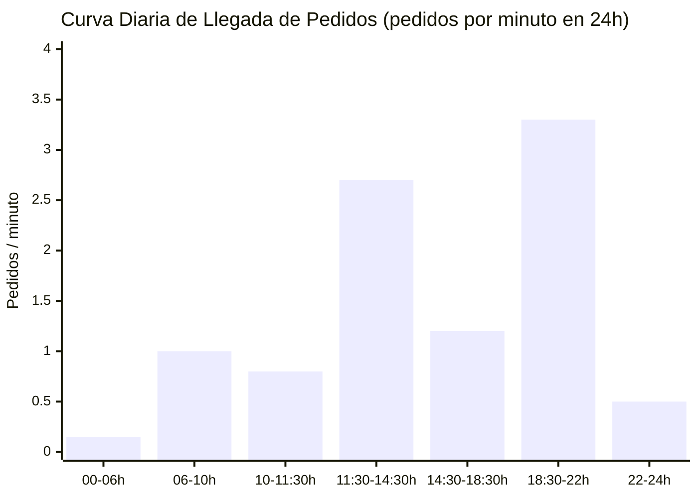
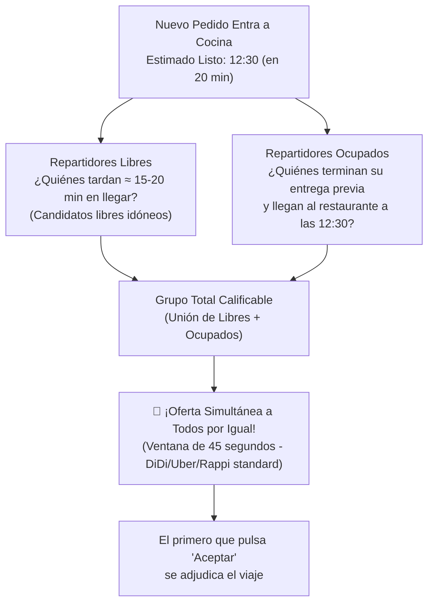
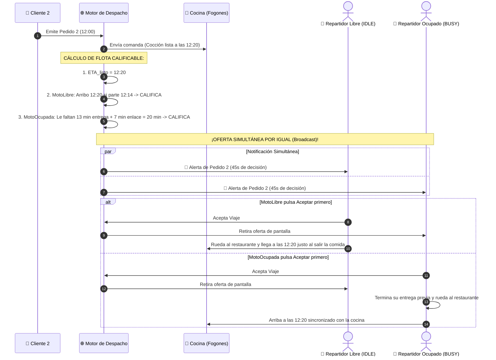
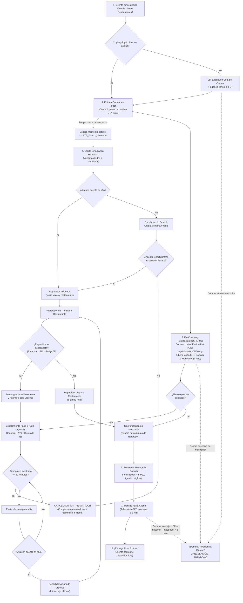
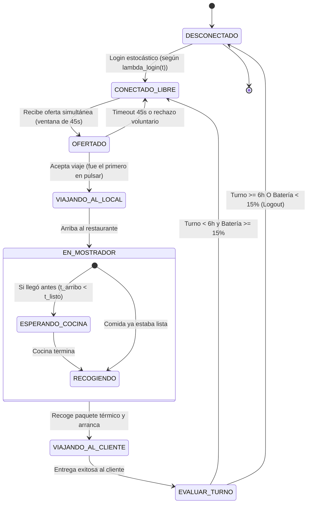

# GUÍA INTEGRAL DEL SISTEMA: DINÁMICA DE 24 HORAS, DESPACHO SINCRONIZADO Y FLUJO COMPLETO
## Gemelo Digital y Simulación Estocástica de Plataforma de Pedidos a Domicilio (*QuickDelivery Sim*)

> **Documento Unificado para el Equipo de Trabajo:**  
> Este documento consolida la visión completa del sistema a simular durante una jornada continua de 24 horas, explicando de manera clara, accesible y rigurosa cómo interactúan los clientes, las cocinas de los restaurantes, la flota abierta de repartidores y el motor algorítmico de despacho.  
> Incorpora todas las decisiones técnicas acordadas en la auditoría de diseño (`docs/verificacion.md`), enfocándose exclusivamente en la **Opción 1: Despacho Sincronizado Predictivo**.  
> **Respaldo Científico y Técnico:** Cada parámetro, distribución de probabilidad, umbral físico y métrica de este documento cuenta con respaldo bibliográfico de fuentes indexadas o normativas oficiales detalladas en [`docs/Fuentes.md`](Fuentes.md).

---

## 1. La Gran Imagen: ¿Quiénes participan en el sistema?

En una zona urbana metropolitana densa ($6\text{ km} \times 6\text{ km}$), la dinámica completa de delivery se sostiene en la interacción de **cuatro actores clave**:

| Actor | Rol en el Sistema | Comportamiento y Decisiones Autónomas | Recursos y Restricciones Físicas |
| :--- | :--- | :--- | :--- |
| **👤 Clientes** | Generadores de demanda y consumidores finales. | Emiten pedidos en ráfagas estocásticas a lo largo del día. Monitorean el avance GPS en tiempo real y **cancelan voluntariamente** si la demora acumulada supera su umbral estocástico de paciencia ($T_{\text{canc}} \sim \text{Weibull}(k=2.4, \lambda_w=40\text{ min})$, donde $k=2.4$ es el parámetro de forma que modela impaciencia creciente y $\lambda_w=40\text{ min}$ es la escala de tolerancia temporal). | Su tolerancia temporal y nivel de satisfacción térmica con la comida. |
| **🍳 10 Restaurantes** | Productores físicos de los alimentos. | Reciben comandas validadas, las encolan en cocina según orden de llegada (FIFO) y preparan los platos en tiempos variables ($\text{LogNormal}(\mu_{\ln}=2.85, \sigma_{\ln}=0.35)$, con media física de $18.5\text{ min}$). | **Fogones finitos simultáneos** ($k_r \in [3, 6]$ puestos de cocción por restaurante) y mostrador de empaque. |
| **🛵 Repartidores** | Flota móvil de recolección y entrega (*Crowdsourcing*). | Se conectan (*login*) y desconectan (*logout*) de forma voluntaria. Evalúan ofertas de viaje en una ventana de 45 s (aceptan o rechazan según distancia y ganancia) y conducen en tráfico mixto. | **Límite de 6 horas de conexión continua** (fatiga psicomotriz) y **autonomía de batería de smartphone** (drenada por GPS a 1 Hz). |
| **🌐 La Plataforma** | Cerebro de software y motor de despacho (FastAPI + PostgreSQL + SimPy). | Recibe peticiones HTTP, gestiona el estado en base de datos, encola pedidos y **ejecuta la política algorítmica de despacho** (Asignación Voraz Inmediata vs. Despacho Sincronizado Predictivo). | Conexiones concurrentes HTTP, workers de Uvicorn, CPU, memoria RAM y socket de telemetría. |

---

## 2. La Jornada de 24 Horas: El Ritmo de la Ciudad

La simulación no es plana ni estacionaria; reproduce las **24 horas continuas de un día real** ($1.440\text{ minutos} = 86.400\text{ segundos}$), capturando el flujo diurno y nocturno a una escala metropolitana representativa:

### 2.1 Franjas Horarias, Demanda y Saturación de Cocina
* **Capacidad de Cocinas:** La oferta culinaria total de la ciudad se compone de **$10\text{ restaurantes}$** con capacidad heterogénea de entre $3$ y $6$ fogones cada uno (promedio $4.7$ fogones, totalizando **$47\text{ fogones en toda la red}$**, estándar empírico de la National Restaurant Association — NRA, 2022; Deliverect, 2023).  
* **Tiempos de Cocina y Distribución Log-Normal:** El tiempo de preparación de cada orden en un fogón sigue una distribución $T_{\text{cocina}} \sim \text{LogNormal}(\mu_{\ln}=2.85, \sigma_{\ln}=0.35)$ (Alnaggar et al., 2021; DoorDash Engineering, 2020), cuyos parámetros se definen como:
  * $\mu_{\ln} = 2.85$: **Media de los logaritmos naturales del tiempo de cocción** ($\mathbb{E}[\ln(T)] = 2.85\ln(\text{min})$).
  * $\sigma_{\ln} = 0.35$: **Desviación estándar logarítmica (parámetro de forma y dispersión)**. Garantiza que los tiempos sean estrictamente positivos ($T > 0$) e introduce una asimetría hacia la derecha (*positive skewness*), modelando la realidad de que algunos platos complejos tardan sustancialmente más.
  * *Media física resultante en minutos:* $\mathbb{E}[T_{\text{cocina}}] = \exp\left(\mu_{\ln} + \frac{\sigma_{\ln}^2}{2}\right) = \exp\left(2.85 + \frac{0.35^2}{2}\right) \approx \mathbf{18.5\text{ minutos}}$ (con desviación estándar de $\sigma \approx 6.8\text{ min}$).
* **Capacidad Nominal Máxima de la Red de Cocinas ($\lambda_{\text{cocina\_max}}$):**
  $$\lambda_{\text{cocina\_max}} = \frac{47\text{ fogones}}{18.5\text{ min}} \approx \mathbf{2.54\text{ pedidos/minuto}}$$
  *(Deducción formal según leyes de balance de colas multi-servidor de Kleinrock, 1975)*.
  * **Descripción de los términos del cálculo:**
    * $\lambda_{\text{cocina\_max}}$: Tasa máxima de producción culinaria continua y sostenible de toda la red de 10 restaurantes (en pedidos por minuto). Si la demanda entrante supera esta cota de forma prolongada, las colas de cocina crecen indefinidamente.
    * $47\text{ fogones}$: Capacidad total de servidores de cocción instalados sumando los fogones de los 10 restaurantes ($k_r \in [3, 6]$).
    * $18.5\text{ min}$: Tiempo medio de preparación física de un pedido en un fogón ($\mathbb{E}[T_{\text{cocina}}]$).
* **Demanda Diaria No Estacionaria (Proceso NHPP):** La tasa de llegada de pedidos sigue un **Proceso de Poisson No Homogéneo (NHPP)** con $\approx 1.890\text{ pedidos/día}$ (Statista Digital Market Insights, 2023; Deliverect, 2023), donde:
  * $\lambda_{\text{pedidos}}(t)$: **Tasa instantánea o función de intensidad de llegadas**, que representa el número promedio esperado de nuevos pedidos emitidos por los clientes por cada minuto en función de la hora del día $t$. A diferencia de un proceso de Poisson clásico con tasa plana, $\lambda(t)$ sube y baja reproduciendo fielmente los ciclos humanos de consumo:

| Franja Horaria | Intervalo ($t$ en min) | Demanda ($\lambda_{\text{pedidos}}(t)$) | Volumen Estimado | Utilización Cocina ($\rho$) | Régimen Operativo y Comportamiento Real |
| :--- | :---: | :---: | :---: | :---: | :--- |
| **00:00 – 06:00** | $0 - 360$ | **$0.15\text{ ped/min}$** | $54\text{ pedidos}$ | **$6\%$** | **Vacío / Ocioso:** Atención instantánea sin colas en cocina. |
| **06:00 – 10:00** | $360 - 600$ | **$1.00\text{ ped/min}$** | $240\text{ pedidos}$ | **$39\%$** | **Fluido / Estable:** Desayunos y café; fogones con baja ocupación. |
| **10:00 – 11:30** | $600 - 690$ | **$0.80\text{ ped/min}$** | $72\text{ pedidos}$ | **$31\%$** | **Valle Mañana:** Transición y preparación previa al almuerzo. |
| **11:30 – 14:30** | $690 - 870$ | **$2.70\text{ ped/min}$** | $486\text{ pedidos}$ | **$\mathbf{106\%}$** | **Pico 1: Almuerzo (Saturación Moderada):** La demanda supera la capacidad; locales pequeños ($3$ fogones) colapsan primero, formando colas de 2 a 4 comandas. |
| **14:30 – 18:30** | $870 - 1.110$ | **$1.20\text{ ped/min}$** | $288\text{ pedidos}$ | **$47\%$** | **Valle Tarde (Desahogo):** Se reduce la llegada y las cocinas vacían las colas del almuerzo. |
| **18:30 – 22:00** | $1.110 - 1.320$ | **$3.30\text{ ped/min}$** | $693\text{ pedidos}$ | **$\mathbf{130\%}$** | **Pico 2: Cena (Saturación Severa):** Todos los fogones al 100%, cola de comanda acumulada (esperas de 25-35 min) y cancelaciones por impaciencia. |
| **22:00 – 24:00** | $1.320 - 1.440$ | **$0.50\text{ ped/min}$** | $60\text{ pedidos}$ | **$20\%$** | **Cierre Nocturno:** Drenaje de últimas órdenes y fin de jornada. |
| **TOTAL 24H** | **$0 - 1.440$** | **Media: $1.31\text{ ped/min}$** | **$\approx 1.890\text{ ped}$** | **Media: $52\%$** | **Ciclo Diario Completo No Estacionario.** |

### 2.2 ¿Por qué el Pico de la Cena es Superior al del Almuerzo?
La asimetría entre el almuerzo y la cena está documentada ampliamente en la literatura de logística urbana (DoorDash Trends, 2023; Deliverect, 2023):
1. **Alternativas Presenciales:** En el almuerzo, muchos trabajadores recurren a comedores de empresa, restaurantes ejecutivos a pie o comida casera (*tupper*). En la cena, la fatiga tras la jornada laboral desincentiva salir a cocinar o comprar, canalizando la demanda casi exclusivamente a apps móviles.
2. **Tamaño de la Canasta:** El almuerzo suele ser individual (1 persona en oficina), mientras que la cena concentra órdenes familiares o grupales (2 a 5 personas) asociadas al ocio, streaming o fútbol, aumentando el volumen de ítems por comanda.
3. **Rigidez de Horarios:** El almuerzo está acotado a pausas rígidas (30–60 min); en la cena las familias toleran ventanas más amplias, acumulando mayor demanda total.

---

## 3. Dinámica de Flota Abierta (Crowdsourcing) y Restricciones Físicas Duras ($C6$)

En plataformas como Rappi o DiDi, la empresa **no posee una flota contratada con turnos fijos**. Los repartidores operan como conductores independientes:

### 3.1 Proceso de Conexión de Repartidores (Decisión D-01: NHPP de Logins)
Para atender los $\approx 1.890$ pedidos diarios y reemplazar a los repartidores que cumplen su límite de 6 horas o agotan batería, la entrada de nuevos conductores se modela como un **Proceso de Poisson No Homogéneo de Conexiones ($\lambda_{\text{login}}(t)$)** (Bai et al., 2019; OIT / ILO, 2021):
* $\lambda_{\text{login}}(t)$: **Tasa instantánea de conexiones por minuto**, que modula el arribo de repartidores según la hora del día. Los couriers ingresan con mayor intensidad antes de los picos atraídos por los incentivos tarifarios.
* Cada repartidor al iniciar sesión recibe un nivel de batería inicial estocástico $\text{Bat}_0 \sim \mathcal{N}(\mu=95\%, \sigma=5\%)$ truncado en $[70\%, 100\%]$, donde:
  * $\mu = 95\%$: Carga promedio de la batería al salir del hogar para iniciar el turno.
  * $\sigma = 5\%$: Desviación estándar que captura variaciones entre repartidores con carga completa ($100\%$) y aquellos que conectan con nivel ligeramente inferior.

| Franja Horaria | Intervalo ($t$ en min) | Tasa de Nuevos Logins ($\lambda_{\text{login}}(t)$) | Oferta Conectada Típica ($c(t)$) |
| :--- | :---: | :---: | :---: |
| **00:00 – 06:00** | $0 - 360$ | $0.02\text{ couriers/min}$ | $\approx 4 - 8$ repartidores |
| **06:00 – 10:00** | $360 - 600$ | $0.12\text{ couriers/min}$ | $\approx 25 - 35$ repartidores |
| **10:00 – 11:30** | $600 - 690$ | $0.10\text{ couriers/min}$ | $\approx 20 - 28$ repartidores |
| **11:30 – 14:30** | $690 - 870$ | **$0.35\text{ couriers/min}$** | **$\approx 65 - 80$ repartidores (pico almuerzo)** |
| **14:30 – 18:30** | $870 - 1.110$ | $0.15\text{ couriers/min}$ | $\approx 30 - 45$ repartidores |
| **18:30 – 22:00** | $1.110 - 1.320$ | **$0.45\text{ couriers/min}$** | **$\approx 80 - 100$ repartidores (pico máximo cena)** |
| **22:00 – 24:00** | $1.320 - 1.440$ | $0.05\text{ couriers/min}$ | $\approx 15 - 8$ repartidores (desconexión progresiva) |

### 3.2 Los Dos Límites Físicos Duros del Repartidor ($C6$) y Gestión Preventiva
1. **Límite Físico de 6 Horas ($T_{\text{turno}} \le 360\text{ min}$) con Flexibilidad de Entrega:**  
   Conducir una motocicleta o bicicleta en tráfico urbano congestionado por más de 6 horas continuas genera fatiga psicomotriz severa, duplicando el riesgo de colisión vial (directrices oficiales OIT / ILO, 2021; Gregory, 2021).  
   *Regla de Flexibilidad Operativa (Decisión D-08):* Si el repartidor cumple las 6 horas de conexión mientras se encuentra en viaje con un pedido activo, **la aplicación no lo desconecta en medio de la calle**. Se le permite culminar la entrega de forma segura al cliente (`EntregaFinal`), y en ese instante exacto se ejecuta su `LogoutRepartidor` obligatorio por fin de jornada.
2. **Autonomía de Batería de Smartphone ($4.5 - 6.0\text{ horas}$) y Verificación Preventiva:**  
   El uso simultáneo de pantalla activa, módem 4G/5G y antena GPS a 1 Hz drena una batería de 5.000 mAh a razón de $0.15\%/\text{min}$ en movimiento y $0.05\%/\text{min}$ en reposo (Carroll & Heiser, 2010, USENIX ATC). El umbral crítico de reserva es del $15\%$ (Android Developer Guidelines, 2023).  
   *Verificación Preventiva de Batería (Pre-dispatch Battery Check - Decisión D-08):* Para evitar que el celular se apague en pleno trayecto con la comida en la mochila, el motor de despacho estima el gasto energético total del viaje:
   $$\Delta \text{Bat}_{\text{est}} = (t_{\text{viaje\_local}} + t_{\text{espera\_est}} + t_{\text{viaje\_cliente}}) \times 0.15\%/\text{min}$$
   * **Descripción de los términos del cálculo:**
     * $\Delta \text{Bat}_{\text{est}}$: Porcentaje proyectado de consumo de batería del smartphone necesario para completar la orden de punta a punta.
     * $t_{\text{viaje\_local}}$: Tiempo estimado de traslado vial en minutos desde la ubicación actual del repartidor hasta el restaurante emisor.
     * $t_{\text{espera\_est}}$: Tiempo estimado de permanencia en mostrador del local antes de que la comida esté empacada.
     * $t_{\text{viaje\_cliente}}$: Tiempo estimado de conducción vial desde el restaurante hasta el punto geodésico del cliente.
     * $0.15\%/\text{min}$: Coeficiente de consumo energético por minuto de pantalla encendida y antena GPS activa transmitiendo a 1 Hz (Carroll & Heiser, 2010).

   Un conductor **solo es calificado para recibir la oferta si su batería actual garantiza no caer bajo el 15% al terminar la entrega**:
   $$\text{Bat}_{\text{actual}} - \Delta \text{Bat}_{\text{est}} \ge 15\%$$
   * **Descripción de los términos de la condición:**
     * $\text{Bat}_{\text{actual}}$: Porcentaje de carga actual de la batería del dispositivo móvil reportado en su última telemetría.
     * $\Delta \text{Bat}_{\text{est}}$: Consumo total estimado para completar todo el ciclo de entrega.
     * $15\%$: Nivel de reserva crítica energética mínima para evitar el apagado imprevisto del dispositivo móvil en ruta.
   
   Si no cumple la condición, el repartidor queda excluido de la oferta y la aplicación le sugiere desconectarse a recargar.

> **El Impacto Crucial en el Negocio:**  
> La verificación preventiva de batería y el despacho sincronizado actúan en sinergia: se evita el tiempo ocioso en restaurante (que drena batería sin generar ingresos) y se elimina el riesgo de que una orden se pierda en la vía por un smartphone apagado.

---

## 4. El Problema Central: Asignación Voraz vs. Despacho Sincronizado

### 4.1 La Política Actual (Línea Base: Asignación Voraz Inmediata)
Tan pronto como el cliente confirma el pedido, la plataforma le adjudica la orden al repartidor libre más cercano.
* El repartidor rueda $4\text{ minutos}$ hasta el restaurante... **¡pero a la comida le restan $20\text{ minutos}$ en el horno!**
* **Resultado:** El repartidor pasa **$16.2\text{ minutos}$ ocioso** de brazos cruzados en el mostrador *(línea base empírica documentada en la industria por DoorDash Engineering, 2020; Alnaggar et al., 2021)*. Ni gana dinero, ni puede transportar pedidos de otros clientes, mientras su batería se consume emitiendo telemetría inútil.

### 4.2 La Política Alternativa Propuesta: Despacho Sincronizado Predictivo con Oferta Simultánea
En lugar de despachar a ciegas, la plataforma calcula en qué momento exacto terminará la cocción ($\text{ETA}_{\text{listo}}$):
$$\text{ETA}_{\text{listo}} = t_{\text{actual}} + (Q_{\text{cocina\_r}} \times \bar{T}_{\text{cocina}}) + T_{\text{preparacion\_est}}$$
* **Descripción de los términos del cálculo:**
  * $\text{ETA}_{\text{listo}}$: Marca de tiempo proyectada (*Estimated Time of Availability*) en la que el pedido saldrá del fogón empacado hacia el mostrador del restaurante.
  * $t_{\text{actual}}$: Minuto actual de la jornada según el reloj de simulación.
  * $Q_{\text{cocina\_r}}$: Número de pedidos pendientes acumulados en la cola de cocina del restaurante $r$ que están a la espera de que se desocupe un fogón.
  * $\bar{T}_{\text{cocina}}$: Tiempo medio histórico de cocción de una comanda en el restaurante ($18.5\text{ min}$).
  * $T_{\text{preparacion\_est}}$: Tiempo propio estimado de cocción para esta orden específica muestreado de la distribución Log-Normal.

Y difiere el despacho para que el arribo del repartidor coincida justo cuando la comida sale del fogón:
$$t_{\text{despacho}} = \text{ETA}_{\text{listo}} - t_{\text{viaje\_repartidor}} + \Delta t_{\text{buffer}}$$
* **Descripción de los términos del cálculo:**
  * $t_{\text{despacho}}$: Minuto de la jornada en el cual el motor algorítmico de la plataforma debe emitir la notificación de oferta simultánea (*broadcast*) a la flota de repartidores.
  * $\text{ETA}_{\text{listo}}$: Momento proyectado de finalización de preparación del pedido.
  * $t_{\text{viaje\_repartidor}}$: Tiempo estimado de traslado vial que le tomará al repartidor desplazarse desde su posición hasta el local.
  * $\Delta t_{\text{buffer}}$: Margen de holgura temporal calibrable ($\Delta t_{\text{buffer}} \in [0, 5]\text{ min}$, variable central de la **Pregunta de Investigación 4**) diseñado para absorber perturbaciones imprevistas de tráfico urbano sin que la comida se enfríe en mostrador.

### 4.3 Criterio de Calificación de Flota y Ventana Basada en Buffer
Para ser calificado como receptor de una oferta simultánea, el repartidor debe cumplir **dos filtros obligatorios**:
1. **Filtro Temporal de Sincronización (Regulado por $\Delta t_{\text{buffer}}$):**
   * *Repartidor Libre (`IDLE`):* Su tiempo de viaje directo al restaurante le permite arribar dentro de la ventana de tolerancia sincronizada:
     $$t_{\text{arribo}} \in [\text{ETA}_{\text{listo}} - \Delta t_{\text{buffer}}, \text{ETA}_{\text{listo}} + \Delta t_{\text{buffer}} + 2\text{ min}]$$
     * **Descripción de los términos:**
       * $t_{\text{arribo}}$: Minuto exacto en que el repartidor libre llegará al local ($t_{\text{actual}} + t_{\text{viaje\_local}}$).
       * $\text{ETA}_{\text{listo}}$: Hora estimada de salida de la comida del fogón.
       * $\Delta t_{\text{buffer}}$: Margen de holgura temporal calibrable de la política de despacho ($\Delta t_{\text{buffer}} \in [0, 5]\text{ min}$).
       * $+ 2\text{ min}$: Margen técnico de tolerancia para permitir el parqueo y entrada al mostrador.
   * *Repartidor Ocupado (`BUSY`):* Se conoce su ubicación GPS en vivo, el tiempo remanente para culminar su entrega en curso ($t_{\text{remanente}}$) y el traslado hacia el nuevo local ($t_{\text{enlace}}$). Es apto si:
     $$t_{\text{actual}} + t_{\text{remanente}} + t_{\text{enlace}} \in [\text{ETA}_{\text{listo}} - \Delta t_{\text{buffer}}, \text{ETA}_{\text{listo}} + \Delta t_{\text{buffer}} + 2\text{ min}]$$
     * **Descripción de los términos:**
       * $t_{\text{actual}}$: Minuto actual del sistema.
       * $t_{\text{remanente}}$: Minutos restantes para completar la entrega del cliente que tiene asignado actualmente.
       * $t_{\text{enlace}}$: Minutos de desplazamiento desde el domicilio del cliente anterior hasta el nuevo restaurante emisor.
2. **Filtro Preventivo de Batería (Decisión D-08):**
   * El repartidor (libre u ocupado) debe poseer batería suficiente para completar todo el viaje proyectado sin caer bajo el $15\%$ de reserva:
     $$\text{Bat}_{\text{actual}} - \left( (t_{\text{viaje\_local}} + t_{\text{espera\_est}} + t_{\text{viaje\_cliente}}) \times 0.15\%/\text{min} \right) \ge 15\%$$
   * Conductor que no supere este filtro energético queda excluido automáticamente, protegiendo al pedido de desconexiones en pleno tránsito (Carroll & Heiser, 2010).

### 4.4 Diagrama de Secuencia de la Oferta Simultánea

### 4.5 Protocolo de Contingencia y Escalamiento Dinámico (Decisiones D-02 y D-07)
¿Qué ocurre si ningún repartidor calificado acepta la oferta en los 45 segundos *(estándar operativo móvil de Uber Eats, DiDi Food y Rappi, 2022-2023)*, si el grupo inicial está vacío o si un conductor asignado se desconecta?
1. **Fase 1 (Ampliación de Ventana y Radio con Buffer $\Delta t_{\text{buffer}}$):** Si la comida aún se encuentra en el fogón, la plataforma expande la ventana de sincronización en función directa del margen de holgura $\Delta t_{\text{buffer}}$ establecido en la **Pregunta de Investigación 4** ($\Delta t_{\text{buffer}} \in [0, 5]\text{ min}$):
   $$t_{\text{arribo}} \in [\text{ETA}_{\text{listo}} - (2 \cdot \Delta t_{\text{buffer}} + 1\text{ min}), \text{ETA}_{\text{listo}} + (2 \cdot \Delta t_{\text{buffer}} + 3\text{ min})]$$
   * **Descripción de los términos y conexión con la Pregunta 4:**
     * $2 \cdot \Delta t_{\text{buffer}}$: Factor de escala que duplica la tolerancia temporal de la ventana ante la falta de aceptación inicial.
     * Si $\Delta t_{\text{buffer}} = 2.5\text{ min}$ (valor nominal), la ventana expandida abarca exactamente $[\text{ETA}_{\text{listo}} - 6\text{ min}, \text{ETA}_{\text{listo}} + 8\text{ min}]$.
     * Si el analista calibra $\Delta t_{\text{buffer}} \to 0\text{ min}$, la ventana expandida es sumamente rígida ($[-1\text{ min}, +3\text{ min}]$), minimizando el riesgo de enfriamiento pero aumentando la probabilidad de no encontrar repartidor; si se incrementa hacia $\Delta t_{\text{buffer}} = 5\text{ min}$, la ventana se ensancha a $[-11\text{ min}, +13\text{ min}]$, asegurando una alta tasa de captura de flota a expensas de mayor tiempo de espera ociosa. De este modo, la respuesta a la Pregunta 4 influye de forma directa y dinámica en el algoritmo de contingencia.
   * Simultáneamente, se amplía el radio geográfico de búsqueda y se reemite el *broadcast* simultáneo a la nueva flota calificada.
2. **Fase 2 (Conmutación a Prioridad Urgente en Mostrador):** Si la comida sale del fogón y llega al mostrador sin repartidor asignado, el pedido abandona el modo predictivo y pasa a la **Cola de Despacho Inmediato con Prioridad Máxima (Anti-Enfriamiento)**. Se le añade un **bono fijo de emergencia del +20%** *(respaldado en literatura de precios dinámicos y surge pricing de Cachon, Daniels & Lobel, 2017; Bai et al., 2019)* y se emiten alertas en ciclos de **45 segundos** a todos los conductores libres.
3. **Fase 3: Protocolo Terminal Anti-Limbo (Decisión D-07):**
   * **Límite Máximo de 20 Minutos en Mostrador ($T_{\text{max\_mostrador}} = 20\text{ min}$):** Si transcurren 20 minutos con la comida en mostrador y ningún conductor acepta la oferta tras múltiples ciclos de 45s:
     * La plataforma cancela proactivamente la orden pasando a estado terminal **`CANCELADO_SIN_REPARTIDOR`**, cumpliendo la directriz sanitaria oficial de control de tiempo y temperatura sin fuente de calor activa (**FDA Food Code 2022**, § 3-501.19; DoorDash Merchant Food Safety Standards, 2022).
     * Se procesa el reembolso completo al cliente y la plataforma compensa al restaurante por concepto de merma/pérdida culinaria.
   * **Desconexión de Conductor Asignado:** Si un repartidor que aceptó el viaje se desconecta (por batería $< 15\%$, límite de 6 horas o cierre imprevisto de app) antes de recoger la comida:
     * El sistema desasigna la orden de forma instantánea y la reinserta al inicio de la cola urgente de mostrador para el siguiente ciclo de 45 segundos.
   * **Cancelación Previa por Cliente:** Si antes de los 20 minutos expira el umbral de paciencia del cliente ($T_{\text{canc}} \sim \text{Weibull}$, Bai et al., 2019), la orden pasa a **`CANCELADO_POR_CLIENTE`**, evitando que la comida viaje en vano.
   * **Garantía del Sistema:** **Ninguna orden queda indefinidamente en el limbo ni atrapada en un bucle infinito.**

---

## 5. El Viaje Completo de un Pedido: Paso a Paso (Punta a Punta)

### Detalle de cada fase del flujo:

#### Paso 1: Emisión y Registro del Pedido
* El cliente selecciona equiprobablemente uno de los 10 restaurantes ($R_i \sim \mathcal{U}\{1, 10\}$, donde cada local tiene una probabilidad idéntica $P(R_i = r) = 1/10 = 10\%$, desacoplando el modelo de sesgos publicitarios según Kleinrock, 1975) y envía su orden vía `POST /api/v1/orders/`.
* El pedido se trata como una unidad agregada de producción culinaria (se delimitan fuera las recetas detalladas para evitar sobreparametrización).
* Se le asigna al cliente un tiempo máximo de tolerancia antes de abandonar ($T_{\text{canc}} \sim \text{Weibull}(k=2.4, \lambda_w=40\text{ min})$, validado empíricamente por Bai et al., 2019 y Deliverect, 2023), donde:
  * $k = 2.4$: **Parámetro de forma (*shape parameter*)**, que al ser mayor a 1 ($k > 1$) modela una tasa instantánea de riesgo creciente (*increasing hazard rate*): la impaciencia del cliente no es constante, sino que se acelera progresivamente con cada minuto adicional de espera.
  * $\lambda_w = 40\text{ min}$: **Parámetro de escala o vida característica (*scale parameter*)**, que indica el minuto en el que el $1 - e^{-1} \approx 63.2\%$ de los clientes ya habrían cancelado voluntariamente su orden si no ha sido entregada.

#### Paso 2 y 3: Cola, Consulta KDS y Cocción en Restaurante
* Cada restaurante tiene $k_r \in [3, 6]$ fogones simultáneos (`simpy.Resource(capacity=k_r)`, National Restaurant Association — NRA, 2022).
* Si los fogones están ocupados, el pedido entra a esperar en la cola de cocina FIFO del restaurante.
* **Consulta de Comandas por el Restaurante (Endpoint KDS):** El sistema del restaurante o pantalla de cocina (KDS) consulta en tiempo real sus comandas activas mediante el endpoint:
  $$\text{GET } \text{/api/v1/restaurants/}\{restaurant\_id\}\text{/orders}$$
  * **Descripción de los términos y respuesta del endpoint:**
    * `restaurant_id`: Identificador entero del restaurante consultado ($r \in \{1, \dots, 10\}$).
    * Parámetro opcional: `?status=EN_COLA_COCINA,EN_PREPARACION,LISTO_EN_MOSTRADOR` para filtrar por estado.
    * Devuelve la lista de comandas con: `order_id`, `restaurant_id`, `created_at`, `status`, `tiempo_espera_cola` y `eta_listo`.
    * **Exclusión formal y deliberada:** **NO se incluye información de platos específicos, ingredientes ni recetas**, respetando estrictamente la Exclusión 2 del modelo (el pedido se gestiona como una unidad agregada de producción culinaria).
* La preparación física en fogón sigue una distribución Log-Normal: $T_{\text{cocina}} \sim \text{LogNormal}(\mu_{\ln}=2.85, \sigma_{\ln}=0.35)$ (media física de $\approx 18.5\text{ min}$, Alnaggar et al., 2021; DoorDash Engineering, 2020).

#### Paso 3.1: Notificación de Fin de Cocción y Pase a Mostrador (Decisión D-09)
* **Acción en Cocina / KDS:** Al finalizar la preparación y empaque del plato, el cocinero interactúa con la pantalla de pedidos del restaurante (KDS / Tablet) presionando el botón *"Pedido Listo en Mostrador"*, lo que genera una llamada HTTP a la API:
  $$\text{POST } \text{/api/v1/orders/}\{order\_id\}\text{/ready}$$
  * **Descripción de los términos:**
    * `order_id`: Identificador único de la comanda terminada.
    * `/ready`: Endpoint transaccional que formaliza la transferencia de la comida desde el área caliente de cocción hacia el mostrador de recolección de repartidores.
* **Efectos Transaccionales Inmediatos:**
  1. El estado del pedido se actualiza a **`LISTO_EN_MOSTRADOR`**.
  2. Se estampa la marca de tiempo de finalización física ($t_{\text{listo}}$).
  3. Se libera inmediatamente el fogón del restaurante (`fogones.release()`), permitiendo que la siguiente comanda en la cola FIFO comience a cocinarse.
  4. Se activa el temporizador de permanencia en mostrador ($t_{\text{mostrador}}$).
  5. Si el pedido aún no tenía repartidor asignado, conmuta automáticamente a la cola urgente con bono del +20% (Fase 2 de escalamiento dinámico, Cachon et al., 2017).
* **Equivalente en Simulación (SimPy):** El proceso de cocina finaliza su retardo estocástico (`yield env.timeout(t_cocina)`), desocupa el recurso de fogones del restaurante, actualiza el estado de la entidad `Order` a `LISTO_EN_MOSTRADOR`, fija `order.t_listo = env.now` y registra el evento para el colector de métricas.

#### Paso 4: Sincronización y Asignación
* Se calcula el $\text{ETA}_{\text{listo}}$ y se emite la oferta simultánea en el instante óptimo $t_{\text{despacho}} = \text{ETA}_{\text{listo}} - t_{\text{viaje\_repartidor}} + \Delta t_{\text{buffer}}$.
* Si nadie acepta en 45 segundos *(Uber/DiDi/Rappi standard)*, se activa la Fase 1 del protocolo de escalamiento dinámico expandiendo la ventana con $2 \cdot \Delta t_{\text{buffer}}$ (Decisión D-02 y Pregunta 4).

#### Paso 5 y 6: Recogida en Mostrador y Calidad Térmica (Decisión D-05)
* El tiempo que la comida pasa en el mostrador antes de ser recogida se registra como:
  $$t_{\text{mostrador}} = \max(0, t_{\text{arribo\_rep}} - t_{\text{listo}})$$
  * **Descripción de los términos del cálculo:**
    * $t_{\text{mostrador}}$: Minutos que el paquete de comida permanece en el mostrador del restaurante expuesto a temperatura ambiente perdiendo calor sensible.
    * $t_{\text{arribo\_rep}}$: Minuto exacto en que el repartidor arriba al local e ingresa a retirar el paquete.
    * $t_{\text{listo}}$: Minuto en que la cocina terminó la cocción y colocó la comida en la barra de despacho.
    * $\max(0, \dots)$: Operador de acotamiento que garantiza que si el repartidor llegó antes de que saliera la comida ($t_{\text{arribo\_rep}} \le t_{\text{listo}}$), el tiempo de enfriamiento en mostrador sea estrictamente $0.0\text{ min}$.
* **Tolerancia Térmica:** Si $t_{\text{mostrador}} \le 6.0\text{ min}$, la bolsa térmica del restaurante preserva la temperatura óptima (Deliverect Thermal Quality Report, 2023).
* **Degradación Térmica:** Si $t_{\text{mostrador}} > 6.0\text{ min}$, la comida se enfría de forma perceptible, **acelerando en un 50% la tasa instantánea de cancelación del cliente** durante la etapa de rastreo (Bai et al., 2019; FDA Food Code 2022, § 3-501.19).
* **Función de Pérdida Biobjetivo:** Se calibra el margen de holgura $\Delta t_{\text{buffer}} \in [0, 5]\text{ min}$ minimizando:
  $$\mathcal{L}(\Delta t_{\text{buffer}}) = 1.0 \cdot \bar{T}_{\text{espera\_rep}} + 1.5 \cdot \bar{T}_{\text{mostrador}} + 100.0 \cdot P_{\text{canc}}$$
  * **Descripción de los términos de la función de pérdida:**
    * $\mathcal{L}(\Delta t_{\text{buffer}})$: Valor de la pérdida multidimensional global del sistema a minimizar para encontrar el buffer óptimo de la Pregunta 4.
    * $1.0$: Coeficiente de ponderación ($w_1$) por cada minuto de espera inactiva del repartidor en el restaurante.
    * $\bar{T}_{\text{espera\_rep}}$: Tiempo promedio de espera ociosa de los repartidores en mostrador (minutos).
    * $1.5$: Coeficiente de ponderación ($w_2$) que prioriza la frescura térmica de los alimentos sobre el tiempo ocioso del conductor.
    * $\bar{T}_{\text{mostrador}}$: Tiempo promedio de permanencia de las órdenes terminadas en el mostrador (minutos).
    * $100.0$: Penalización severa ($w_3$) impuesta a la plataforma por cada pedido perdido por cancelación.
    * $P_{\text{canc}}$: Tasa o proporción global de pedidos cancelados por impaciencia respecto al total diario ($N_{\text{canc}} / N_{\text{total}}$).

#### Paso 7: Cinemática de Tránsito Urbano y Rastreo GPS
* **Distancia Vial con Sinuosidad ($\tau = 1.25$):** La red de calles no es una cuadrícula perfecta ni línea recta. Se utiliza distancia Manhattan corregida por el factor empírico de sinuosidad urbana (**Ballou et al., 2002; Levinson & El-Geneidy, 2009; Boeing, 2019**):
  $$d_{\text{vial}} = 1.25 \times (|x_{\text{destino}} - x_{\text{origen}}| + |y_{\text{destino}} - y_{\text{origen}}|)$$
  * **Descripción de los términos del cálculo:**
    * $d_{\text{vial}}$: Distancia real de traslado sobre la malla vial urbana en kilómetros.
    * $1.25$: Factor de sinuosidad urbana ($\tau = 1.25$), que representa un $25\%$ de sobre-recorrido vial por sentidos de vías, curvas y desvíos urbanos frente a la distancia Manhattan ortogonal.
    * $|x_{\text{destino}} - x_{\text{origen}}|$: Desplazamiento horizontal ortogonal en coordenadas cartesianas (kilómetros Este-Oeste).
    * $|y_{\text{destino}} - y_{\text{origen}}|$: Desplazamiento vertical ortogonal en coordenadas cartesianas (kilómetros Norte-Sur).
* **Velocidad de Circulación y Distribución Truncada:** $V_{\text{rep}} \sim \mathcal{N}(\mu=18\text{ km/h}, \sigma=3\text{ km/h})$ truncada en $[8, 25]\text{ km/h}$ (Dablanc et al., 2018; OpenStreetMap Mobility Analytics, 2023), donde:
  * $\mu = 18\text{ km/h}$: Velocidad media de desplazamiento efectivo de motocicletas en arterias urbanas con tráfico cotidiano.
  * $\sigma = 3\text{ km/h}$: Desviación estándar cinemática que modela variaciones de flujo y paradas intermedias.
  * Cotas $[8, 25]\text{ km/h}$: Límites físicos inferior ($8\text{ km/h}$, marcha en atascos) y superior ($25\text{ km/h}$, límite de seguridad vial metropolitana) para impedir velocidades irreales en el modelo.
* **Telemetría y Consumo:** La app envía coordenadas GPS al endpoint `GET /api/v1/orders/{id}/tracking`, drenando batería a razón de $0.15\%/\text{min}$ en movimiento (Carroll & Heiser, 2010). Gracias al filtro preventivo de batería previo a la asignación, se previene que el smartphone se apague en trayecto. Si ocurriese un siniestro imprevisto (accidente vial o fallo mecánico con pérdida total de telemetría $> 5\text{ min}$), la orden transita a **`CANCELADO_INCIDENCIA_TRANSITO`** con reembolso al cliente y merma en ruta.

#### Paso 8: Entrega Final y Flexibilidad de Turno
* El pedido pasa a `ENTREGADO`. El cliente recibe su comanda y el repartidor queda libre (`IDLE`) en la posición del cliente.
* **Flexibilidad de Turno (Decisión D-08):** Si el conductor superó las 6 horas acumuladas mientras conducía con la comida (OIT / ILO, 2021), la plataforma le permitió entregar el paquete y, justo en este momento de entrega final, ejecuta su **`LogoutRepartidor`** obligatorio, impidiéndole tomar más pedidos hasta su próximo turno de descanso. Si aún tiene tiempo disponible ($< 6\text{ h}$) y batería suficiente ($\ge 15\%$), permanece disponible para una nueva oferta.

---

## 6. La Vida de un Repartidor (Máquina de Estados de la Flota)

---

## 7. Preguntas de Decisión Cuantitativas (Política Actual vs. Alternativa)

El gemelo digital está concebido para responder cuatro preguntas de ingeniería con métricas precisas:

1. **Pregunta de Decisión 1 (Sincronización y Productividad de Flota):**  
   *¿En qué porcentaje se reduce el tiempo de espera ociosa del repartidor en el restaurante ($T_{\text{espera\_rest}}$, meta: $\le 3.5\text{ min}$) y cuál es el incremento en pedidos completados por repartidor dentro de su turno de 6 horas al pasar de la asignación voraz al despacho sincronizado predictivo?*
2. **Pregunta de Decisión 2 (Dimensionamiento en Pico de Cena):**  
   *¿Cuál es el número mínimo de repartidores activos conectados por hora ($c_{min}(t) \in [75, 95]$) que la plataforma debe incentivar en el pico de cena (18:30–22:00, $3.30\text{ ped/min}$) para mantener la utilización ($\rho$) entre el 75% y el 85%, con $W_{total\_p95} \le 40\text{ min}$ y cancelaciones $P_{canc} < 3\%$?*
3. **Pregunta de Decisión 3 (Frecuencia de Rastreo y Recursos de Servidor):**  
   *¿Cómo influye modificar la tasa de actualización del socket de telemetría (cada 5 s vs. cada 15 s) en la preservación de la batería del repartidor y en la latencia $p99$ del microservicio de rastreo ($T_{lat\_api\_p99} \le 180\text{ ms}$)?*
4. **Pregunta de Decisión 4 (Calibración Óptima del Margen de Holgura):**  
   *¿Cuál es el valor óptimo del buffer ($\Delta t_{buffer} \in [0, 5]\text{ min}$) que minimiza conjuntamente la espera del conductor y el enfriamiento de la comida en mostrador sin disparar las cancelaciones?*

---

## 8. Arquitectura del Prototipo Técnico y Metodología (Decisiones D-03 y D-04)

### 8.1 Sistema Real Mínimo en Docker Compose (Decisión D-04)
El sistema real mínimo desplegable se compone de 2 servicios independientes en `docker-compose.yml`:
1. `db`: Contenedor oficial **PostgreSQL 15 (`postgres:15-alpine`)** con volumen persistente (`postgres_data`) para almacenar entidades `Order`, `Courier` y `TrackingRecord`.
2. `api`: Contenedor **FastAPI con Uvicorn** multi-worker, exponiendo los endpoints obligatorios del dominio:
   * `POST /api/v1/orders/`: Ingestión y creación de pedidos.
   * `GET /api/v1/restaurants/{restaurant_id}/orders`: Consulta en tiempo real de pedidos activos por parte del sistema KDS del restaurante (devuelve `order_id`, `status`, `tiempo_espera_cola`, `eta_listo` **sin incluir platos ni ingredientes**, respetando la Exclusión 2).
   * `POST /api/v1/orders/{order_id}/ready`: Notificación del restaurante al terminar la cocción y transferir la comanda al mostrador (Decisión D-09).
   * `POST /api/v1/dispatch/assign/`: Ejecución del motor de asignación.
   * `GET /api/v1/orders/{order_id}/tracking`: Telemetría y rastreo en tiempo real.
   * `GET /api/v1/telemetry/health`: Estado de CPU, RAM y latencias.
   * Middleware de telemetría registrando métricas de rendimiento en `datos/telemetry_log.csv`.

### 8.2 Inyección de Tráfico Sintético en la API con Locust (`locustfile.py`)
Para evaluar el comportamiento de la API bajo condiciones reales de concurrencia y registrar telemetría fidedigna (Bono opcional de +0.2 en la rúbrica), se emplea **Locust** como inyector de tráfico independiente que opera en **tiempo de reloj real (*wall-clock time*)**:
* **`CustomerUser`:** Simula el comportamiento del consumidor emitiendo pedidos (`POST /api/v1/orders/`) y sondeando la posición del repartidor en intervalos cortos (`GET /api/v1/orders/{id}/tracking`).
* **`RestaurantUser`:** Simula la interacción de los locales mediante su sistema KDS: sondea periódicamente las comandas pendientes (`GET /api/v1/restaurants/{id}/orders`) y notifica pedidos listos en mostrador al terminar la cocción (`POST /api/v1/orders/{id}/ready`).
* **`CourierUser`:** Simula repartidores que envían actualizaciones de telemetría y solicitan viajes disponibles (`POST /api/v1/dispatch/assign/`).
* **Captura de Telemetría:** El middleware asíncrono intercepta cada petición y registra en `datos/telemetry_log.csv`:
  $$\text{[timestamp, method, path, status\_code, latency\_ms, cpu\_percent, memory\_mb]}$$
  * **Descripción de los campos del registro de telemetría:**
    * `timestamp`: Marca de tiempo en formato ISO-8601 del instante exacto de finalización de la respuesta.
    * `method`: Verbo HTTP ejecutado (`GET`, `POST`).
    * `path`: Ruta del recurso invocado en la API (ej. `/api/v1/orders/12/ready`).
    * `status_code`: Código numérico de respuesta HTTP (ej. `200`, `201`, `422`, `500`).
    * `latency_ms`: Duración total del procesamiento de la petición en el backend en milisegundos.
    * `cpu_percent`: Uso instantáneo porcentual de CPU del host capturado mediante la librería `psutil`.
    * `memory_mb`: Memoria física RAM residente en megabytes consumida por el contenedor de FastAPI.

### 8.3 Gemelo Digital en SimPy: Tiempo Simulado Autónomo y Desacoplamiento Estricto (Decisión D-10)
Existe una **separación estricta y deliberada** entre la ejecución de SimPy y la API REST:
* **SimPy NO hace llamadas HTTP a la API:** Acoplar la simulación a peticiones de red en cada evento generaría un cuello de botella artificial de sockets TCP locales, ralentizaría la simulación y desvirtuaría la naturaleza estocástica del modelo.
* **Tiempo Simulado Virtual:** SimPy no espera en tiempo real. Mediante su bucle de eventos (`env.timeout()`), el reloj salta instantáneamente de evento en evento, permitiendo simular las **24 horas completas y $\approx 1.890$ pedidos en apenas 2 a 5 segundos de cómputo**.
* **Generadores de Tráfico Internos en SimPy:**
  * *Tráfico de Clientes:* Proceso `generador_pedidos(env)` que muestrea tiempos entre arribos según el proceso NHPP horario $\lambda_{\text{pedidos}}(t)$.
  * *Tráfico de Repartidores:* Proceso `generador_logins(env)` que inyecta oferta de couriers según $\lambda_{\text{login}}(t)$ con su control individual de batería y límite de 6 horas.
  * *Operación en Cocinas:* Manejada internamente mediante recursos `simpy.Resource(capacity=k_r)` con tiempos Log-Normales.
* **Vínculo Científico entre Ambos Mundos:** La API y Locust aportan la caracterización empírica de latencias del software real (modelada como $T_{\text{latencia\_api}} \sim \mathcal{N}(\mu=35\text{ ms}, \sigma=8\text{ ms})$, donde $\mu=35\text{ ms}$ es la latencia media observada y $\sigma=8\text{ ms}$ su desviación típica), las cuales se inyectan en SimPy como retardos estocásticos de cómputo, logrando que el gemelo digital incorpore las demoras del software sin requerir comunicación de red en tiempo de ejecución.

### 8.4 Matriz de Roles: Sistema Real (API + Locust) vs. Gemelo Digital (SimPy)

| Dimensión Operativa | Sistema Real Mínimo (`sistema_real/` + Locust) | Gemelo Digital DES (`simulacion/` en SimPy) |
| :--- | :--- | :--- |
| **Generador de Tráfico** | **Locust (`locustfile.py`):** Clientes, restaurantes y couriers virtuales emitiendo HTTP real. | **Procesos NHPP estocásticos internos:** `generador_pedidos` y `generador_logins`. |
| **Manejo del Tiempo** | **Tiempo de Reloj Real (*Wall-Clock Time*):** Milisegundos y segundos reales de servidor. | **Tiempo Virtual Simulado:** Salto discreto entre marcas temporales ($0.0 \to 1.440.0\text{ min}$). |
| **Duración de Corrida** | Minutos de inyección de carga (según duración del test en Locust). | **2 a 5 segundos** para simular una jornada completa de 24 horas. |
| **Métricas Capturadas** | Latencia de endpoints ($ms$), RPS, % CPU del host y memoria RAM usada. | Tiempo de ciclo ($W_{p95}$), espera en local ($T_{\text{espera}}$), $\rho_{\text{flota}}$, cancelaciones ($P_{\text{canc}}$). |
| **Cumplimiento en Rúbrica** | Criterios **C1, C2** (sistema real funcional) y **Bono de +0.2**. | Criterios **C3, C4, C5, C6, C7** y **R4–R8** (simulación estocástica y toma de decisiones). |
| **Dependencia de Red** | Servidor Uvicorn escuchando peticiones en puerto local (`:8000`). | **Completamente autónomo (Sin llamadas HTTP hacia la API).** |

### 8.5 Desacoplamiento de Simulación y Benchmark $M/M/c$ (Decisión D-03)
Para garantizar la máxima calificación en la rúbrica (Criterio R8 con error $< 5\%$):
* **Módulo de Contraste (`analisis/`):** Script canónico `contrast_analysis.py` que parametriza un subsistema puro markoviano:
  * Tiempos entre llegadas exponenciales: $T_a \sim \text{Exp}(\lambda)$ (tasa constante de arribo $\lambda$).
  * Tiempos de servicio de reparto exponenciales: $T_s \sim \text{Exp}(\mu)$ (tasa de servicio por servidor $\mu$, tiempo medio $1/\mu$).
  * Flota fija y homogénea de $c$ servidores de reparto.
  * Factor de utilización: $\rho = \frac{\lambda}{c \mu} < 1$, condición estricta de estabilidad de cola.
  * Contrasta matemáticamente la simulación SimPy canónica frente a las fórmulas cerradas de Erlang-C, demostrando computacionalmente la Ley de Little ($L = \lambda W$ y $L_q = \lambda W_q$) con error $< 5\%$.
* **Gemelo Digital Completo (`simulacion/`):** Motor de 24 horas `simpy_engine.py` que incorpora todas las complejidades reales (NHPP de pedidos y logins, Log-Normal en cocinas, sinuosidad vial $\tau = 1.25$, fatiga de 6 horas, batería y cancelaciones Weibull), demostrando ante el evaluador por qué la teoría de colas simple es incapaz de optimizar la operación metropolitana sin simulación computacional.

---

## 9. Glosario de Estados en Base de Datos para el Equipo de Desarrollo

| Estado del Pedido | Significado Operativo | Disparador de Cambio |
| :--- | :--- | :--- |
| **`CREADO`** | El cliente confirmó el pedido a través de la API. | `POST /api/v1/orders/` |
| **`EN_COLA_COCINA`** | El restaurante recibió la orden, pero sus $k_r$ fogones están ocupados. | Inserción en cola FIFO del local |
| **`EN_PREPARACION`** | La comida está cocinándose en un fogón u horno. | Desocupación de un puesto de cocción |
| **`LISTO_EN_MOSTRADOR`**| Cocción terminada, comida empacada esperando repartidor. | Evento `FinCocina` / `POST /api/v1/orders/{order_id}/ready` (Decisión D-09) |
| **`OFERTADO`** | Se emitió el broadcast simultáneo a la flota calificada. | Motor de despacho predictivo |
| **`ASIGNADO`** | Un conductor pulsó aceptar y viaja al restaurante. | Aceptación del repartidor |
| **`EN_TRANSITO_CLIENTE`**| El repartidor recogió la orden y conduce al domicilio. | Evento `RecogidaPedido` |
| **`ENTREGADO`** | Comida entregada conforme al cliente. Pedido cerrado exitosamente. | Evento `EntregaFinal` |
| **`CANCELADO_POR_CLIENTE`** | El cliente canceló por exceso de demora acumulada. | Temporizador de Impaciencia (Weibull) |
| **`CANCELADO_SIN_REPARTIDOR`** | La comida cumplió 20 min en mostrador sin repartidor; merma asumida. | Temporizador de Merma ($T_{\text{max\_mostrador}} = 20\text{ min}$) |
| **`CANCELADO_INCIDENCIA_TRANSITO`** | Siniestro, falla mecánica o desconexión irrecuperable (> 5 min) del repartidor en ruta; reembolso total al cliente y merma asumida. | Notificación de Incidencia / Timeout de Telemetría |

---

## 10. Checklist de Cumplimiento de Criterios de Elegibilidad (C1 a C7)

| Criterio | Exigencia Oficial | Demostración en QuickDelivery Sim |
| :--- | :--- | :--- |
| **C1: Contención por recursos finitos** | Sistema TI o software con recursos limitados. | Fogones de cocina ($k_r$), flota conectada ($c(t)$), workers HTTP de la API y conexiones a PostgreSQL. |
| **C2: Sistema real mínimo desplegable** | API REST en contenedor con $\ge 2$ servicios y $\ge 3$ endpoints. | FastAPI + PostgreSQL 15 en Docker Compose con 13 endpoints propios (Clientes, KDS, Couriers, Configuración y Salud) y telemetría continua registrada en `datos/telemetry_log.csv`. |
| **C3: $\ge 3$ etapas de servicio y regla de prioridad** | Red de colas con $\ge 3$ etapas y regla de prioridad. | 1. Recepción $\rightarrow$ 2. Cocina/Despacho $\rightarrow$ 3. Tránsito/Rastreo. Prioridad urgente anti-enfriamiento en comidas listas. |
| **C4: Variable de decisión controlable** | Política actual vs. alternativa explícita. | Asignación Voraz Inmediata vs. Despacho Sincronizado Predictivo con oferta simultánea. |
| **C5: Llegadas no estacionarias** | Picos y estacionalidad horaria. | Jornada de 24 horas gobernada por NHPP con picos de almuerzo ($2.70\text{ ped/min}$) y cena ($3.30\text{ ped/min}$). |
| **C6: Límite físico duro medible** | Cota física insuperable con valor y fuente. | Límite de 6 horas continuas por fatiga psicomotriz (OIT/ILO, 2021) y autonomía de batería de smartphone (4-6h, Carroll & Heiser). |
| **C7: Actores autónomos para ABM** | Actores con comportamiento adaptativo. | Repartidores (decisión de login/logout, aceptar/rechazar ofertas) y clientes (curva de impaciencia y abandono). |

---

## 11. Límites del Sistema y Exclusiones Justificadas (Fuera del Alcance)

Para garantizar la viabilidad computacional, la pureza metodológica y el rigor analítico del gemelo digital, es tan importante definir lo que el sistema **hace** como explicitar con solidez técnica lo que **queda fuera de su alcance**. Modelar la realidad completa de una metrópoli implicaría una explosión dimensional inmanejable; por ello, se adoptan **15 exclusiones formales clasificadas en 5 dominios operativos** (Decisión D-11):

### 11.1 Catálogo de Exclusiones en 5 Dominios Operativos

| Dominio Operativo | # | Situación / Variable Excluida | Justificación Técnica y Criterio de Modelado | Impacto Metodológico en la Simulación |
| :--- | :-: | :--- | :--- | :--- |
| **1. Culinario y Restaurantes** | **1** | **Comensales y pedidos presenciales en salón (*Dine-in / Take-out*)** | Los $10$ restaurantes se modelan como cocinas con capacidad dedicada ($k_r \in [3, 6]$ fogones exclusivos para la app, análogo a *Dark Kitchens* o líneas de ensamblaje separadas). Modelar el salón físico agregaría variables ajenas a la última milla (rotación de mesas, camareros, pedidos de bebidas). | La cola de cocina $Q_{\text{cocina}}$ responde 100% a la contención de pedidos de la plataforma digital, permitiendo aislar y medir el cuello de botella culinario con precisión. |
| **1. Culinario y Restaurantes** | **2** | **Desagregación del menú por recetas, ingredientes y faltantes de stock** | No se simulan insumos individuales (carnes, salsas, panes) ni número de ítems desagregados por plato. Cada comanda se trata como una unidad agregada de cocción en fogón ($T_{\text{cocina}} \sim \text{LogNormal}(\mu=18.5\text{ min})$). El desabastecimiento de materias primas pertenece al ERP/POS interno del local. | Evita sobreparametrización y explosión dimensional innecesaria en la simulación estocástica de colas. |
| **1. Culinario y Restaurantes** | **3** | **Tiempos de empaque diferenciados y rotura de envases** | Se asume que el empaque de la orden está integrado en el tiempo de cocción final y que los envases son homogéneos y seguros. | El paso al mostrador (`LISTO_EN_MOSTRADOR`) marca el instante atómico en que la comanda queda disponible para el repartidor. |
| **2. Vial, Flota y Geografía** | **4** | **Micro-tráfico vial, semáforos individuales y giros (SUMO / GIS micro)** | No se simulan colas en esquinas, fases de semáforos ni cambios de carril. Se adopta una cinemática mesoscópica con distancia Manhattan corregida por el **factor de sinuosidad vial ($\tau = 1.25$)** y velocidad urbana estocástica ($18 \pm 4\text{ km/h}$), validada empíricamente en ingeniería de transporte (Ballou et al., 2002; Boeing, 2019). | Aísla el desempeño de las políticas de despacho eliminando el ruido caótico de atascos microscópicos y evitando una penalización computacional inviable. |
| **2. Vial, Flota y Geografía** | **5** | **Consumo y recarga de combustible / gasolina de vehículos** | Un tanque estándar de moto (10–12 L) rinde $250\text{–}350\text{ km}$ urbanos ($> 2$ jornadas completas). En un turno acotado a 6 horas, la gasolina no es el factor limitante. El recurso restrictivo real de desconexión imprevista es la **batería del smartphone con pantalla activa y GPS continuo a 1 Hz** (4.5 a 6h de autonomía, Carroll & Heiser, 2010). | Concentra la restricción energética en el dispositivo de telecomunicaciones del repartidor, punto crítico de desconexión en la *gig economy*. |
| **2. Vial, Flota y Geografía** | **6** | **Mantenimiento mecánico programado y desgaste de la flota** | No se simulan cambios periódicos de aceite, desgaste de neumáticos ni revisiones de taller. Los incidentes mecánicos graves o siniestros imprevistos se modelan mediante la probabilidad estocástica de contingencia en ruta (`CANCELADO_INCIDENCIA_TRANSITO`). | Permite modelar la disponibilidad de la flota mediante la oferta de turnos NHPP $\lambda_{\text{login}}(t)$ sin gestionar inventarios de repuestos mecánicos. |
| **2. Vial, Flota y Geografía** | **7** | **Rutas intermunicipales, autopistas rápidas ($> 60\text{ km/h}$) y peajes** | El modelo delimita un clúster urbano denso de $6\text{ km} \times 6\text{ km}$ ($36\text{ km}^2$) anclado a coordenadas GPS metropolitanas. No se contemplan viajes interurbanos ni autopistas de peaje. | Garantiza la validez de la distribución de velocidad urbana ($18 \pm 4\text{ km/h}$) y acota los tiempos de traslado dentro de los límites de frescura térmica de los alimentos. |
| **2. Vial, Flota y Geografía** | **8** | **Multientrega o agrupamiento de pedidos (*Order Batching*)** | Queda expresamente descartado que un repartidor transporte 2 o más pedidos simultáneos. Se modela exclusivamente la **Opción 1: Despacho Sincronizado Predictivo (1 comanda por repartidor)** según las decisiones D-02 y el alcance concertado. | Evalúa con pureza matemática la sincronización entre el fogón y la llegada del repartidor, eliminando la complejidad combinatoria de problemas de ruteo con ventanas de tiempo (VRPTW). |
| **3. Cliente y Entrega** | **9** | **Interacciones de portería, ascensores y entrega en apartamentos** | El punto de entrega geodésico se delimita en la coordenada de acera/calle del cliente. Las esperas en conserjería o subida por ascensores dependen de la arquitectura edilicia y añaden variabilidad no instrumentable. | El tiempo de viaje queda gobernado por cinemática vial y telemetría GPS replicable, finalizando en el arribo geográfico al domicilio. |
| **3. Cliente y Entrega** | **10** | **Condiciones meteorológicas dinámicas (lluvias torrenciales o tormentas)** | Se simula una jornada de 24 horas bajo condiciones climáticas estándar y homogéneas para garantizar el principio *ceteris paribus* (comparabilidad controlada) entre el algoritmo voraz y el algoritmo predictivo. | Cualquier mejora en los KPIs ($W_{p95}$, frescura térmica, cancelaciones) es atribuible exclusivamente a la inteligencia algorítmica y no a fluctuaciones climáticas externas. |
| **3. Cliente y Entrega** | **11** | **Clientes con membresía prioritaria (*Delivery Pass* / Clientes VIP)** | No existen colas de prioridad comercial de pago para clientes. Se preserva una política equitativa (FIFO en cocina y proximidad/ETA en despacho). | Evita distorsiones en la disciplina de colas y permite verificar de forma limpia el comportamiento del modelo de colas analítico y SimPy. |
| **4. Tecnología y Pagos** | **12** | **Pasarela de pagos externa, protocolos 3D-Secure y fraude bancario** | Se asume que el pago bancario se procesa de forma síncrona y exitosa en $< 1\text{ s}$ al ejecutar `POST /api/v1/orders/`. Las fallas bancarias externas son ortogonales a la logística de reparto. | El motor de simulación no se interrumpe por rechazos de tarjetas bancarias, manteniendo el foco en la contención de cocinas y flota. |
| **4. Tecnología y Pagos** | **13** | **Pérdida intermitente de señal celular en túneles o sombras de red** | Se asume cobertura 4G/5G continua en todo el cuadrante metropolitano. Los reportes de telemetría de rastreo (`TrackingRecord`) se emiten a intervalos regulares sin retransmisiones por caída de señal de red. | Mantiene la regularidad de la telemetría enviada a la base de datos PostgreSQL y la interpolación cinemática. |
| **5. Negocio y Post-Servicio** | **14** | **Facturación electrónica, retenciones tributarias y liquidación contable** | La emisión de facturas fiscales y el cálculo de impuestos (IVA, retenciones) son procesos asíncronos en segundo plano que no consumen recursos del camino crítico de despacho ni afectan los tiempos de entrega. | Protege la latencia del backend transaccional en tiempo real evitando consultas contables pesadas. |
| **5. Negocio y Post-Servicio** | **15** | **Calificaciones cualitativas por estrellas (1 a 5) y comentarios de texto** | La calidad del servicio se mide mediante indicadores cuantitativos duros: tiempo de ciclo ($W_{p95}$), tiempo de comida en mostrador ($T_{\text{mostrador}}$) y tasa de cancelación ($P_{\text{canc}}$). | Reemplaza valoraciones subjetivas por SLAs auditables y directamente contrastables con los supuestos analíticos. |

---

## 12. Glosario de Conceptos Clave (Explicados en Sencillo)

Para que todo el equipo maneje el mismo lenguaje y pueda explicar el proyecto con naturalidad en cualquier presentación o sustentación, aquí están los términos técnicos traducidos a palabras cotidianas:

### 1. Estocástico (vs. Determinista)
* **En difícil:** *Variable o proceso regido por leyes probabilísticas cuya evolución temporal no es determinista.*
* **En sencillo:** Significa que **hay azar e incertidumbre de la vida real**.  
  Un modelo *determinista* diría: *"Todas las pizzas tardan exactamente 15 minutos en hornearse"*. Pero en la vida real, una pizza puede tardar 12 min si la cocina está vacía o 24 min si el horno está saturado. Decir que nuestro sistema es **estocástico** significa que usamos curvas de probabilidad (campanas de Gauss, Log-Normal, Weibull) para que los tiempos de cocina, las llamadas de clientes y la velocidad del tráfico varíen de forma realista como en un día de verdad.

### 2. *Crowdsourcing* (Flota Abierta / Economía Colaborativa)
* **En difícil:** *Externalización masiva y abierta de la fuerza laboral bajo esquemas descentralizados on-demand.*
* **En sencillo:** Significa que la empresa **no contrata repartidores con sueldo fijo ni horarios impuestos**.  
  Cualquier persona con moto o bicicleta abre la aplicación cuando quiere ganar dinero (*login*) y la cierra cuando se cansa o tiene otros compromisos (*logout*). Para nosotros como ingenieros, esto implica un reto enorme: **no podemos obligar a 500 motos a salir a la calle a las 8:00 p.m.**; tenemos que diseñar algoritmos de despacho e incentivos tarifarios para que a ellos les resulte atractivo conectarse.

### 3. Asignación Voraz (*Greedy Assignment*)
* **En difícil:** *Heurística miope que adopta la decisión óptima local inmediata sin considerar el impacto global o temporal posterior.*
* **En sencillo:** Es el algoritmo del **"desesperado que no piensa en el futuro"**.  
  Tan pronto entra una orden de hamburguesa, el sistema busca a la moto más cercana y se la asigna al instante. Suena bien a primera vista, pero es una mala idea: la moto llega en 4 minutos al restaurante y se queda **16 minutos parada mirando el techo** porque a la carne todavía le falta cocinarse. Es "voraz" porque toma lo primero que tiene a la mano sin sincronizarse con los tiempos de la cocina.

### 4. Despacho Sincronizado Predictivo (*Just-in-Time Dispatch*)
* **En difícil:** *Política de asignación coordinada que sincroniza el tiempo esperado de preparación ($t_{\text{ready}}$) con la cinemática de viaje ($t_{\text{viaje}}$).*
* **En sencillo:** Es el principio del **"justo a tiempo"**.  
  Si la pizza estará lista a las 12:30 y el repartidor tarda 6 minutos en llegar rodando, la plataforma **espera con calma y le envía la orden a las 12:24**. El repartidor frena en la puerta a las 12:30, la comida recién sale de la cocina, la guarda en su maleta térmica y arranca de inmediato. ¡Tiempo de espera en mostrador casi cero!

### 5. Proceso de Poisson No Homogéneo (NHPP)
* **En difícil:** *Proceso estocástico puntual de conteo no estacionario cuya tasa instantánea $\lambda(t)$ es función explícita del tiempo.*
* **En sencillo:** Es una forma matemática de decir que **los pedidos entran por ráfagas según la hora del día**.  
  A las 3:00 de la mañana entran apenas 0.15 pedidos por minuto (1 cada 7 minutos), pero a las 8:00 de la noche entran 3.30 pedidos por minuto (pico de cena). En vez de asumir una tasa plana y aburrida todo el día, nuestro modelo modula la "marea" de pedidos hora tras hora.

### 6. Gemelo Digital (*Digital Twin*)
* **En difícil:** *Contraparte virtual ejecutable de un sistema sociotécnico físico acoplada mediante telemetría y modelos causales para evaluación contrafáctica.*
* **En sencillo:** Es un **"laboratorio virtual idéntico a la realidad"**.  
  Si queremos saber qué pasa si cambiamos la política de asignación o si una lluvia reduce la velocidad de las motos, no podemos arriesgarnos a quebrar a Rappi en la vida real probando a ciegas. Creamos una copia en software en nuestra computadora, probamos 100 configuraciones en 5 minutos y encontramos la mejor decisión con datos demostrables.

### 7. Simulación de Eventos Discretos (DES)
* **En difícil:** *Técnica de modelado computacional donde el estado del sistema cambia instantáneamente en puntos discretos del tiempo.*
* **En sencillo:** El reloj del simulador **no avanza segundo a segundo en cámara lenta, sino que salta de evento importante en evento importante**.  
  Si un pedido entra a las 12:00 y la comida se termina a las 12:18, el simulador salta instantáneamente de $t=12:00$ a $t=12:18$, procesa el fin de cocción y salta al siguiente evento. Esto permite simular **un día entero de 24 horas y casi 2.000 pedidos en apenas 2 segundos de computadora**.

### 8. Factor de Sinuosidad Vial ($\tau = 1.25$ / *Circuity Factor*)
* **En difícil:** *Ratio empírico entre la distancia geodésica real en red de transporte y la distancia ortogonal Manhattan ($d_{\text{real}} / d_{\text{Manhattan}}$).*
* **En sencillo:** Las motos **no vuelan en línea recta ni las calles son una cuadrícula de ajedrez perfecta**.  
  Hay esquinas sin giro a la izquierda, vías de un solo sentido, glorietas y obras. La literatura científica de transporte urbano demuestra que en ciudades latinoamericanas, la distancia real rodando sobre el pavimento es en promedio un **25% más larga** que la cuadrícula teórica. Por eso multiplicamos la distancia por $1.25$, evitando engañarnos con tiempos de viaje irreales.

### 9. Límite Físico Duro (*Hard Boundary*)
* **En difícil:** *Restricción asintótica impuesta por leyes físicas o biológicas insoslayables del entorno operativo.*
* **En sencillo:** Son **las reglas de la física y el cuerpo humano que ningún software puede romper**.  
  Una app de delivery puede prometer entregas milagrosas, pero: (a) la batería de litio de un teléfono con GPS al máximo se apaga a las 5 horas si no se recarga, y (b) un ser humano manejando moto en tráfico pesado por más de 6 horas se agota y se accidenta. Nuestro gemelo digital modela estos límites obligatorios para que los resultados sean creíbles.

### 10. Ley de Little ($L = \lambda W$ y $L_q = \lambda W_q$)
* **En difícil:** *Teorema fundamental de colas que establece la equivalencia asintótica entre inventario medio, tasa de flujo y tiempo de ciclo.*
* **En sencillo:** Es la **regla de oro universal de cualquier fila o negocio**.  
  Dice que la cantidad promedio de pedidos esperando en el sistema ($L$) es igual a los pedidos que llegan por minuto ($\lambda$) multiplicados por los minutos que dura cada pedido en el sistema ($W$). Si entran 3.3 pedidos por minuto y cada uno tarda 22 minutos en entregarse, en cualquier momento dado habrá $3.3 \times 22 \approx 73$ pedidos rodando por la ciudad. La usamos para verificar matemáticamente que nuestras simulaciones no tengan errores.
  * **Descripción de los términos de la fórmula:**
    * $L$: Número medio total de pedidos presentes en el sistema en cualquier instante (en cola de restaurante, en fogón o en tránsito hacia el domicilio).
    * $L_q$: Número medio de pedidos que se encuentran esperando exclusivamente en colas (cola de cocina o cola de asignación de flota).
    * $\lambda$: Tasa media de llegada de pedidos por minuto proveniente de la demanda de clientes.
    * $W$: Tiempo de permanencia o ciclo total promedio que un pedido dura en el sistema de punta a punta (minutos).
    * $W_q$: Tiempo medio que un pedido pasa esperando en cola antes de ser atendido (minutos).

### 11. Telemetría de Rendimiento
* **En difícil:** *Instrumentación asíncrona no intrusiva de latencias de capa de red y utilización de recursos del sistema operativo.*
* **En sencillo:** Es como ponerle un **pulsómetro y tensiómetro al servidor**.  
  Cada vez que alguien hace un pedido o pide la ubicación de su moto, nuestro código mide cuántos milisegundos tardó la respuesta, cuánta CPU usó la computadora y cuánta memoria RAM se consumió, guardándolo todo en un archivo CSV (`datos/telemetry_log.csv`) para demostrar el rendimiento técnico del sistema.

### 12. Buffer de Holgura ($\Delta t_{\text{buffer}}$)
* **En difícil:** *Margen temporal de seguridad estocástica incorporado en la función de control para mitigar la varianza del tiempo de arribo.*
* **En sencillo:** Es el **"colchón de minutos" por si las moscas**.  
  Si calculamos que la moto llega exactamente cuando sale la pizza, cualquier semáforo en rojo hará que la comida espere un minuto en el mostrador. Si enviamos la moto muy temprano, el repartidor esperará. El buffer ($\Delta t$) es ese pequeño margen de 0 a 5 minutos que calibramos para encontrar el balance perfecto entre comida caliente y repartidor sin tiempos muertos.

### 13. KDS (*Kitchen Display System* / Pantalla de Cocina)
* **En difícil:** *Terminal digital de planta en cocina que sincroniza el ciclo de vida de producción de comandas con el bus de eventos de la plataforma.*
* **En sencillo:** Es la **pantalla táctil o tablet que tiene el cocinero al lado del horno**.  
  El restaurante consulta sus comandas activas mediante `GET /api/v1/restaurants/{id}/orders`. Cuando el cocinero termina de hornear y empacar una hamburguesa, no grita a la calle ni usa papelitos; toca el botón verde *"Pedido Listo en Mostrador"*. Ese toque envía un `POST /api/v1/orders/{id}/ready` al servidor, avisa a la plataforma que la comida está en la barra y libera el fogón para la siguiente orden.

### 14. Tiempo de Reloj Real (*Wall-Clock Time*) vs. Tiempo Virtual Simulado
* **En difícil:** *Dicotomía entre el tiempo físico monotónico del sistema operativo anfitrión y el reloj lógico de eventos discretos ($t \in \mathbb{R}^+$).*
* **En sencillo:** Es la diferencia entre **mirar el reloj de la pared vs. pasar las páginas de un libro**.  
  El *tiempo de reloj real* es el que tarda tu computadora en ejecutar algo (segundos de procesador). El *tiempo virtual* es el que vive dentro del simulador SimPy: si una pizza tarda 18 minutos en cocinarse, SimPy no te hace esperar 18 minutos sentado; salta en un microsegundo de $t=100.0$ a $t=118.5$. ¡Por eso simulamos 24 horas en solo 2 segundos!

### 15. Desacoplamiento de Ejecución (Sin Llamadas de Red)
* **En difícil:** *Aislamiento computacional estricto entre el motor estocástico y la interfaz de red para eludir la contención de sockets TCP locales.*
* **En sencillo:** Significa que **SimPy y la API de FastAPI no se hablan por internet ni se mandan peticiones HTTP durante la simulación**.  
  Si SimPy tuviera que hacer una llamada de red por cada pedido, la computadora colapsaría abriendo miles de puertos y la simulación tardaría horas. En su lugar, probamos la API por separado con Locust para medir cuánto tarda el software, y luego le enseñamos esos números a SimPy para que simule la demora sin gastar red.

### 16. Merma Culinaria y Límite Térmico en Mostrador
* **En difícil:** *Pérdida económica por degradación organoléptica y caducidad sanitaria bajo directriz FDA Food Code (§ 3-501.19).*
* **En sencillo:** Es **la comida que se enfría tanto que toca botarla a la basura y pagársela al restaurante**.  
  Una pizza recién salida aguanta bien 6 minutos en mostrador. Pero si pasan 20 minutos y ninguna moto vino por ella, la comida ya no es apta ni rica para el cliente. La app cancela la orden (`CANCELADO_SIN_REPARTIDOR`), le devuelve el 100% del dinero al cliente y le paga los platos al restaurante para no perjudicarlo.

### 17. Escalamiento Dinámico en Fases (Protocolo Anti-Limbo)
* **En difícil:** *Heurística adaptativa multi-etapa con relajación de cotas espacio-temporales e inyección de incentivos para garantizar estados terminales absorbentes.*
* **En sencillo:** Es el **plan de rescate paso a paso para que ningún pedido se quede huérfano**.  
  Si lanzamos una orden y nadie la toma en 45 segundos: en la **Fase 1** ampliamos el radio y la ventana en proporción a $\Delta t_{\text{buffer}}$ para buscar motos más lejos. Si la comida ya salió y sigue sola, en la **Fase 2** le ponemos un bono de dinero extra (+20%) para que a cualquier repartidor le encante tomarla. Y si aun así nadie viene en 20 minutos, en la **Fase 3** se cancela y se reembolsa. ¡Cero pedidos en el limbo!

### 18. *Broadcast* Simultáneo (Oferta Competitiva)
* **En difícil:** *Notificación masiva concurrente a un conjunto filtrado de recursos móviles bajo disciplina de adjudicación al primer postor (First-to-Respond).*
* **En sencillo:** Es **gritar la orden a todas las motos aptas al mismo tiempo, en vez de llamar a una por una**.  
  En lugar de mandarle la orden a Juan, esperar 45 segundos a que diga que no, y luego a Pedro otros 45 segundos, la app le prende la pantalla a 10 repartidores a la vez. El primero que le dé al botón *"Aceptar"* se queda con el viaje. Es rápido, justo y evita que la comida espere.

### 19. Filtro Preventivo de Batería (*Pre-Dispatch Battery Check*)
* **En difícil:** *Restricción preventiva de solvencia energética basada en la integral de consumo cinemático proyectado.*
* **En sencillo:** Es **no mandar a la guerra a un soldado sin munición**.  
  Antes de ofrecerle un viaje a un repartidor, la app calcula cuánta batería va a gastar viajando al local y luego a la casa del cliente. Si calculamos que al entregar le va a quedar menos del 15% de batería, **no le damos la orden**. Así evitamos el desastre de que el teléfono se le apague en medio de la autopista con la comida en la mochila.

### 20. Tasa de Riesgo de Cancelación (*Hazard Rate* / Curva Weibull)
* **En difícil:** *Función condicional de fallo instantáneo $h(t) = f(t)/(1-F(t)) = \frac{k}{\lambda_w} (t/\lambda_w)^{k-1}$ caracterizada por envejecimiento positivo ($k > 1$).*
* **En sencillo:** Significa que **la paciencia del cliente se agota cada minuto más rápido que el anterior**.  
  Al minuto 10 el cliente espera tranquilo mirando la tele. Al minuto 25 mira la app con ansiedad. Al minuto 40 cada minuto que pasa le da 10 veces más ganas de cancelar que al principio. La curva de Weibull ($k=2.4$) imita con precisión matemática esa desesperación humana de la vida real.
  * **Descripción de los términos de la tasa de riesgo:**
    * $h(t)$: Tasa condicional de cancelación instantánea en el minuto $t$ dado que el pedido no ha sido cancelado aún.
    * $f(t)$: Función de densidad de probabilidad (PDF) del abandono del cliente.
    * $F(t)$: Función de probabilidad acumulada (CDF) de cancelación antes del tiempo $t$.
    * $1 - F(t)$: Probabilidad de supervivencia (cliente que aún continúa esperando).
    * $k = 2.4$: Parámetro de forma (*shape*). Al ser $>1$, $h(t)$ es estrictamente creciente, capturando la impaciencia acumulativa.
    * $\lambda_w = 40\text{ min}$: Vida característica o escala temporal donde el $63.2\%$ de los clientes ya han cancelado.

### 21. Percentiles de Cola ($p95$ y $p99$) vs. Promedios
* **En difícil:** *Medidas no paramétricas de dispersión en la cola superior de la distribución empírica acumulada.*
* **En sencillo:** Es el principio de que **los promedios engañan, pero los percentiles dicen la cruda verdad**.  
  Si 9 clientes reciben su almuerzo en 15 minutos, pero 1 cliente tarda 2 horas, el "promedio" dirá que tardaron unos inocentes 25 minutos. ¡Pero el cliente de 2 horas está furioso y desinstalará la app! El percentil 95 ($p95$) nos dice qué tiempo sufrió el 5% de los clientes más desafortunados de la ciudad, asegurando que la app funcione bien para todos.

---

> [!NOTE]  
> Para consultar el desglose académico exhaustivo, fórmulas y códigos DOI de cada fuente bibliográfica que respalda estos conceptos, consulta el documento maestro [`docs/Fuentes.md`](Fuentes.md).

