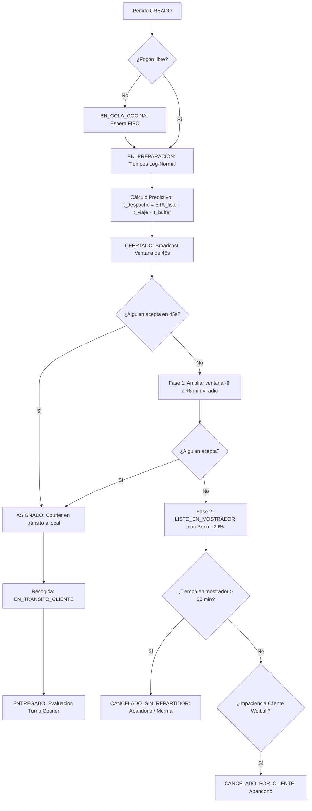

# PLAN DE ACCIÓN 02: MODELO CONCEPTUAL DES Y TEORÍA DE COLAS

## Módulos del Documento: 3.6 Modelo Conceptual DES (Pasos 1–6), 3.7 Análisis Analítico Preliminar con Teoría de Colas

## Criterios de Rúbrica Asociados: R4 (0.8), R5 (0.6)

---

### 1. Objetivos del Plan

Formalizar el modelo conceptual de Simulación de Eventos Discretos (DES) que gobierna el flujo de pedidos a domicilio, estableciendo las entidades, recursos finitos, variables de estado, eventos atómicos y diagrama de flujo con abandonos y reprocesos. Simultáneamente, formular y resolver el modelo analítico de teoría de colas ($M/M/c$) para el subsistema de despacho, verificando la Ley de Little y argumentando rigurosamente por qué las restricciones de la realidad justifican la construcción del simulador computacional.

---

### 2. Estructura y Contenidos Detallados por Sección

#### 2.1 Modelo Conceptual DES (Sección 3.6 & Criterio R4)

### 3.6 Modelo Conceptual DES (Pasos 1–6 de la Metodología)

El gemelo digital se fundamenta en un modelo de eventos discretos (DES) que orquesta la interacción entre clientes, restaurantes y flota.

#### 1. Entidades con sus Atributos
*   **Entidad Principal: Pedido (`Order`)**
    *   `id`: Identificador único de la orden.
    *   `restaurante_id`: Identificador del local emisor.
    *   `distancia_vial_km`: Distancia calculada con métrica Manhattan corregida por factor de sinuosidad vial ($\tau = 1.25$).
    *   `t_creacion`: Marca temporal de llegada del pedido.
    *   `t_listo`: Marca de tiempo de finalización en cocina y pase a mostrador.
    *   `t_mostrador`: Tiempo acumulado enfriándose en mostrador sin repartidor.
    *   `paciencia_max`: Tiempo límite antes del abandono del cliente (Weibull).
    *   `estado`: `CREADO`, `EN_COLA_COCINA`, `EN_PREPARACION`, `LISTO_EN_MOSTRADOR`, `OFERTADO`, `ASIGNADO`, `EN_TRANSITO_CLIENTE`, `ENTREGADO`, `CANCELADO_POR_CLIENTE`, `CANCELADO_SIN_REPARTIDOR`, `CANCELADO_INCIDENCIA_TRANSITO`.
*   **Entidad Dinámica: Repartidor (`Courier`)**
    *   `id`: Identificador único.
    *   `bateria_pct`: Porcentaje de carga actual (drenaje $0.15\%/\text{min}$ en movimiento).
    *   `tiempo_activo`: Tiempo acumulado en turno (límite duro de fatiga de 6 horas continuas).
    *   `estado`: `DESCONECTADO`, `CONECTADO_LIBRE`, `OFERTADO`, `VIAJANDO_A_COCINA`, `EN_MOSTRADOR`, `VIAJANDO_AL_CLIENTE`, `EVALUAR_TURNO`.

#### 2. Recursos del Sistema y Disciplina de Colas
*   **Red de Cocinas de Restaurantes (`KitchenNetwork`):** Capacidad finita de 10 restaurantes con $k_r \in [3, 6]$ fogones simultáneos, sumando 47 fogones totales en la red. Disciplina de cola: **FIFO** por restaurante.
*   **Flota de Repartidores (`CourierPool`):** Capacidad variable basada en conexiones ($c(t)$). Disciplina de asignación: Oferta simultánea (*Broadcast*) con filtro preventivo de batería ($\ge 15\%$) y priorización a órdenes urgentes en mostrador.

#### 3. Eventos y Variables de Estado
**Variables de Estado Principales:**
*   $N_{ped}(t)$: Número total de pedidos activos en el sistema.
*   $Q_{cocina}(t)$: Número de pedidos esperando o preparándose en fogones.
*   $Q_{mostrador}(t)$: Número de pedidos listos esperando asignación o recogida.
*   $R_{disp}(t)$: Repartidores libres y conectados.
*   $R_{ocup}(t)$: Repartidores en tránsito (hacia el restaurante o cliente).

#### 4. Diagrama de Flujo del Proceso (Con abandonos y reprocesos)

#### 5. Tabla relacional: Eventos atómicos vs. Variables de estado modificadas

| Evento Atómico | Transición de Estado | Impacto en Variables de Estado |
| :--- | :--- | :--- |
| **LlegadaPedido** | `Order` $\to$ CREADO | $N_{ped}(t) + 1$, evalúa $\lambda(t)$ del modelo NHPP[cite: 16]. |
| **InicioCocina** | `Order` $\to$ EN_PREPARACION | Ocupa fogón, $Q_{cocina}(t) + 1$[cite: 16]. Inicia retardo Log-Normal[cite: 16]. |
| **FinCocina** | `Order` $\to$ LISTO_EN_MOSTRADOR | Libera fogón, sella $t_{listo}$[cite: 16]. $Q_{cocina}(t) - 1$, $Q_{mostrador}(t) + 1$[cite: 16]. |
| **DisparoDespacho**| `Order` $\to$ OFERTADO | Inicia *timeout* de 45s[cite: 16]. Filtra flota por batería ($\ge 15\%$) y fatiga[cite: 16]. |
| **AceptacionRepartidor** | `Order` $\to$ ASIGNADO | $R_{disp}(t) - 1$, $R_{ocup}(t) + 1$[cite: 16]. $Q_{asig}(t) - 1$[cite: 16]. |
| **ExpiracionOferta** | Sistema Algorítmico | Dispara protocolo de contingencia (Bono +20% o ensancha $\Delta t_{buffer}$)[cite: 16]. |
| **LlegadaARestaurante** | `Courier` $\to$ EN_MOSTRADOR | Registra $t_{arribo}$, inicia cálculo térmico $\Delta t_{mostrador}$[cite: 16]. |
| **RecogidaPedido** | `Order` $\to$ EN_TRANSITO_CLIENTE | $Q_{mostrador}(t) - 1$[cite: 16]. Drena batería en ruta final[cite: 16]. |
| **EntregaFinal** | `Order` $\to$ ENTREGADO | $N_{ped}(t) - 1$, $R_{ocup}(t) - 1$[cite: 16]. Si $T_{turno} \ge 6\text{h} \to$ Logout forzado[cite: 16]. |
| **Cancelaciones** | `Order` $\to$ CANCELADO_... | $N_{ped}(t) - 1$[cite: 16]. Cierra ciclo prematuro por impaciencia, merma o siniestro[cite: 16]. |

#### 2.2 Análisis Analítico con Teoría de Colas (Sección 3.7 & Criterio R5)

Para establecer una línea base de comparación matemática, el subsistema de despacho de repartidores se modela teóricamente como una cola multicanal markoviana $M/M/c$. Este modelo asume llegadas de pedidos exponenciales con tasa $\lambda$, tiempos de servicio exponenciales con tasa $\mu$, y una flota homogénea de $c$ servidores, que son los repartidores.

Las métricas en estado estable se rigen por las siguientes ecuaciones cerradas, condicionadas a la estabilidad del sistema donde el factor de utilización es $\rho = \frac{\lambda}{c \mu} < 1$:

1. Probabilidad de sistema vacío ($P_0$):

   $$P_0 = \left[ \sum_{n=0}^{c-1} \frac{(c\rho)^n}{n!} + \frac{(c\rho)^c}{c!(1-\rho)} \right]^{-1}$$

2. Probabilidad de espera (Fórmula C de Erlang, $P_w$):

   $$P_w = \frac{(c\rho)^c}{c!(1-\rho)} P_0$$

3. Longitud y tiempos de espera (Ley de Little):

   El número promedio de pedidos esperando en cola ($L_q$) se define como:

   $$L_q = \frac{P_w \cdot \rho}{1 - \rho}$$

   Aplicando la Ley de Little ($L = \lambda W$ y $L_q = \lambda W_q$), derivamos los tiempos medios:

   * **Tiempo en cola:** $W_q = \frac{L_q}{\lambda}$
   * **Tiempo total en el sistema:** $W = W_q + \frac{1}{\mu}$
   * **Inventario total:** $L = \lambda W$

**Explicación de la Disparidad:** Aunque el modelo $M/M/c$ ofrece una cota teórica perfecta, fracasa al intentar capturar la dinámica operativa real de la plataforma en la ciudad por tres razones fundamentales:

1. **Violación de Estacionariedad ($\rho > 1$):** El modelo analítico exige colas estables. En nuestro entorno real, las ráfagas no estacionarias (NHPP) provocan saturaciones del $106\%$ en el almuerzo y $130\%$ en la cena, lo que matemáticamente colapsaría la fórmula de Erlang hacia el infinito, mientras que en la realidad genera colas finitas con abandonos.
2. **Distribuciones no exponenciales:** Los tiempos de cocción reales siguen una distribución Log-Normal y las rutas están penalizadas por un factor de sinuosidad vial ($\tau = 1.25$). Estas variables carecen de la propiedad de pérdida de memoria (*memoryless*), invalidando el supuesto markoviano.
3. **Comportamiento adaptativo y límites físicos:** La teoría clásica asume clientes con paciencia infinita y servidores inagotables. Nuestro gemelo digital en SimPy incorpora la tolerancia límite del cliente (curva Weibull), el agotamiento de la batería de los móviles y el límite duro de fatiga psicomotriz de 6 horas de los repartidores.

---

### 3. Criterios de Aceptación y Verificación

* [ ] Todas las entidades poseen identificador, tipo y marcas de tiempo asociadas.

* [ ] El diagrama de flujo modela bifurcaciones (aceptar/rechazar), abandonos (cancelación) y reprocesos.
* [ ] La tabla evento–estado detalla exactamente qué variable se incrementa o decrementa.
* [ ] El modelo analítico incluye el cálculo formal paso a paso de $P_0, P_w, L_q, W_q, W, L$.
* [ ] La Ley de Little se comprueba con valores numéricos coherentes.
* [ ] Se incluye la discusión formal de al menos 3 supuestos analíticos que fallan en la realidad.
