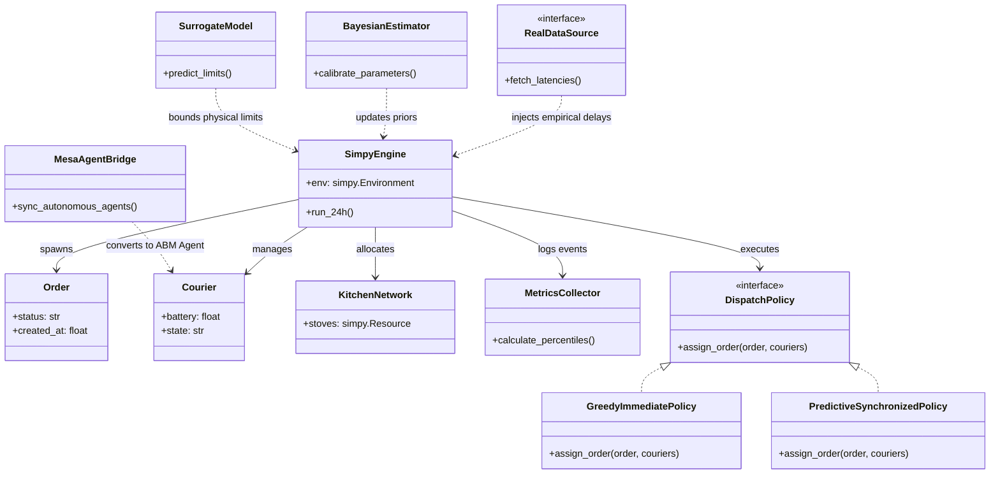

# PLAN DE ACCIÓN 03: PARÁMETROS, MÉTRICAS Y DISEÑO POO

## Módulos del Documento: 3.8 Parámetros, Distribuciones y Plan de Datos, 3.9 Métricas de Desempeño (KPIs), 3.10 Diseño de Clases POO (Paso 8)

## Criterios de Rúbrica Asociados: R6 (0.4), R7 (0.3), R9 (0.5 parcial)

---

### 1. Objetivos del Plan

Establecer las distribuciones de probabilidad rigurosamente fundamentadas para cada parámetro estocástico del modelo de pedidos a domicilio, formular el plan de telemetría y recolección para la Entrega 2, definir los 4 a 6 KPIs operacionales (incluyendo percentiles $p95/p99$), y diseñar la arquitectura orientada a objetos (POO) mediante patrones de diseño (Strategy) con puntos de extensión explícitos para los módulos futuros (Bayesiano, Subrogado y Multiagente).

---

### 2. Estructura y Contenidos Detallados por Sección

#### 2.1 Parámetros, Distribuciones y Plan de Datos (Sección 3.8 & Criterio R6)

Para garantizar la fidelidad estocástica del gemelo digital y evitar las limitaciones de la distribución exponencial plana, el modelo adopta las siguientes distribuciones:

**Tabla Técnica de Variables Aleatorias**

* **Tiempo de Preparación en Cocina ($T_{\text{cocina}}$):** Distribución Log-Normal con $\mu_{\ln}=2.85$ y $\sigma_{\ln}=0.35$ (media $\approx 18.5$ min). **Fuente:** DoorDash Engineering (2020) y Alnaggar et al. (2021). **Justificación:** Garantiza tiempos estrictamente positivos y captura la "cola larga" de demoras en platos complejos.
* **Impaciencia del Cliente ($T_{\text{canc}}$):** Distribución Weibull con $k=2.4$ y $\lambda_w=40$ min. **Fuente:** Bai et al. (2019). **Justificación:** El parámetro $k > 1$ modela una tasa de riesgo creciente, reflejando cómo la frustración humana se acelera tras superar los 35 minutos.
* **Velocidad de Desplazamiento ($V_{\text{rep}}$):** Normal Truncada en $[8, 25]$ km/h con $\mu=18$ km/h y $\sigma=3$ km/h. **Fuente:** Dablanc et al. (2018). **Justificación:** Representa la velocidad media en tráfico urbano, acotando el rango para impedir la generación de velocidades negativas.
* **Distancia Cinemática Efectiva ($d_{\text{vial}}$):** Distancia Manhattan con factor de sinuosidad $\tau = 1.25$. **Fuente:** Boeing (2019) y Ballou et al. (2002). **Justificación:** Incorpora un 25% de recorrido extra por el sentido de las vías y desvíos urbanos.
* **Llegada de Pedidos ($\lambda_{\text{pedidos}}(t)$):** Proceso de Poisson No Homogéneo (NHPP). **Fuente:** Deliverect Industry Insights (2023). **Justificación:** Captura la saturación severa en picos de almuerzo ($2.70$ ped/min) y cena ($3.30$ ped/min).

**Plan de Recolección de Datos para Entrega 2**

1. **Entorno Simulado (SimPy):** La clase `MetricsCollector` capturará eventos estocásticos y calculará percentiles $p_{95}$ y $p_{99}$ con `numpy`, exportando a `datos/simulation_results.json`.
2. **Entorno Real (API REST):** Mediante *middleware* en FastAPI y la librería `psutil`, se medirán las latencias de los endpoints, las tasas de llegada reales (pedidos procesados por segundo), y el uso de CPU/RAM.
3. **Escenario de Carga (Locust):** Las mediciones se realizarán inyectando un escenario de estrés concurrente simulando el "Pico de Cena" (más de 100 usuarios virtuales concurrentes emitiendo órdenes continuas durante 5 minutos), exportando la telemetría a `datos/telemetry_log.csv`.

#### 2.2 Métricas de Desempeño / KPIs (Sección 3.9 & Criterio R7)

Para evaluar cuantitativamente el impacto de las políticas de despacho, se definen seis métricas clave (KPIs). La extracción de estas métricas asegura la evaluación de percentiles de cola superior ($p_{95}$ y $p_{99}$), mitigando el sesgo de los promedios frente a eventos extremos de congestión.

| KPI | Descripción y Fórmula Operacional | Unidad | Umbral Aceptable | Pregunta de Decisión que Responde |
| :--- | :--- | :---: | :---: | :--- |
| **$W_{\text{total\_p95}}$** | **Tiempo de ciclo total (Percentil 95):** Tiempo transcurrido desde la creación de la orden hasta la entrega final al cliente. | Minutos | $\le 40$ min | ¿La política de despacho afecta el tiempo de entrega percibido por los usuarios extremos en horas pico? |
| **$T_{\text{espera\_rest}}$** | **Espera ociosa del repartidor:** Promedio de tiempo inactivo que el repartidor pasa en el mostrador esperando la comida ($t_{\text{listo}} - t_{\text{arribo\_rep}}$). | Minutos | $\le 3.5$ min | ¿En qué porcentaje se reduce el tiempo ocioso del conductor al cambiar de asignación voraz a despacho predictivo? |
| **$\rho_{\text{rep}}(t)$** | **Utilización de la flota:** Fracción de la jornada de 6 horas en la que el repartidor está activamente asignado o en tránsito. | Porcentaje | $75\% - 85\%$ | ¿Cuántos repartidores ($c_{\min}$) se necesitan incentivar en el pico de cena para mantener la flota rentable pero no colapsada? |
| **$P_{\text{canc}}$** | **Tasa de cancelación:** Proporción de pedidos abandonados por impaciencia (Weibull) frente al total de órdenes emitidas diarias. | Porcentaje | $< 3.0\%$ | ¿El retraso intencional del despacho sincronizado incrementa el riesgo de cancelación del cliente? |
| **$T_{\text{mostrador\_p95}}$** | **Tiempo en mostrador (Percentil 95):** Tiempo que la comida permanece empacada antes de ser recogida ($t_{\text{arribo\_rep}} - t_{\text{listo}}$). | Minutos | $\le 6.0$ min | ¿Cuál es el valor óptimo del *buffer* ($\Delta t$) para no comprometer la calidad térmica de los alimentos? |
| **$T_{\text{lat\_api\_p99}}$** | **Latencia de Rastreo (Percentil 99):** Tiempo de respuesta del endpoint HTTP `GET /tracking` bajo carga concurrente medida en Locust. | Milisegundos | $\le 180$ ms | ¿Cómo impacta la frecuencia de telemetría de los repartidores en los recursos de CPU/RAM del servidor backend? |

#### 2.3 Diseño Preliminar de Clases POO (Sección 3.10 & Criterio R9)

El diseño arquitectónico del simulador desacopla las entidades del motor de eventos, utilizando el patrón *Strategy* para las políticas de decisión y estableciendo interfaces claras para la futura integración de los Módulos II, III y IV.

---

### 3. Criterios de Aceptación y Verificación

* [ ] Ninguna distribución de tiempo continuo es asignada como exponencial de forma arbitraria sin justificación formal.

* [ ] El plan de datos detalla herramientas reales (Locust, psutil, middleware) y tipos de carga.
* [ ] Se especifican exactamente 6 métricas cuantificables y al menos dos son percentiles ($p95$ y $p99$).
* [ ] El diagrama de clases implementa formalmente el patrón Strategy para las dos políticas de la Opción 1 (Voraz vs. Sincronizada).
* [ ] Se explicitan los puntos de conexión futuros para Módulos II, III y IV.
