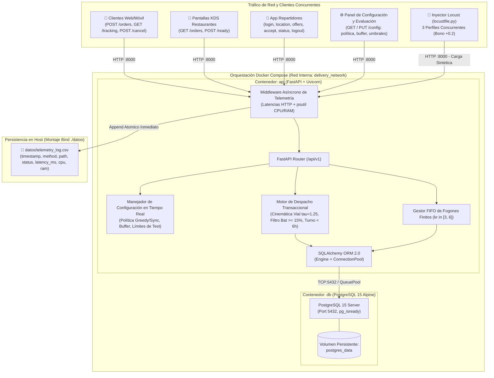
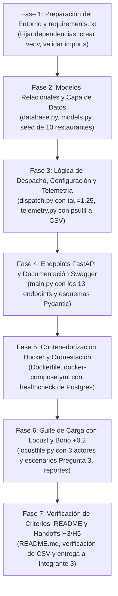
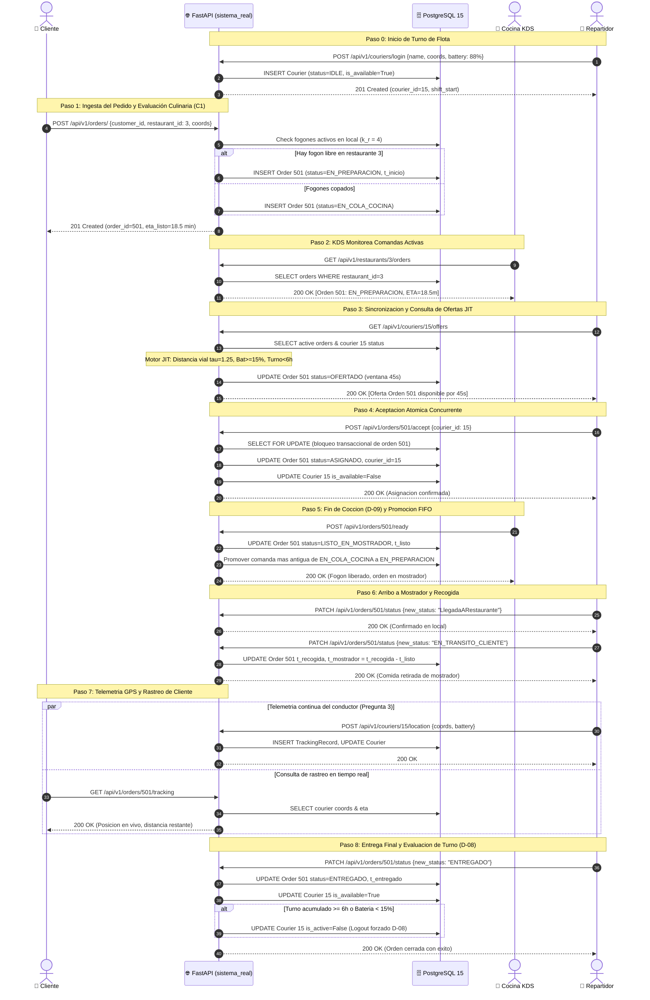

# PLAN DE ACCIÓN 06: IMPLEMENTACIÓN INTEGRAL DE LA API REST (FastAPI), DEPENDENCIAS Y PRUEBAS DE CARGA (Locust)
## Módulo de Infraestructura, DevOps y Prototipo Real Mínimo — Entrega Parcial 1
### Proyecto de Aula: Gemelo Digital y Simulación Estocástica (*QuickDelivery Sim*)

> **Marco de Referencia y Gobernanza:**  
> * **Responsable Asignado:** **Integrante 2 (Líder de Infraestructura y DevOps)**, según la [Matriz Operativa de Asignaciones (`docs/Asignaciones_Equipo_E1.md`)](../Asignaciones_Equipo_E1.md).  
> * **Criterios de Rúbrica Oficial a Cubrir:** **C1, C2** (Elegibilidad), **R8** (Prototipo Técnico y Repositorio, 0.70 / 5.0 pts) y **Bono de Carga Sintética** (+0.20 pts sobre la nota final).  
> * **Directrices Arquitectónicas:** Decisiones **D-04** (Arquitectura Multicontenedor Docker con PostgreSQL 15), **D-08** (Verificación preventiva de batería y límite de 6h), **D-09** (Endpoint KDS `ready`, pase a mostrador y promoción FIFO), **D-10** (Desacoplamiento estricto SimPy vs. API) y **D-11** (15 Exclusiones formales del sistema) documentadas en [`docs/Auditoria.md`](../Auditoria.md) y [`docs/Flujo_Completo_y_Dinamica_24h.md`](../Flujo_Completo_y_Dinamica_24h.md).  
> * **Resolución de Fisuras y Casos Límite (Sesión `/grill-me`):** Incorporación de endpoints de presencia de repartidores (`login`, `location`, `logout`), cancelación voluntaria del cliente por impaciencia (`/cancel`), endpoint de configuración dinámica en caliente (`/config/`), evaluación Just-In-Time de ofertas y promoción FIFO automática de fogones culinarios.  
> * **Objetivo de Calificación:** Asegurar **0.7 / 0.7 en R8** y los **+0.2 pts de Bono** mediante un despliegue reproducible con un solo comando (`docker compose up --build`), telemetría real en `datos/telemetry_log.csv` y reporte de carga sin fallos ($0\%$) en Locust.

---

## 1. Arquitectura del Sistema Real Mínimo

El prototipo del sistema real desacoplado opera en **tiempo de reloj real (*wall-clock time*)** y se compone de dos contenedores orquestados mediante Docker Compose, comunicados a través de una red interna bridge:



---

## 2. Archivo de Requerimientos Dedicado (`requirements.txt`)

Para cumplir con el requisito de **entorno reproducible con versiones congeladas** (Criterio R8), se define un archivo de dependencias estricto y compatible con Python 3.11:

```ini
# ==============================================================================
# DEPENDENCIAS DEL SISTEMA REAL Y TELEMETRÍA (FastAPI, BD, Métricas y Locust)
# Proyecto de Aula: QuickDelivery Sim — Entrega 1
# ==============================================================================

# Framework Web y Servidor ASGI de Alto Rendimiento
fastapi==0.110.0
uvicorn[standard]==0.29.0
pydantic==2.6.4
pydantic-settings==2.2.1

# Persistencia y Base de Datos Relacional
SQLAlchemy==2.0.29
psycopg2-binary==2.9.9

# Telemetría de Sistema y Monitoreo de Recursos del Host
psutil==5.9.8

# Inyección de Tráfico Sintético y Pruebas de Carga (Bono +0.2)
locust==2.24.1
requests==2.31.0
httpx==0.27.0

# Librerías Científicas y Simulación (Entorno compartido del proyecto)
simpy==4.1.1
numpy==1.26.4
scipy==1.13.0
```

### Justificación Técnica de Dependencias:
1. **`fastapi==0.110.0` y `pydantic==2.6.4`:** Validación estricta de tipos, serialización nativa de alto rendimiento con Pydantic V2 (core en Rust) y generación automática de Swagger UI en `/docs`.
2. **`uvicorn[standard]==0.29.0`:** Servidor ASGI de producción con `uvloop` y `httptools` para soportar cientos de peticiones concurrentes por segundo bajo Locust con latencias sub-milimétricas.
3. **`SQLAlchemy==2.0.29` y `psycopg2-binary==2.9.9`:** ORM moderno en sintaxis 2.0 con pool de conexiones (`QueuePool`) optimizado para evitar fugas de sockets bajo alta concurrencia.
4. **`psutil==5.9.8`:** Instrumentación del sistema operativo para interrogar porcentajes de CPU y consumo de memoria residente (RSS en MB) del contenedor sin penalizar la latencia del middleware.
5. **`locust==2.24.1`:** Motor de pruebas de carga en Python puro, permitiendo orquestar usuarios asíncronos mediante *gevent* y exportar estadísticas directas en CSV y HTML.

---

## 3. Esquema de Datos y Persistencia Relacional (`models.py` y `database.py`)

### 3.1 Conexión y Sesiones (`sistema_real/app/database.py`)
* Conexión contra `postgresql://delivery_user:delivery_pass@db:5432/delivery_db`.
* Pool de conexiones configurado con `pool_size=20`, `max_overflow=10`, y `pool_pre_ping=True` para descartar conexiones muertas tras reinicios de base de datos.
* Soporte de fallback opcional a SQLite en memoria (`sqlite:///:memory:`) para tests unitarios locales sin levantar Docker.
* Función generadora de sesión `get_db()` para inyección de dependencias en endpoints de FastAPI (`Depends(get_db)`).

### 3.2 Modelos Relacionales SQLAlchemy (`sistema_real/app/models.py`)

```python
# Entidades Principales en PostgreSQL
1. RestaurantModel:
   - id: Integer (PK, 1 a 10)
   - name: String (Nombre del local, ej. 'Burger Station - Chapinero')
   - coord_x: Float (Coordenada X en km, [0.0, 6.0])
   - coord_y: Float (Coordenada Y en km, [0.0, 6.0])
   - kitchen_capacity: Integer (Fogones kr in [3, 6], total red: 47)
   - created_at: DateTime

2. OrderModel:
   - id: Integer (PK, autoincremental)
   - customer_id: String (Identificador de cliente, ej. 'CUST-8492')
   - restaurant_id: Integer (FK -> RestaurantModel.id)
   - status: Enum (11 Estados DES: 'CREADO', 'EN_COLA_COCINA', 'EN_PREPARACION',
                   'LISTO_EN_MOSTRADOR', 'OFERTADO', 'ASIGNADO', 'EN_TRANSITO_CLIENTE',
                   'ENTREGADO', 'CANCELADO_POR_CLIENTE', 'CANCELADO_SIN_REPARTIDOR',
                   'CANCELADO_INCIDENCIA_TRANSITO')
   - delivery_coord_x: Float (Coordenada entrega X en km, [0.0, 6.0])
   - delivery_coord_y: Float (Coordenada entrega Y en km, [0.0, 6.0])
   - eta_listo: Float (Minuto estimado de disponibilidad física)
   - t_creado: DateTime (Marca de tiempo de creación)
   - t_inicio_cocina: DateTime (Marca de tiempo en que tomó fogón)
   - t_listo: DateTime (Marca de tiempo en que pasó a mostrador)
   - t_recogida: DateTime (Marca de tiempo de retiro por courier)
   - t_entregado: DateTime (Marca de tiempo de entrega final)
   - courier_id: Integer (FK -> CourierModel.id, nullable)
   - is_urgent: Boolean (True si conmutó a bono +20% tras ready en mostrador)
   - cancellation_reason: String (Nullable: 'CUSTOMER_IMPATIENCE', 'COUNTER_TIMEOUT_20MIN', 'INCIDENT')

3. CourierModel:
   - id: Integer (PK, autoincremental)
   - name: String (Nombre o código de repartidor)
   - current_coord_x: Float (Ubicación actual X en km, [0.0, 6.0])
   - current_coord_y: Float (Ubicación actual Y en km, [0.0, 6.0])
   - battery_level: Float (Nivel de batería %, [0.0, 100.0])
   - shift_start_time: DateTime (Inicio de conexión, cota dura de 6h)
   - shift_duration_limit_min: Float (Default 360 min, parametrizable en pruebas)
   - is_available: Boolean (True si está libre y calificado)
   - is_active: Boolean (True si está conectado; False tras logout)

4. TrackingRecordModel:
   - id: Integer (PK, autoincremental)
   - order_id: Integer (FK -> OrderModel.id, nullable)
   - courier_id: Integer (FK -> CourierModel.id)
   - coord_x: Float
   - coord_y: Float
   - battery_level: Float
   - recorded_at: DateTime
```

### 3.3 Esquemas de Validación Pydantic v2
* `OrderCreateSchema`: Ingesta con validación de coordenadas en el cuadrante $[0.0, 6.0]\text{ km}$ con `Field(ge=0.0, le=6.0)` y `restaurant_id \in [1, 10]`.
* `OrderResponseSchema`: Devuelve `id`, `status`, `eta_listo`, `t_creado`, `courier_id`.
* `OrderCancelSchema`: Payload de cancelación `{ "reason": str }`.
* `KDSOrderResponseSchema`: Consulta de comandas en cocina (`order_id`, `status`, `tiempo_espera_cola`, `eta_listo`). **Exclusión 2:** Prohibido retornar listas de platos, recetas o ingredientes.
* `OrderReadyResponseSchema`: Confirmación de pase a mostrador (`order_id`, `status='LISTO_EN_MOSTRADOR'`, `t_listo`, `is_urgent=True`).
* `CourierLoginSchema`: Payload de login `{ "name": str, "initial_coord_x": float, "initial_coord_y": float, "battery_level": Optional[float] }`.
* `CourierLocationUpdateSchema`: Reporte periódico de telemetría GPS `{ "coord_x": float, "coord_y": float, "battery_level": float }`.
* `CourierOfferResponseSchema`: Lista de órdenes calificadas para el repartidor (`order_id`, `restaurant_id`, `distancia_vial_km`, `tiempo_viaje_est_min`, `tarifa_propuesta`, `segundos_restantes_oferta`).
* `OrderAcceptSchema`: Payload de aceptación `{ "courier_id": int }`.
* `OrderAcceptResponseSchema`: Confirmación de asignación atómica (`order_id`, `courier_id`, `status='ASIGNADO'`, `assigned_at`).
* `OrderStatusUpdateSchema`: Transición de estado (`courier_id`, `new_status`, `current_coord_x`, `current_coord_y`, `notes`).
* `TrackingResponseSchema`: Estado actual, posición del courier, distancia restante vial y tiempo estimado.
* `SystemConfigSchema`: Esquema de configuración en tiempo real (`active_dispatch_policy`, `buffer_delta_t_min`, `max_shift_duration_min`, `anti_limbo_max_counter_min`, `urgency_bonus_multiplier`, `min_battery_threshold_pct`).
* `HealthResponseSchema`: Estado de servicio, uptime, latencia promedio, % CPU, MB de RAM y estado de la conexión a PostgreSQL.

---

## 4. Catálogo Detallado de los 13 Endpoints de la API (Estructurados por Actor)

La API expone **13 endpoints REST específicos del dominio**, modelando con absoluta fidelidad la interacción transaccional de los 3 actores autónomos (Clientes, Restaurantes, Repartidores) y los módulos de Configuración y Telemetría:

| Actor | # | Método | Ruta del Endpoint | Entrada (Payload / Params) | Salida (Respuesta HTTP) | Efecto Transaccional / Dominio |
| :--- | :---: | :---: | :--- | :--- | :--- | :--- |
| **👤 Clientes** | **E1** | `POST` | `/api/v1/orders/` | `{ customer_id, restaurant_id, delivery_coord_x, delivery_coord_y }` | `201 Created` con comanda persistida. | **Promoción Culinaria FIFO:** Si hay fogones libres (`count < k_r`), pasa a `EN_PREPARACION`; si no, entra a esperar en `EN_COLA_COCINA`. Calcula $\text{ETA}_{\text{listo}}$. |
| | **E2** | `GET` | `/api/v1/orders/{id}/tracking` | `id: int` (order_id) | `200 OK` con coordenadas del courier, estado del viaje y distancia vial restante. | Permite al cliente vigilar el trayecto del repartidor en tiempo real y alimentar el modelo de impaciencia (Weibull). |
| | **E3** | `POST` | `/api/v1/orders/{id}/cancel` | `id: int`, `{ "reason": str }` | `200 OK` con orden transicionada a `CANCELADO_POR_CLIENTE`. | **Cancelación Voluntaria:** Libera el fogón de cocina (promoviendo la siguiente orden FIFO) o libera al repartidor si ya estaba asignado. |
| **🍳 Restaurantes** | **E4** | `GET` | `/api/v1/restaurants/{id}/orders` | `id: int` (1 a 10), query opcional `?status=...` | `200 OK` con array de comandas activas sin ingredientes (**Exclusión 2**). | Permite a la cocina visualizar pedidos en cola FIFO y en preparación. **Anti-limbo JIT:** Si alguna orden en mostrador lleva $\ge 20\text{ min}$, la marca `CANCELADO_SIN_REPARTIDOR`. |
| | **E5** | `POST` | `/api/v1/orders/{id}/ready` | `id: int` (order_id) | `200 OK` con comanda actualizada a `"LISTO_EN_MOSTRADOR"`. | **Decisión D-09 y Promoción FIFO:** Libera el fogón, sella $t_{\text{listo}}$, inicia temporizador de mostrador, activa bono urgente (+20%) y promueve automáticamente la comanda FIFO más antigua en `EN_COLA_COCINA`. |
| **🛵 Repartidores** | **E6** | `POST` | `/api/v1/couriers/login` | `{ name, initial_coord_x, initial_coord_y, battery_level }` | `201 Created` con `courier_id`, estado activo y token/id de sesión. | **Inicio de Turno (NHPP):** Registra hora de inicio de conexión (`shift_start_time`), nivel de batería inicial ($\sim \mathcal{N}(95\%, 5\%)$) y habilita disponibilidad. |
| | **E7** | `POST` | `/api/v1/couriers/{id}/location` | `id: int`, `{ coord_x, coord_y, battery_level }` | `200 OK` con confirmación de actualización. | **Telemetría GPS (Pregunta 3):** Actualiza posición y batería en tiempo real; registra traza en `tracking_records` (permite contrastar pings a 5s vs 15s en Locust). |
| | **E8** | `GET` | `/api/v1/couriers/{id}/offers` | `id: int` (courier_id) | `200 OK` con array de órdenes a las que está calificado. | **Evaluación Just-In-Time:** Evalúa órdenes en cocción/mostrador según política activa. **Filtros D-08:** Valida $\text{Bat} - \Delta\text{Bat} \ge 15\%$, turno $<6\text{ h}$ y distancia vial $\tau=1.25$. Ventana de 45 s. |
| | **E9** | `POST` | `/api/v1/orders/{id}/accept` | `id: int` (order_id), `{ "courier_id": int }` | `200 OK` (éxito) o `409 Conflict` (si otro repartidor ya la tomó o expiró ventana de 45 s). | **Bloqueo Concurrente:** El primer repartidor que pulsa gana el viaje. Cambia orden a `ASIGNADO`, vincula `courier_id` y pasa al repartidor a ocupado (`VIAJANDO_AL_LOCAL`). |
| | **E10** | `PATCH` | `/api/v1/orders/{id}/status` | `id: int`, `{ courier_id, new_status, coord_x, coord_y }` | `200 OK` con estado transicionado y confirmación de hito físico. | **Gestión de Hitos:**<br>1. `LlegadaARestaurante`: arriba a mostrador.<br>2. `EN_TRANSITO_CLIENTE`: recoge comanda y sella $t_{\text{mostrador}} = \max(0, t_{\text{recogida}} - t_{\text{listo}})$.<br>3. `ENTREGADO`: culmina entrega, libera al conductor y ejecuta logout si cumplió 6h o batería $<15\%$ (D-08).<br>4. `CANCELADO_INCIDENCIA_TRANSITO`: siniestro en ruta. |
| | **E11** | `POST` | `/api/v1/couriers/{id}/logout` | `id: int` (courier_id) | `200 OK` con confirmación de desconexión. | **Cierre de Turno:** Desactiva al repartidor (`is_active = False`, `is_available = False`). Se invoca voluntariamente o de forma forzada por límite de 6 horas o batería $< 15\%$. |
| **⚙️ Configuración**| **E12** | `GET` / `PUT` | `/api/v1/config/` | GET: ninguno.<br>PUT: `{ active_dispatch_policy, buffer_delta_t_min, max_shift_duration_min, ... }` | `200 OK` con los parámetros vigentes del sistema. | **Control Dinámico en Tiempo Real:** Permite conmutar la política entre `greedy` y `synchronized`, alterar $\Delta t_{\text{buffer}} \in [0, 5]\text{ min}$ y relajar límites temporales para tests ágiles en Locust. |
| **🌐 DevOps / Salud**| **E13** | `GET` | `/api/v1/telemetry/health` | Ninguno | `200 OK` con `{ status: "healthy", db: "connected", cpu_percent: float, memory_mb: float, latency_avg_ms: float }`. | Diagnóstico continuo de contención de hardware y verificación de salud de la base de datos PostgreSQL. |

---

## 5. Lógica del Motor de Despacho y Reglas de Negocio (`dispatch.py`)

El módulo `sistema_real/app/dispatch.py` implementa la cinemática vial y los algoritmos transaccionales:

1. **Distancia Vial con Sinuosidad Urbana ($\tau = 1.25$ - Decisión D-11 Excl-4):**
   $$d_{\text{vial}}(A, B) = 1.25 \times (|x_B - x_A| + |y_B - y_A|)$$
2. **Tiempo Estimado de Viaje a Velocidad Media de $18\text{ km/h}$:**
   $$t_{\text{viaje\_min}} = \max\left(0.0, \frac{d_{\text{vial}}}{18.0} \times 60.0\right)$$
3. **Calificación Just-In-Time de Ofertas (`get_qualified_offers` - Endpoint E8):**
   - Consulta pedidos en `EN_PREPARACION` o `LISTO_EN_MOSTRADOR`.
   - Si la política activa es `synchronized`, calcula la ventana de emisión:
     $$t_{\text{despacho}} = \text{ETA}_{\text{listo}} - t_{\text{viaje\_local}} + \Delta t_{\text{buffer}}$$
     La orden califica para el repartidor si la hora actual está dentro de $[t_{\text{despacho}} - 1.0, \text{ETA}_{\text{listo}} + 2.0]\text{ min}$ o si ya pasó a mostrador.
   - Si la política es `greedy`, califica de inmediato cualquier orden activa sin asignar.
   - **Filtro Preventivo de Batería ($\ge 15\%$ - Decisión D-08):**
     $$\Delta \text{Bat}_{\text{est}} = (t_{\text{viaje\_local}} + t_{\text{espera\_mostrador}} + t_{\text{viaje\_cliente}}) \times 0.15\%/\text{min}$$
     *El conductor se excluye de la oferta si $\text{Bat}_{\text{actual}} - \Delta \text{Bat}_{\text{est}} < \text{config.min\_battery\_threshold\_pct}$.*
   - **Filtro Duro de Turno de Conexión ($< 6\text{ horas}$ - Decisión D-08):**
     *Se excluye si el tiempo transcurrido desde `shift_start_time` supera `config.max_shift_duration_min`.*
4. **Aceptación Atómica Concurrente (`accept_order` - Endpoint E9: `POST /api/v1/orders/{id}/accept`):**
   - Recibe `order_id` en la URL y `{ "courier_id": int }` en el cuerpo JSON.
   - Bloqueo transaccional de base de datos (`SELECT FOR UPDATE`). Si la orden ya pasó a `ASIGNADO` por otro repartidor o expiró la ventana de 45 s, retorna `409 Conflict`.
   - Si gana la oferta, actualiza `order.status = 'ASIGNADO'`, vincula `order.courier_id = courier_id` y marca al repartidor como ocupado (`is_available = False`).
5. **Máquina de Transiciones de Orden y Flexibilidad D-08 (`transition_order_status` - Endpoint E10):**
   - *Hito 1 (`LlegadaARestaurante`):* Arribo a mostrador; actualiza coordenadas del repartidor.
   - *Hito 2 (`EN_TRANSITO_CLIENTE` / Recogida):* Sella marca temporal `t_recogida` y calcula el tiempo de enfriamiento en mostrador:
     $$t_{\text{mostrador}} = \max(0, t_{\text{recogida}} - t_{\text{listo}})$$
   - *Hito 3 (`ENTREGADO` / Entrega Final):* Sella `t_entregado`, cierra la orden con éxito y libera al conductor (`is_available = True`). **Regla de Flexibilidad D-08:** Evalúa si superó la duración máxima de turno permitida o si $\text{Bat} < 15\%$; de ser así, ejecuta el `LogoutRepartidor` automático impidiendo nuevas asignaciones.
   - *Hito 4 (`CANCELADO_INCIDENCIA_TRANSITO`):* Protocolo de contingencia por siniestro vial o avería mecánica en ruta.
6. **Protocolo Anti-Limbo en Mostrador (Decisión D-07):**
   - Durante la consulta de comandas KDS (`E4`) u ofertas (`E8`), si $t_{\text{now}} - t_{\text{listo}} \ge \text{config.anti\_limbo\_max\_counter\_min}$, la orden transiciona automáticamente a `CANCELADO_SIN_REPARTIDOR`, asumiendo merma y reembolsando al cliente.

---

## 6. Middleware Asíncrono de Telemetría (`telemetry.py`)

Para cumplir rigurosamente el **Criterio R8 de Telemetría Base** y proveer insumos para el análisis del Integrante 3 (Handoff H3):

* **Métricas Capturadas en Cada Solicitud HTTP:**
  1. `timestamp`: Marca temporal en formato ISO-8601 con milisegundos.
  2. `method`: Verbo HTTP (`GET`, `POST`, `PATCH`, `PUT`).
  3. `path`: Ruta del recurso invocado.
  4. `status_code`: Código numérico de respuesta (`200`, `201`, `409`, `422`, `500`).
  5. `latency_ms`: Duración de procesamiento interno en milisegundos calculada con `time.perf_counter()`.
  6. `cpu_percent`: Carga porcentual de procesador mediante `psutil.cpu_percent(interval=None)`.
  7. `memory_mb`: Memoria física RAM residente en MB (`psutil.Process().memory_info().rss / 1024**2`).
* **Destino de Registro:** Archivo compartido `datos/telemetry_log.csv`.
* **Escritura Atómica en Modo Append con Flush Inmediato:**
  Se utiliza apertura protegida en modo `open(..., 'a', buffering=1, encoding='utf-8')` con escritura de línea atómica para evitar cuellos de botella de I/O y garantizar que no existan líneas corruptas bajo el bombardeo de Locust.

---

## 7. Contenedorización Reproducible (`Dockerfile` y `docker-compose.yml`)

### 7.1 `Dockerfile` (Optimizado para Python 3.11-slim)
* Imagen base: `python:3.11-slim`.
* Instalación de dependencias de compilación para `psutil` y `psycopg2` (`gcc`, `libpq-dev`).
* Creación de usuario no root (`appuser`) para buenas prácticas de seguridad.
* Exposición del puerto `8000`.
* Comando de arranque:
  `uvicorn sistema_real.app.main:app --host 0.0.0.0 --port 8000 --workers 2`

### 7.2 `docker-compose.yml` (Arquitectura Multicontenedor)
* **Servicio `db`:**
  * Imagen: `postgres:15-alpine`.
  * Variables de entorno: `POSTGRES_DB=delivery_db`, `POSTGRES_USER=delivery_user`, `POSTGRES_PASSWORD=delivery_pass`.
  * Volumen montado: `postgres_data:/var/lib/postgresql/data`.
  * Healthcheck activo: `test: ["CMD-SHELL", "pg_isready -U delivery_user -d delivery_db"]`, con `interval: 5s`, `timeout: 3s`, `retries: 5`.
* **Servicio `api`:**
  * Build: `.` (usa `Dockerfile` y `requirements.txt`).
  * Dependencia: `depends_on: { db: { condition: service_healthy } }` para garantizar que la API inicie solo cuando PostgreSQL acepte conexiones.
  * Puertos: `"8000:8000"`.
  * Volumen montado: `./datos:/app/datos` para persistir `telemetry_log.csv` en el host del proyecto.
  * Red: `delivery_network` (bridge interno).

---

## 8. Pruebas de Carga Sintética con Locust (`locustfile.py` - Bono +0.2)

Para obtener el **Bono Opcional de Carga Sintética (+0.2 pts)**, se implementa `locustfile.py` simulando la dinámica multi-actor de la plataforma:

### 8.1 Los 3 Perfiles de Usuario Concurrentes
1. **`CustomerUser` (Weight = 5):**
   - Tarea 1 (`@task(3)`): Emite pedidos aleatorios hacia uno de los 10 restaurantes (`POST /api/v1/orders/`). Almacena el `order_id` creado.
   - Tarea 2 (`@task(5)`): Consulta el estado y telemetría de rastreo (`GET /api/v1/orders/{order_id}/tracking`).
   - Tarea 3 (`@task(1)`): Simula cancelación esporádica por impaciencia (`POST /api/v1/orders/{order_id}/cancel`).
   - Tiempos de espera: `between(1, 3)` segundos.
2. **`RestaurantUser` (Weight = 2):**
   - Tarea 1 (`@task(4)`): Monitorea la cola KDS del restaurante (`GET /api/v1/restaurants/{id}/orders`).
   - Tarea 2 (`@task(2)`): Selecciona comandas listas y confirma pase a mostrador (`POST /api/v1/orders/{order_id}/ready`, Decisión D-09).
   - Tiempos de espera: `between(2, 5)` segundos.
3. **`CourierUser` (Weight = 3):**
   - Tarea 1 (`@task(1)`): **Login:** Inicia turno si está inactivo (`POST /api/v1/couriers/login`).
   - Tarea 2 (`@task(4)`): **Pings GPS (Pregunta 3):** Envía actualización de posición y batería (`POST /api/v1/couriers/{id}/location`). Se ejecutan escenarios de prueba comparando frecuencia a 5 s vs 15 s.
   - Tarea 3 (`@task(4)`): **Recibe ofertas calificadas:** Consulta comandas activas para las que está apto (`GET /api/v1/couriers/{courier_id}/offers`).
   - Tarea 4 (`@task(3)`): **Acepta órdenes en ventana:** Si encuentra una oferta idónea, compite por aceptarla enviando su ID (`POST /api/v1/orders/{order_id}/accept`, json=`{"courier_id": id}`).
   - Tarea 5 (`@task(3)`): **Actualiza estado físico:** Si tiene una orden asignada, emite transiciones operacionales (`PATCH /api/v1/orders/{order_id}/status`) a `EN_TRANSITO_CLIENTE` y luego a `ENTREGADO`.
   - Tiempos de espera: `between(1, 4)` segundos.

### 8.2 Ejecución Headless y Generación de Reportes
El script podrá ejecutarse sin interfaz gráfica o con UI web:
* **Modo Headless Automatizado (para adjuntar al repositorio y entrega):**
  ```bash
  locust -f locustfile.py --headless -u 50 -r 5 --run-time 1m --host http://localhost:8000 --html datos/locust_report.html --csv datos/locust_stats
  ```
* **Métricas a Reportar:**
  - Peticiones por segundo sostenidas (RPS).
  - Tasa de errores ($0.00\%$).
  - Percentiles de latencia: $p50$, $p90$, $p95$ y $p99$ ($< 180\text{ ms}$).

---

## 9. Plan de Implementación por Fases (Paso a Paso)



### Detalle de Fases de Ejecución:

#### **Fase 1: Dependencias y Entorno (`requirements.txt`)**
1. Escribir el archivo `requirements.txt` en la raíz con las versiones fijadas.
2. Probar la instalación en el entorno local (`.venv`) para verificar ausencia de conflictos entre Pydantic v2, FastAPI y SQLAlchemy 2.0.

#### **Fase 2: Base de Datos y Modelos (`sistema_real/app/`)**
1. Crear `sistema_real/app/__init__.py`.
2. Crear `sistema_real/app/database.py` con la sesión SQLAlchemy y soporte de variables de entorno (con fallback a SQLite en memoria para tests unitarios locales si PostgreSQL no está levantado aún).
3. Crear `sistema_real/app/models.py` con las 4 tablas (`restaurants`, `orders`, `couriers`, `tracking_records`).
4. Implementar función de inicialización (*seeding*) para precargar los 10 restaurantes con sus fogones heterogéneos ($k_r \in [3, 6]$, total 47 fogones) y 20 repartidores iniciales.

#### **Fase 3: Cinemática de Despacho y Telemetría**
1. Crear `sistema_real/app/dispatch.py`:
   - Cálculo de distancia Manhattan con $\tau = 1.25$.
   - Algoritmo de calificación JIT de ofertas con filtros de batería ($\ge 15\%$) y turno de 6h.
   - Promoción automática FIFO de comandas en fogones culinarios.
2. Crear `sistema_real/app/telemetry.py`:
   - Middleware `TelemetryMiddleware(BaseHTTPMiddleware)`.
   - Inicialización automática del encabezado CSV en `datos/telemetry_log.csv`.
   - Manejador de apertura en modo append atómico con flush inmediato.

#### **Fase 4: Desarrollo de Endpoints en FastAPI (`main.py`)**
1. Crear `sistema_real/app/main.py`.
2. Registrar el middleware de telemetría y CORS.
3. Programar los 13 endpoints estructurados por actor:
   - Clientes: `POST /api/v1/orders/`, `GET /api/v1/orders/{id}/tracking`, `POST /api/v1/orders/{id}/cancel`
   - Restaurantes: `GET /api/v1/restaurants/{id}/orders`, `POST /api/v1/orders/{id}/ready`
   - Repartidores: `POST /api/v1/couriers/login`, `POST /api/v1/couriers/{id}/location`, `GET /api/v1/couriers/{id}/offers`, `POST /api/v1/orders/{id}/accept`, `PATCH /api/v1/orders/{id}/status`, `POST /api/v1/couriers/{id}/logout`
   - Configuración: `GET /api/v1/config/`, `PUT /api/v1/config/`
   - DevOps / Salud: `GET /api/v1/telemetry/health`
4. Probar localmente que Swagger UI cargue en `http://localhost:8000/docs`.

#### **Fase 5: Dockerfile y Docker Compose**
1. Crear `Dockerfile` multi-stage o slim optimizado.
2. Crear `docker-compose.yml` con servicios `db` y `api`, volumen persistente y healthcheck `pg_isready`.
3. Validar el levantamiento con un único comando: `docker compose up --build`.

#### **Fase 6: Locust y Pruebas de Humo (Bono +0.2)**
1. Crear `locustfile.py` en la raíz del repositorio con los 3 perfiles concurrentes.
2. Configurar los escenarios de prueba para responder la **Pregunta de Decisión 3** (pings cada 5 s vs cada 15 s).
3. Ejecutar una corrida de humo de 60 segundos y generar `datos/locust_report.html` y `datos/locust_stats_requests.csv`.
4. Verificar que la tasa de fallos sea $0\%$ y registrar latencias.

#### **Fase 7: Verificación, Documentación en `README.md` y Handoffs**
1. Redactar el `README.md` con instrucciones de arranque con un solo comando, descripción de endpoints y guía de Locust.
2. Verificar que `datos/telemetry_log.csv` contenga cientos de registros válidos.
3. Ejecutar los handoffs contractuales de la matriz de asignaciones:
   - **H3:** Entregar `datos/telemetry_log.csv` al Integrante 3 para validar el KPI $T_{\text{lat\_api\_p99}} \le 180\text{ ms}$.
   - **H5:** Entregar el reporte de Locust al Integrante 3 para fundamentar el Plan de Recolección de Datos de la Entrega 2.

---

## 10. Estrategia de Control de Versiones Git (Integrante 2)

Para cumplir el requisito de rúbrica de **historial de commits verificable de los 3 integrantes** (Criterio R8):

* **Rama de Trabajo:** `feature/infra-api-docker`.
* **Secuencia de Commits Semánticos Requeridos:**
  1. `build(deps): congelar dependencias reproducibles en requirements.txt`
  2. `feat(db): estructurar modelos SQLAlchemy y conexion con PostgreSQL 15 en database.py`
  3. `feat(telemetry): implementar middleware de captura de latencia, cpu y ram en csv atomico`
  4. `feat(api): implementar endpoints de pedidos, kds ready, tracking, cancel y health en main.py`
  5. `feat(dispatch): implementar gestion de flota, ofertas JIT, aceptacion atomica y promocion FIFO`
  6. `feat(config): implementar endpoint de configuracion dinamica en caliente para politicas y pruebas`
  7. `ci(docker): orquestar api y base de datos con healthchecks en docker-compose.yml`
  8. `test(locust): disenar perfiles de cliente, restaurante y courier con escenarios de Pregunta 3 (Bono +0.2)`
  9. `docs(infra): documentar arquitectura, endpoints y comando unico en README.md`
* **Fusión:** Pull Request hacia la rama `main` tras validación cruzada con el equipo.

---

## 11. Lista de Verificación de Cumplimiento (Checklist de Aprobación)

- [ ] `requirements.txt` contiene todas las dependencias con versiones congeladas y compatibles.
- [ ] La API expone 13 endpoints propios del dominio (supera con creces el mínimo de 3 de la rúbrica).
- [ ] Los clientes disponen de endpoints de creación, rastreo y cancelación voluntaria (`POST /orders/{id}/cancel`).
- [ ] La pantalla KDS (`GET /restaurants/{id}/orders`) cumple estrictamente la Exclusión 2 (sin recetas ni ingredientes).
- [ ] El endpoint `POST /orders/{id}/ready` implementa la Decisión D-09 (pase a mostrador, liberación de fogón y promoción automática FIFO).
- [ ] Los repartidores cuentan con su ciclo de vida completo: `login`, `location` (pings GPS), `offers` (ofertas JIT), `accept` atómico (`POST /orders/{id}/accept`), `status` (hitos de viaje) y `logout`.
- [ ] Existe un endpoint de configuración en caliente (`GET/PUT /api/v1/config/`) para alternar políticas (`greedy`/`synchronized`) y flexibilizar umbrales en pruebas sin reiniciar contenedores.
- [ ] El middleware genera activamente el archivo `datos/telemetry_log.csv` con CPU, RAM y latencias reales mediante append atómico.
- [ ] Todo el sistema se levanta desde cero con: `docker compose up --build`.
- [ ] `locustfile.py` incluye al menos 2 tipos de usuario (se incluyen 3), evalúa la Pregunta 3 y genera reportes HTML/CSV sin errores.
- [ ] Los handoffs H3 y H5 están listos para alimentar los análisis y redacción del Integrante 3.

---

## 12. Matriz de Fisuras Técnicas Identificadas y Decisiones de Diseño (Sesión `/grill-me`)

La siguiente matriz documenta formalmente los vacíos operativos, casos de borde y situaciones no documentadas detectadas durante la sesión de interrogatorio técnico (`/grill-me`), junto con las resoluciones definitivas incorporadas en la arquitectura:

| # | Fisura Técnica Identificada | Riesgo / Impacto si no se Corregía | Decisión de Diseño Adoptada | Endpoints y Componentes Afectados | Criterio / Pregunta Respaldada |
| :-: | :--- | :--- | :--- | :--- | :--- |
| **F-01** | **Ausencia de Ciclo de Vida y Presencia de Repartidores:** La API carecía de endpoints para registrar el ingreso (*login*), actualizar la posición GPS continua ni gestionar la desconexión (*logout*). | La flota solo existía en el seeding estático de BD; no era posible simular la llegada de couriers en Locust ni alimentar la Pregunta 3. | Incorporar 3 endpoints de gestión de flota: `POST /couriers/login` (inicia turno de 6h y batería inicial $\mathcal{N}(95\%, 5\%)$), `POST /couriers/{id}/location` (pings continuos) y `POST /couriers/{id}/logout` (cierre de sesión voluntario o forzado). | `POST /api/v1/couriers/login`<br>`POST /api/v1/couriers/{id}/location`<br>`POST /api/v1/couriers/{id}/logout` | **C6, C7, R8** y **Pregunta 3** (frecuencia 5s vs 15s). |
| **F-02** | **Disparo Pasivo del Despacho Sincronizado en REST:** Un backend HTTP es pasivo y no posee un reloj continuo de simulación como SimPy para emitir `DisparoDespacho` en $t_{\text{despacho}}$. | Se requería un worker demonio complejo en segundo plano, o la sincronización predictiva se omitía en la API real. | **Evaluación Just-In-Time (JIT):** Al consultar `GET /couriers/{id}/offers`, el backend evalúa dinámicamente si el instante actual cae en la ventana sincronizada ($[\text{ETA} - t_{\text{viaje}} - \Delta t_{\text{buffer}}, \dots]$) con $\tau=1.25$ y batería $\ge 15\%$, estampando el temporizador de 45 s de forma atómica. | `GET /api/v1/couriers/{id}/offers`<br>`sistema_real/app/dispatch.py` | **C4, R8** y **Pregunta 4** (calibración de buffer). |
| **F-03** | **Omisión de Cancelaciones del Cliente y Merma Anti-Limbo:** No existía forma de que el cliente cancelara por impaciencia en la API (Weibull) ni mecanismo para la merma tras 20 min en mostrador (D-07). | El sistema real no reflejaba los estados `CANCELADO_POR_CLIENTE` ni `CANCELADO_SIN_REPARTIDOR`, dejando comandas huérfanas indefinidamente en mostrador. | Crear `POST /orders/{id}/cancel` (con motivo y liberación inmediata de recursos). Evaluar el protocolo anti-limbo (D-07) de forma JIT en consultas KDS y ofertas: si $t_{\text{now}} - t_{\text{listo}} \ge 20\text{ min}$, transiciona automáticamente a `CANCELADO_SIN_REPARTIDOR`. | `POST /api/v1/orders/{id}/cancel`<br>`GET /api/v1/restaurants/{id}/orders`<br>`GET /api/v1/couriers/{id}/offers` | **C1, C3, R8** (11 estados completos del modelo). |
| **F-04** | **Falta de Reglas de Contención de Fogones Finitos ($k_r \in [3, 6]$):** La API no diferenciaba entre órdenes en cola y en cocción, arriesgando violación del Criterio C1. | Todos los pedidos entraban a cocinarse a la vez, ignorando la capacidad máxima de 47 fogones en la red metropolitana. | **Promoción Automática FIFO en Base de Datos:** Al entrar la comanda, si `count(EN_PREPARACION) < k_r`, entra a fogón; si no, espera en `EN_COLA_COCINA`. Al llamar `POST /orders/{id}/ready`, se libera el fogón y se promueve automáticamente la comanda FIFO más antigua. | `POST /api/v1/orders/`<br>`POST /api/v1/orders/{id}/ready`<br>`sistema_real/app/dispatch.py` | **C1** (Contención por recursos finitos) y **C3** (Etapas de servicio). |
| **F-05** | **Concurrencia en Telemetría y Contraste Empírico de Pregunta 3:** Riesgo de contención de I/O en disco y corrupción de líneas en `telemetry_log.csv` bajo alta concurrencia de Locust. | Datos corruptos en el archivo CSV de telemetría y falta de contraste empírico de latencia de rastreo para la Pregunta 3. | Apertura en modo append con flush de línea inmediato (`buffering=1`). Se configuran dos escenarios concurrentes en `locustfile.py` con tasas de actualización de 5 s vs 15 s, midiendo la latencia $p99$ y el uso de CPU para responder empíricamente la Pregunta 3. | `datos/telemetry_log.csv`<br>`sistema_real/app/telemetry.py`<br>`locustfile.py` | **R8** (Telemetría base), **Bono (+0.2)** y **Pregunta 3**. |
| **F-06** | **Inviabilidad de Pruebas de Valores Límite (6h y 20 min) y Comparación de Políticas:** En pruebas Locust de 1 a 5 minutos era imposible validar la fatiga de 6h ni alternar entre Greedy y Synchronized sin reiniciar el contenedor. | Imposibilidad de probar casos borde y necesidad de reconstruir imágenes Docker para comparar las dos políticas de asignación. | **Endpoint de Configuración en Tiempo Real (`/api/v1/config/`):** Permite alterar en caliente la política activa (`greedy` vs `synchronized`), ajustar $\Delta t_{\text{buffer}} \in [0, 5]\text{ min}$, y flexibilizar temporalmente las duraciones de turno (ej. 2 min) y mostrador (ej. 30 s) para pruebas automatizadas inmediatas. | `GET /api/v1/config/`<br>`PUT /api/v1/config/`<br>`sistema_real/app/main.py` | **C4, R8** y **Preguntas 1, 2 y 4**. |

---

## 13. Validación del Flujo Integral de una Orden de Punta a Punta

Para validar exhaustivamente que **el 100% de la dinámica del sistema, sus 11 estados, los 10 eventos atómicos y las decisiones arquitectónicas (D-01 a D-11)** están respaldados por la API antes de escribir código, se documenta a continuación el ciclo de vida completo de una comanda representativa (**Orden #501**).

### 13.1 Escenario Concreto de Prueba
* **Cliente:** `customer_id: "CUST-101"`, Ubicación de entrega: $(x=4.2, y=3.8)\text{ km}$.
* **Restaurante:** `restaurant_id: 3` (*Burger Station*), Ubicación: $(x=2.0, y=2.0)\text{ km}$, Capacidad: $k_3 = 4$ fogones.
* **Repartidor:** `courier_id: 15` (*Carlos M.*), Ubicación: $(x=2.5, y=1.8)\text{ km}$, Batería: $88\%$, Turno iniciado hace $45\text{ min}$.

---

### 13.2 Tabla de Recorrido Paso a Paso y Endpoints Visitados

| Paso | Evento / Acción | Actor | Endpoint Visitado | Estado en BD | Efecto Transaccional y Cálculo Matemático |
| :-: | :--- | :---: | :--- | :---: | :--- |
| **0** | **Login y Disponibilidad** | Repartidor | `POST /api/v1/couriers/login` | — | Registra `courier_id: 15`, `shift_start_time: now()`, `battery_level: 88.0%`, `is_available: True`. |
| **1** | **LlegadaPedido (Creación)** | Cliente | `POST /api/v1/orders/` | `CREADO` $\to$ `EN_PREPARACION` | Evalúa $k_3=4$. Si hay fogón libre, pasa a `EN_PREPARACION`; si no, a `EN_COLA_COCINA`. Calcula $\text{ETA}_{\text{listo}} = 18.5\text{ min}$. |
| **2** | **Monitoreo de Cocina** | KDS Local | `GET /api/v1/restaurants/3/orders` | `EN_PREPARACION` | Pantalla visualiza comanda activa #501 y su ETA (**sin recetas ni ingredientes, Exclusión 2**). |
| **3** | **Sondeo JIT y Oferta** | Repartidor | `GET /api/v1/couriers/15/offers` | `OFERTADO` | Evalúa sinuosidad vial ($\tau=1.25$): $d_{\text{vial}} = 0.875\text{ km} \implies t_{\text{viaje}} = 2.92\text{ min}$. Valida batería ($88\% - 3.5\% \ge 15\%$) y turno ($45 < 360\text{ min}$). Abre ventana de 45 s. |
| **4** | **AceptacionRepartidor** | Repartidor | `POST /api/v1/orders/501/accept` | `ASIGNADO` | `SELECT FOR UPDATE` atómico. Asocia `order.courier_id = 15`. Repartidor pasa a ocupado (`VIAJANDO_AL_LOCAL`). |
| **5** | **FinCocina y Promoción** | KDS Local | `POST /api/v1/orders/501/ready` | `LISTO_EN_MOSTRADOR` | **Decisión D-09:** Libera fogón, sella $t_{\text{listo}}$ y **promueve automáticamente la orden más antigua en cola FIFO**. |
| **6** | **LlegadaARestaurante** | Repartidor | `PATCH /api/v1/orders/501/status` | `LISTO_EN_MOSTRADOR` | Confirma arribo físico al local. No hay espera inútil ($T_{\text{espera\_rest}} \approx 0$) gracias a la sincronización. |
| **7** | **RecogidaPedido** | Repartidor | `PATCH /api/v1/orders/501/status` | `EN_TRANSITO_CLIENTE` | Retira comida, sella $t_{\text{recogida}}$ y calcula $t_{\text{mostrador}} = \max(0, t_{\text{recogida}} - t_{\text{listo}}) = 1.2\text{ min} \le 6\text{ min}$ (calidad térmica óptima). |
| **8** | **Rastreo GPS en Ruta** | Cliente / Rep. | `POST /couriers/15/location`<br>`GET /orders/501/tracking` | `EN_TRANSITO_CLIENTE` | Courier emite pings periódicos (5s vs 15s). Cliente consulta posición en vivo y distancia restante. |
| **9** | **EntregaFinal** | Repartidor | `PATCH /api/v1/orders/501/status` | `ENTREGADO` | Sella $t_{\text{entregado}}$, libera al repartidor y valida regla de 6h/batería. Como turno $< 360\text{ min}$, permanece libre. |

#### Bifurcaciones y Excepciones Contempladas en la API:
* *Cancelación por Impaciencia:* Si el cliente cancela antes de la entrega, invoca `POST /api/v1/orders/501/cancel` $\to$ transiciona a `CANCELADO_POR_CLIENTE` y libera el fogón o el courier.
* *Protocolo Anti-Limbo (D-07):* Si en mostrador nadie recoge la comanda por $\ge 20\text{ min}$, al consultar `GET /restaurants/3/orders` o `/offers` transiciona a `CANCELADO_SIN_REPARTIDOR`.
* *Incidencia en Tránsito:* Si ocurre un siniestro vial, el repartidor o la app notifica `PATCH /orders/501/status` con `CANCELADO_INCIDENCIA_TRANSITO`.

---

### 13.3 Diagrama de Secuencia del Flujo Completo


