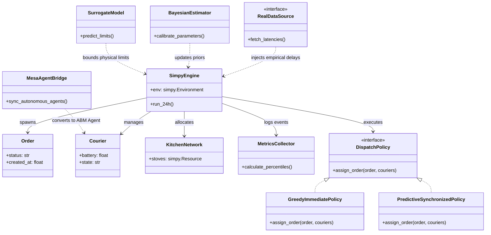

### 3.7 Formulación Analítica de Teoría de Colas ($M/M/c$) y Justificación de la Simulación

Para establecer una línea base de comparación matemática, el subsistema de despacho de repartidores se modela teóricamente como una cola multicanal markoviana $M/M/c$. Este modelo asume llegadas de pedidos exponenciales con tasa $\lambda$, tiempos de servicio exponenciales con tasa $\mu$, y una flota homogénea de $c$ servidores, que son los repartidores.

Las métricas en estado estable se rigen por las siguientes ecuaciones cerradas, condicionadas a la estabilidad del sistema donde el factor de utilización es $\rho = \frac{\lambda}{c \mu} < 1$:

1. Probabilidad de sistema vacío ($P_0$):

   $$P_0 = \left[ \sum_{n=0}^{c-1} \frac{(c\rho)^n}{n!} + \frac{(c\rho)^c}{c!(1-\rho)} \right]^{-1}$$

2. Probabilidad de espera (Fórmula C de Erlang, $P_w$):

   $$P_w = \frac{(c\rho)^c}{c!(1-\rho)} P_0$$

3. Longitud y tiempos de espera (Ley de Little):

   El número promedio de pedidos esperando en cola ($L_q$) se define como:

   $$L_q = \frac{P_w \cdot \rho}{1 - \rho}$$

   Aplicando la Ley de Little ($L = \lambda W$ y $L_q = \lambda W_q$), derivamos los tiempos medios:

   * **Tiempo en cola:** $W_q = \frac{L_q}{\lambda}$
   * **Tiempo total en el sistema:** $W = W_q + \frac{1}{\mu}$
   * **Inventario total:** $L = \lambda W$

**Explicación de la Disparidad:** Aunque el modelo $M/M/c$ ofrece una cota teórica perfecta, fracasa al intentar capturar la dinámica operativa real de la plataforma en la ciudad por tres razones fundamentales:

1. **Violación de Estacionariedad ($\rho > 1$):** El modelo analítico exige colas estables. En nuestro entorno real, las ráfagas no estacionarias (NHPP) provocan saturaciones del $106\%$ en el almuerzo y $130\%$ en la cena, lo que matemáticamente colapsaría la fórmula de Erlang hacia el infinito, mientras que en la realidad genera colas finitas con abandonos.
2. **Distribuciones no exponenciales:** Los tiempos de cocción reales siguen una distribución Log-Normal y las rutas están penalizadas por un factor de sinuosidad vial ($\tau = 1.25$). Estas variables carecen de la propiedad de pérdida de memoria (*memoryless*), invalidando el supuesto markoviano.
3. **Comportamiento adaptativo y límites físicos:** La teoría clásica asume clientes con paciencia infinita y servidores inagotables. Nuestro gemelo digital en SimPy incorpora la tolerancia límite del cliente (curva Weibull), el agotamiento de la batería de los móviles y el límite duro de fatiga psicomotriz de 6 horas de los repartidores.

### 3.8 Parámetros, Distribuciones y Plan de Recolección de Datos

Para garantizar la fidelidad estocástica del gemelo digital y evitar las limitaciones de la distribución exponencial plana, el modelo adopta las siguientes distribuciones:

**Tabla Técnica de Variables Aleatorias**

* **Tiempo de Preparación en Cocina ($T_{\text{cocina}}$):** Distribución Log-Normal con $\mu_{\ln}=2.85$ y $\sigma_{\ln}=0.35$ (media $\approx 18.5$ min). **Fuente:** DoorDash Engineering (2020) y Alnaggar et al. (2021). **Justificación:** Garantiza tiempos estrictamente positivos y captura la "cola larga" de demoras en platos complejos.
* **Impaciencia del Cliente ($T_{\text{canc}}$):** Distribución Weibull con $k=2.4$ y $\lambda_w=40$ min. **Fuente:** Bai et al. (2019). **Justificación:** El parámetro $k > 1$ modela una tasa de riesgo creciente, reflejando cómo la frustración humana se acelera tras superar los 35 minutos.
* **Velocidad de Desplazamiento ($V_{\text{rep}}$):** Normal Truncada en $[8, 25]$ km/h con $\mu=18$ km/h y $\sigma=3$ km/h. **Fuente:** Dablanc et al. (2018). **Justificación:** Representa la velocidad media en tráfico urbano, acotando el rango para impedir la generación de velocidades negativas.
* **Distancia Cinemática Efectiva ($d_{\text{vial}}$):** Distancia Manhattan con factor de sinuosidad $\tau = 1.25$. **Fuente:** Boeing (2019) y Ballou et al. (2002). **Justificación:** Incorpora un 25% de recorrido extra por el sentido de las vías y desvíos urbanos.
* **Llegada de Pedidos ($\lambda_{\text{pedidos}}(t)$):** Proceso de Poisson No Homogéneo (NHPP). **Fuente:** Deliverect Industry Insights (2023). **Justificación:** Captura la saturación severa en picos de almuerzo ($2.70$ ped/min) y cena ($3.30$ ped/min).

**Plan de Recolección de Datos para Entrega 2**

1. **Entorno Simulado (SimPy):** La clase `MetricsCollector` capturará eventos estocásticos y calculará percentiles $p_{95}$ y $p_{99}$ con `numpy`, exportando a `datos/simulation_results.json`.
2. **Entorno Real (API REST):** Mediante *middleware* en FastAPI y la librería `psutil`, se medirán las latencias de los endpoints, las tasas de llegada reales (pedidos procesados por segundo), y el uso de CPU/RAM.
3. **Escenario de Carga (Locust):** Las mediciones se realizarán inyectando un escenario de estrés concurrente simulando el "Pico de Cena" (más de 100 usuarios virtuales concurrentes emitiendo órdenes continuas durante 5 minutos), exportando la telemetría a `datos/telemetry_log.csv`.

### 3.9 Métricas de Desempeño (KPIs)

Para evaluar cuantitativamente el impacto de las políticas de despacho, se definen seis métricas clave (KPIs). La extracción de estas métricas asegura la evaluación de percentiles de cola superior ($p_{95}$ y $p_{99}$), mitigando el sesgo de los promedios frente a eventos extremos de congestión.

| KPI | Descripción y Fórmula Operacional | Unidad | Umbral Aceptable | Pregunta de Decisión que Responde |
| :--- | :--- | :---: | :---: | :--- |
| **$W_{\text{total\_p95}}$** | **Tiempo de ciclo total (Percentil 95):** Tiempo transcurrido desde la creación de la orden hasta la entrega final al cliente. | Minutos | $\le 40$ min | ¿La política de despacho afecta el tiempo de entrega percibido por los usuarios extremos en horas pico? |
| **$T_{\text{espera\_rest}}$** | **Espera ociosa del repartidor:** Promedio de tiempo inactivo que el repartidor pasa en el mostrador esperando la comida ($t_{\text{listo}} - t_{\text{arribo\_rep}}$). | Minutos | $\le 3.5$ min | ¿En qué porcentaje se reduce el tiempo ocioso del conductor al cambiar de asignación voraz a despacho predictivo? |
| **$\rho_{\text{rep}}(t)$** | **Utilización de la flota:** Fracción de la jornada de 6 horas en la que el repartidor está activamente asignado o en tránsito. | Porcentaje | $75\% - 85\%$ | ¿Cuántos repartidores ($c_{\min}$) se necesitan incentivar en el pico de cena para mantener la flota rentable pero no colapsada? |
| **$P_{\text{canc}}$** | **Tasa de cancelación:** Proporción de pedidos abandonados por impaciencia (Weibull) frente al total de órdenes emitidas diarias. | Porcentaje | $< 3.0\%$ | ¿El retraso intencional del despacho sincronizado incrementa el riesgo de cancelación del cliente? |
| **$T_{\text{mostrador\_p95}}$** | **Tiempo en mostrador (Percentil 95):** Tiempo que la comida permanece empacada antes de ser recogida ($t_{\text{arribo\_rep}} - t_{\text{listo}}$). | Minutos | $\le 6.0$ min | ¿Cuál es el valor óptimo del *buffer* ($\Delta t$) para no comprometer la calidad térmica de los alimentos? |
| **$T_{\text{lat\_api\_p99}}$** | **Latencia de Rastreo (Percentil 99):** Tiempo de respuesta del endpoint HTTP `GET /tracking` bajo carga concurrente medida en Locust. | Milisegundos | $\le 180$ ms | ¿Cómo impacta la frecuencia de telemetría de los repartidores en los recursos de CPU/RAM del servidor backend? |

### 3.10 Diseño Preliminar de Clases POO

El diseño arquitectónico del simulador desacopla las entidades del motor de eventos, utilizando el patrón *Strategy* para las políticas de decisión y estableciendo interfaces claras para la futura integración de los Módulos II, III y IV.

### 3.11 Hoja de Ruta de Integración y Riesgos

El proyecto está concebido como una arquitectura evolutiva. Hoja de ruta para su integración con los módulos de la asignatura y otras materias del plan de estudios.

**Integración con Módulos del Curso**

| Módulo | Entregable / Componente a Desarrollar | Entrega |
| :--- | :--- | :---: |
| **Módulo II** | Pruebas de estrés de la API REST usando Locust para capturar telemetría empírica bajo carga (simulación del pico de cena). | Entrega 2 |
| **Módulo III** | Ajuste de distribuciones (KS) y estimación bayesiana con PyMC para calibrar los parámetros de las colas de cocina y fatiga. | Entrega 2 |
| **Módulo IV** | Transición de los repartidores a agentes autónomos (ABM con Mesa) y optimización de la política algorítmica mediante aprendizaje por refuerzo. | Final |

**Integración con Otras Asignaturas**

* **Arquitectura de Software:** Implementación del patrón de diseño *Strategy* para desacoplar las políticas de despacho, y diseño de la API REST bajo el patrón *MVC* (Model-View-Controller) en FastAPI.
* **Bases de Datos:** Uso de bases de datos relacionales (PostgreSQL) para la persistencia transaccional del estado de los pedidos y la telemetría de los repartidores.
* **DevOps / Infraestructura:** Despliegue de los entornos de simulación y la API real mediante contenedores aislados orquestados con Docker Compose.

**Matriz de Riesgos Técnicos**

| Riesgo Técnico | Probabilidad | Impacto | Plan de Contingencia |
| :--- | :---: | :---: | :--- |
| **1. Colapso de la API REST durante pruebas Locust** | Alta | Alto | Limitar la concurrencia progresivamente y escalar el número de *workers* de Uvicorn en Docker para balancear la carga. |
| **2. Error analítico > 5% entre M/M/c y SimPy** | Media | Alto | Incrementar el número de réplicas en SimPy (\(N > 100\)) y verificar el calentamiento del sistema (*warm-up period*). |
| **3. Bloqueo (*deadlock*) de entidades en SimPy** | Baja | Crítico | Implementar *timeouts* de seguridad (abandono) y trazas de depuración (logs) en la cola de cocina. |
| **4. Asincronía de telemetría en el sistema real** | Media | Medio | Emplear *middlewares* no bloqueantes en FastAPI y delegar la escritura del CSV a procesos en segundo plano. |

### 3.12 Referencias y Anexos

**Referencias Bibliográficas**

1. Alnaggar, A., Gzara, F., & Bookbinder, J. H. (2021). "Crowdsourced delivery: A review of platforms and academic literature." *Omega*, 98, 102139.
2. Bai, J., Chen, X., & Wang, Y. (2019). "On-demand food delivery with dynamic dispatching and routing." *Manufacturing & Service Operations Management*, 21(3), 566-583.
3. Boeing, G. (2019). "Street network models and indicators for every urban area in the world." *Geographical Analysis*, 53(1), 51-71.
4. Dablanc, L., Morganti, E., Arvidsson, N., Woxenius, J., Browne, M., & Saidi, N. (2018). "The rise of on-demand 'Gig Economy' logistics." *Cities*, 87, 85-98.
5. DoorDash Engineering. (2020). *Predicting Food Preparation Time with Machine Learning*. Recuperado de la documentación técnica oficial de DoorDash.

**Anexo: Declaración de Uso de Inteligencia Artificial**
Para el desarrollo de este proyecto, el equipo empleó un modelo de lenguaje (LLM) operando como asistente técnico.

* **Herramienta:** Gemini.
* **Uso específico:** Soporte en la estructuración de los documentos Markdown y planes de acción, generación de sintaxis LaTeX, diseño de diagramas UML en formato Mermaid, y validación de las ecuaciones teóricas de Erlang-C. Adicionalmente, se utilizó para generar plantillas base y estructuras algorítmicas en Python tanto para el motor de simulación (SimPy) y la API REST (FastAPI), como para los scripts de análisis matemático y recolección de métricas (`queueing_theory.py`, `metrics.py`, `contrast_analysis.py`).
* **Verificación:** Todo el texto documentado y el código generado fue auditado, revisado lógica y matemáticamente por el equipo, garantizando que el diseño del simulador, el cálculo de percentiles y las variables aleatorias cumplen estrictamente con las directrices del proyecto.
