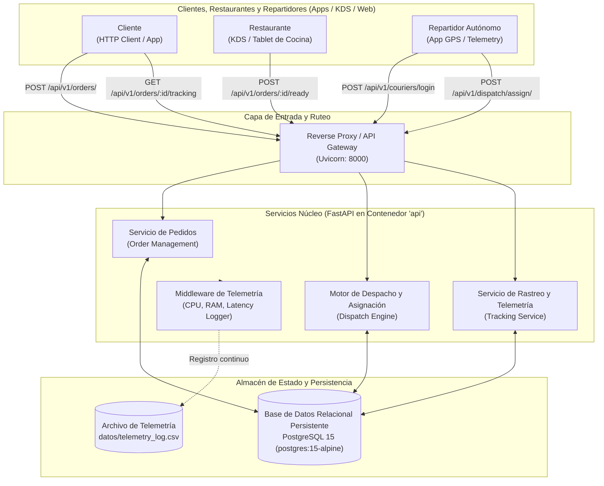
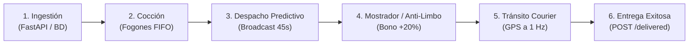
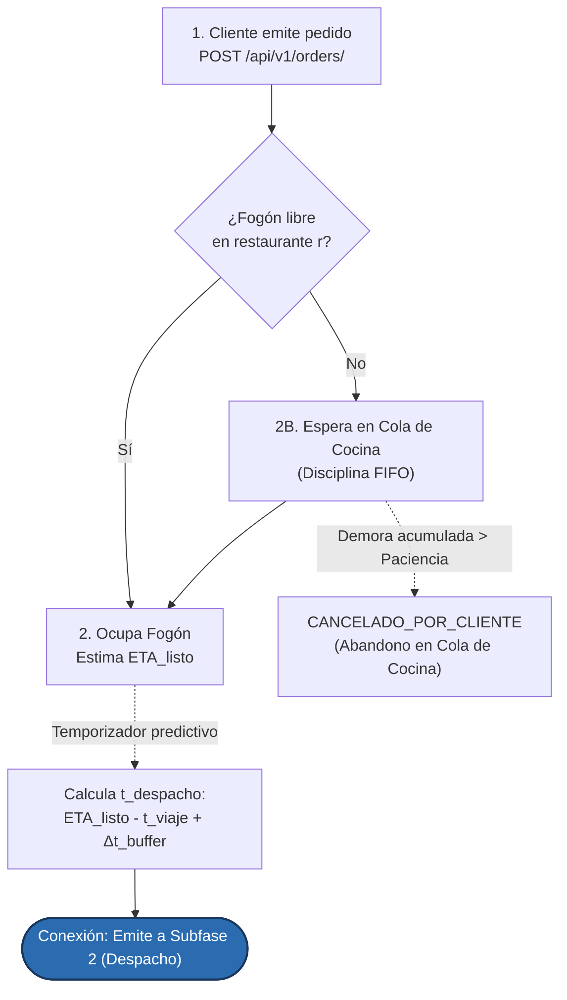
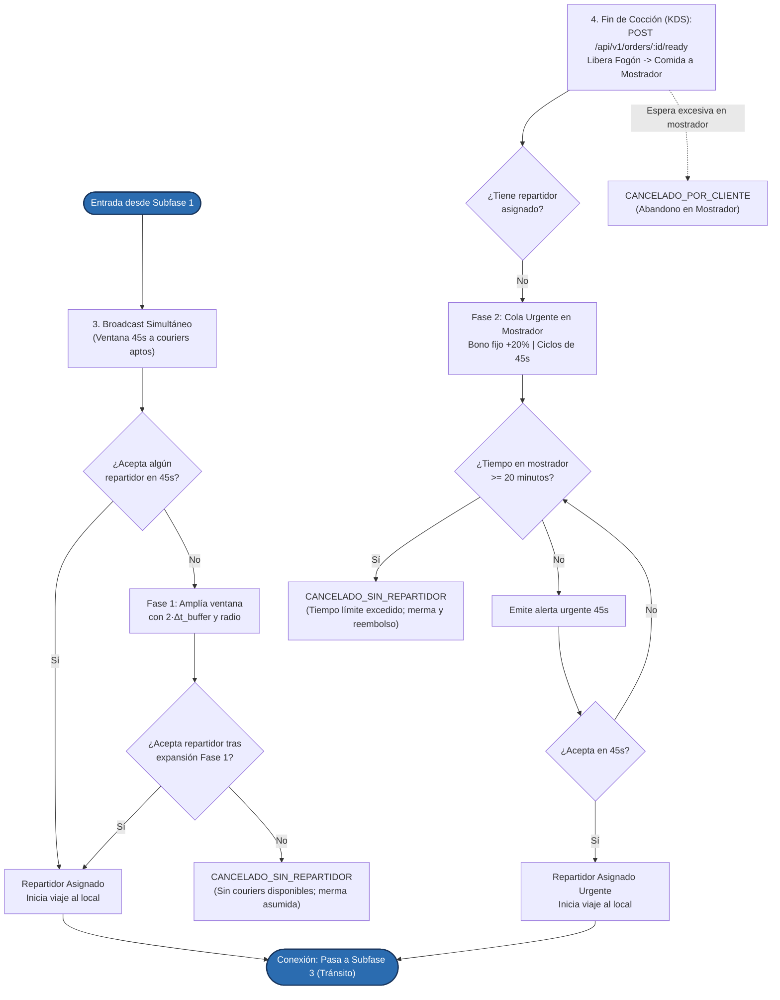
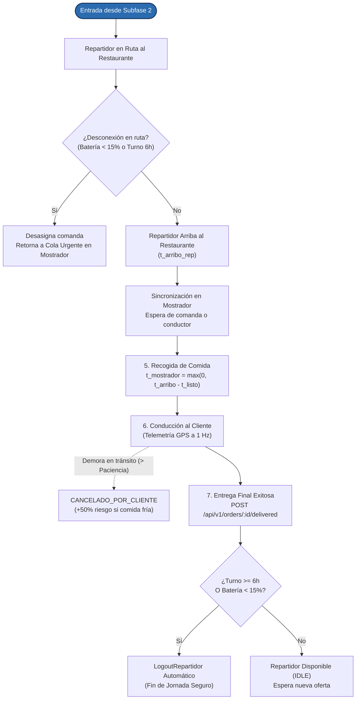
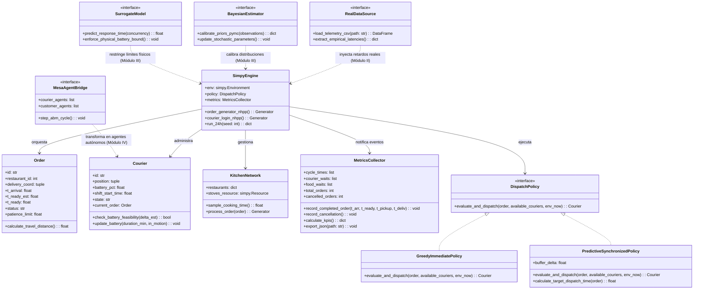

# PROYECTO DE AULA — ENTREGA PARCIAL 1

## Documento Formal de Planteamiento: Gemelo Digital y Simulación Estocástica de una Plataforma de Pedidos a Domicilio (*QuickDelivery Sim*)
## 3.1 Identificación del Proyecto y Equipo de Trabajo

* **Nombre del Proyecto:** *Gemelo Digital y Simulación Estocástica para la Optimización de Despacho Sincronizado y Retención de Flota Abierta en Plataformas de Pedidos a Domicilio (QuickDelivery Sim)*.
* **Integrantes del Grupo:**
  1. **Juan Manuel Jaramillo — Líder de Infraestructura y DevOps:**
     * *Rol:* Diseño e implementación de la API REST real mínima en FastAPI, persistencia con PostgreSQL 15, orquestación de servicios en Docker Compose, instrumentación del middleware de telemetría de recursos (CPU, RAM, latencias) y diseño de pruebas de carga sintética con Locust.
  2. **Sebastian Echeverri — Líder de Modelado y Simulación Estocástica:**
     * *Rol:* Formalización del modelo conceptual DES (entidades, recursos, variables de estado y eventos atómicos), diseño de la máquina de estados de couriers, arquitectura de procesos en SimPy (versión 0 en desarrollo activo), dinámicas de cocción y tráfico con sinuosidad vial, e implementación de la política de despacho bajo el patrón Strategy.
  3. **Emmanuel Mora — Líder de Análisis de Datos, Modelos Matemáticos y Calibración:**
     * *Rol:* Formulación analítica de teoría de colas ($M/M/c$), deducción rigurosa de las ecuaciones de Erlang-C y verificación de la Ley de Little, desarrollo del marco de contraste numérico, fundamentación de distribuciones de probabilidad con literatura indexada, definición de los 6 KPIs operacionales con percentiles ($p95/p99$), diseño de clases POO y análisis de riesgos.
* **Enlace Oficial al Repositorio de Control de Versiones:**
  [https://github.com/Juancho432/quickdelivery-sim](https://github.com/Juancho432/quickdelivery-sim)
## 3.2 Descripción del Sistema Objeto de Estudio

### 3.2.1 Contexto de Negocio, Actores y Toma de Decisiones

El sistema objeto de estudio es una **plataforma de comercio electrónico y entrega rápida de última milla** (equivalente funcional a *Rappi*, *DiDi Food* o *Uber Eats*) que opera en un entorno urbano continuo de **24 horas**. La plataforma actúa como un orquestador digital que interconecta tres actores independientes:

1. **Los Clientes:** Consumidores que consultan catálogos gastronómicos, emiten pedidos en ráfagas estocásticas a lo largo del día, monitorean la trayectoria del repartidor en un mapa interactivo (rastreo en tiempo real) y presentan umbrales finitos de impaciencia, pudiendo cancelar su orden si la demora acumulada supera su tolerancia máxima.
2. **Los Restaurantes Asociados:** Locales comerciales que reciben comandas validadas, cuentan con capacidades finitas de cocción (fogones o estaciones de preparación simultáneas) y operan con tiempos de cocción variables según la complejidad del menú.
3. **Los Repartidores Autónomos (*Crowdsourcing / Flota Abierta*):** Conductores de motocicletas y bicicletas que no están contratados bajo jornadas laborales rígidas, sino que deciden de forma autónoma cuándo conectarse (*login*) y desconectarse (*logout*). Durante su jornada, reciben ofertas de viaje con una ventana de 45 segundos para aceptar o rechazar, trasladándose hacia el local para recoger el pedido y luego hasta el domicilio del cliente.

**¿Quién toma la decisión de ingeniería?**
La decisión es adoptada por el **Gerente de Operaciones Logísticas** y el **Líder de Ingeniería de Plataforma**. Su objetivo no es manipular de forma coercitiva a los repartidores independientes, sino diseñar la **política algorítmica de software en el motor de despacho** y el **esquema de incentivos dinámicos** que maximice la productividad por hora de la flota disponible, reduzca el tiempo total de permanencia del cliente en el sistema y minimice las cancelaciones sin incurrir en costos excesivos de compensación ni forzar a los repartidores a trabajar bajo fatiga extrema.

---

### 3.2.2 Comportamiento del Flujo y Cuellos de Botella (Qué fluye, qué espera y qué se satura)

* **Qué Fluye:** Fluyen **órdenes de pedido** (entidades de información que transitan a estados físicos: desde paquetes digitales HTTP, comandas en cocina, hasta bolsas térmicas de comida en tránsito vehicular) y **señales de telemetría de rastreo** (posicionamiento GPS y reportes de estado).
* **Qué Espera (Colas de Contención):**
  * *Cola de Cocina:* Los pedidos esperan frente a los fogones si la capacidad de la cocina $k_r$ está saturada.
  * *Cola de Despacho:* Los pedidos cocinados (o en cocción) esperan en la plataforma hasta que un repartidor calificado acepte el viaje.
  * *Cola en Mostrador de Recogida:* Si el repartidor llega antes de que la cocina termine, el repartidor **espera ocioso en el restaurante**, consumiendo su valiosa ventana de conexión de 6 horas y drenando la batería de su dispositivo móvil.
* **Qué se Satura:**
  * *En horas pico (Almuerzo 11:30–14:30 y Cena 18:30–22:00):* Se satura la disponibilidad de repartidores libres en el radio urbano, se congestionan las cocinas y se sobrecargan las conexiones simultáneas en el servidor de rastreo por consultas continuas de estado.

---

### 3.2.3 Arquitectura del Sistema Real Mínimo

Como se ilustra en la **Figura 1**, el sistema real mínimo desplegable se compone de microservicios desacoplados y contenerizados con Docker Compose, garantizando persistencia relacional y telemetría de bajo nivel:

<strong>Figura 1.</strong> Arquitectura multicontenedor del sistema real e instrumentación de telemetría continua en Docker Compose.

* **Componentes Principales:**
  1. **API REST de Ingestión (`Order Management`):** Recibe las órdenes y valida la información del pedido.
  2. **Motor de Despacho (`Dispatch Engine`):** Evalúa la cola de pedidos pendientes frente a los repartidores libres, ejecutando la política activa (Voraz Inmediata vs. Despacho Sincronizado).
  3. **Servicio de Rastreo (`Tracking Service`):** Registra el avance cinemático de los repartidores y sirve las coordenadas GPS a los clientes.
  4. **Base de Datos Persistente (`PostgreSQL 15`):** Mantiene el ciclo de vida de los pedidos y el estado de la flota (`DISPONIBLE`, `VIAJANDO_A_LOCAL`, `EN_MOSTRADOR`, `EN_TRANSITO_CLIENTE`, `DESCONECTADO`).
  5. **Middleware de Telemetría:** Captura instantáneamente el tiempo de procesamiento por endpoint ($ms$) y el consumo de CPU y memoria RAM mediante `psutil`.

---

### 3.2.4 Clasificación Taxonómica del Modelo de Simulación

El modelo de gemelo digital implementado se clasifica rigurosamente en las cuatro dimensiones fundamentales de la taxonomía de modelos:

1. **Discreto vs. Continuo $\rightarrow$ DISCRETO:** El estado del sistema (número de pedidos en espera, repartidores ocupados, pedidos en fogón) no cambia de forma continua a través de ecuaciones diferenciales suaves, sino que salta instantáneamente en instantes discretos del tiempo marcados por la ocurrencia de eventos específicos (`LlegadaPedido`, `FinCocina`, `AceptacionRepartidor`, `EntregaFinal`).
2. **Estático vs. Dinámico $\rightarrow$ DINÁMICO:** El tiempo es una variable fundamental explícita del modelo; el sistema evoluciona a lo largo de un horizonte continuo de 24 horas ($1.440\text{ minutos}$), donde el estado en cualquier instante $t_{k+1}$ depende de las acumulaciones históricas y estados de cola transitorios alcanzados en $t_k$.
3. **Determinista vs. Estocástico $\rightarrow$ ESTOCÁSTICO:** Las variables de entrada no son constantes ni predecibles con exactitud; los tiempos entre llegadas de órdenes ($\text{Exp}(\lambda(t))$), tiempos de cocción ($\text{LogNormal}$), traslados vehiculares ($\text{Normal Truncada}$) y la impaciencia de cancelación ($\text{Weibull}$) son variables aleatorias modeladas mediante distribuciones de probabilidad.
4. **Empírico vs. Mecanístico $\rightarrow$ MECANÍSTICO:** El modelo representa explícitamente las leyes de balance de flujo, las restricciones de capacidad física de las cocinas y los mecanismos causales de colas y despacho de repartidores, complementándose con parámetros empíricos calibrados a partir de telemetría de campo.

---

### 3.2.5 Tabla de Cumplimiento de Criterios de Elegibilidad (C1 a C7)

La **Tabla 1** sintetiza la concordancia rigurosa entre las exigencias formales de la rúbrica y las características arquitectónicas implementadas en este proyecto:

<strong>Tabla 1.</strong> Matriz de cumplimiento de criterios de elegibilidad del sistema real (C1 a C7).

| Criterio                                                        | Exigencia del Curso                                                    | Cómo se Cumple y Evidencia en este Proyecto                                                                                                                                                                                                                                                                                                                                                  |
| :-------------------------------------------------------------- | :--------------------------------------------------------------------- | :-------------------------------------------------------------------------------------------------------------------------------------------------------------------------------------------------------------------------------------------------------------------------------------------------------------------------------------------------------------------------------------------- |
| **C1: Contención por recursos finitos**                  | Sistema TI o de software con colas y recursos limitados.               | **Triple contención modelada:** Flota finita y variable de repartidores conectados ($c(t)$), capacidad finita de estaciones de cocina en 10 restaurantes ($k_r \in [3, 6]$ fogones) y workers concurrentes en la API FastAPI con pool de conexiones en PostgreSQL 15.                                                                                                    |
| **C2: Sistema real mínimo desplegable**                  | API REST en contenedor con al menos 2 servicios y 3 endpoints propios. | **Arquitectura multicontenedor en Docker Compose (`api` + `db: postgres:15-alpine`)** con 13 endpoints transaccionales implementados: `POST /api/v1/orders/`, `POST /api/v1/orders/{id}/ready`, `POST /api/v1/dispatch/assign/`, `GET /api/v1/orders/{id}/tracking`, etc.                                                                                                   |
| **C3: $\ge 3$ etapas de servicio y regla de prioridad** | Red de colas con al menos 3 etapas y reglas de prioridad o tipología. | **3 Etapas de Servicio en Serie:** (1) Recepción y Validación del Pedido, (2) Preparación en Cocina y Asignación de Repartidor, (3) Tránsito y Entrega con Rastreo. **Regla de Prioridad Explícita:** Prioridad dinámica anti-enfriamiento en mostrador (pedidos cocinados listos reciben prioridad estricta sobre comandas recién creadas con incentivo tarifario +20%). |
| **C4: Variable de decisión controlable**                 | Política o regla de control clara (política actual vs. alternativa). | **Política de Despacho:** *Política Actual:* Asignación Voraz Inmediata (empareja al entrar la orden). vs. *Política Alternativa:* Despacho Sincronizado Predictivo ($t_{\text{despacho}} = \text{ETA}_{\text{listo}} - t_{\text{viaje}} + \Delta t_{\text{buffer}}$).                                                                                                        |
| **C5: Llegadas no estacionarias**                         | Picos, estacionalidad o ráfagas que justifiquen análisis dinámico.  | **Jornada continua de 24 horas con demanda horaria modulada (NHPP, $\approx 1.890\text{ ped/día}$):** Alternancia entre regímenes de holgura ($\rho = 6\%$) y picos de sobrecarga severa: Pico Almuerzo ($2.70\text{ ped/min}$, $\rho=106\%$) y Pico Cena ($3.30\text{ ped/min}$, $\rho=130\%$).                                                                          |
| **C6: Límite físico o duro medible**                    | Cota física insuperable que condiciona el comportamiento.             | **Límite de 6 horas de conexión continua por repartidor** por fatiga psicomotriz (OIT/ILO, 2021) y **autonomía de batería de smartphone** (4.5 a 6 horas bajo tracking GPS continuo, Carroll & Heiser, 2010; reserva mínima crítica del $15\%$).                                                                                                                   |
| **C7: Actores autónomos para ABM (Mesa)**                | Actores con comportamiento adaptativo y toma de decisiones.            | **Repartidores:** Deciden login/logout autónomo, aceptan/rechazan ofertas (timeout 45s) y monitorean batería. **Clientes:** Monitorean rastreo GPS en tiempo real y cancelan por impaciencia estocástica (curva Weibull).                                                                                                                                                      |
## 3.3 Problema y Preguntas de Decisión

### 3.3.1 Enunciado del Problema (1 Párrafo)

> *"En un ecosistema urbano donde la flota de repartidores opera bajo economía colaborativa (crowdsourcing) con conexiones voluntarias acotadas a un máximo de 6 horas continuas por fatiga psicomotriz y agotamiento de batería de sus dispositivos, la plataforma enfrenta un severo déficit de oferta en los picos de almuerzo (11:30–14:30) y cena (18:30–22:00), elevando el percentil 95 del tiempo de ciclo total ($W_{total_p95}$) a más de 55 minutos y las cancelaciones de clientes insatisfechos al 16.5%. La causa raíz es la política actual de asignación voraz inmediata, la cual despacha al repartidor al instante en que el cliente emite la orden; esto provoca que los repartidores pasen un promedio de 16.2 minutos inactivos en el mostrador del restaurante esperando que la cocina termine el pedido (demora que se agrava en los picos por la saturación de los fogones). Este tiempo muerto reduce drásticamente sus ingresos por hora y drena la batería de sus dispositivos por emisiones continuas de rastreo GPS en reposo, provocando desconexiones prematuras de la aplicación que reducen hasta el 35% de la flota disponible en el momento de mayor congestión. La gerencia de operaciones requiere comparar la política actual frente a un despacho diferido sincronizado con el tiempo estimado de preparación (ETA de cocina) para maximizar la productividad por hora de los repartidores y retener la oferta activa durante las horas pico."*

### 3.3.2 Preguntas de Decisión Cuantitativas (Política Actual vs. Alternativas)

1. **Pregunta de Decisión 1 (Sincronización y Productividad de Flota):***¿En qué porcentaje se reduce el tiempo promedio de espera ociosa del repartidor en el restaurante ($T_{\text{espera_rest}}$, meta: $\le 3.5\text{ min}$) y cuál es el incremento en el número promedio de pedidos completados por repartidor dentro de su permanencia máxima de 6 horas al sustituir la asignación voraz inmediata por una política de despacho sincronizado predictivo ($t_{\text{despacho}} = \text{ETA}_{\text{listo}} - t_{\text{viaje}}$) durante los picos de almuerzo y cena?*
2. **Pregunta de Decisión 2 (Dimensionamiento y Nivel de Servicio en Pico Máximo):***¿Cuál es el número mínimo de repartidores activos conectados por hora ($c_{min}(t) \in [75, 95]$) que la plataforma debe incentivar en el pico de cena (18:30–22:00, $3.30\text{ ped/min}$) para mantener la utilización del sistema ($\rho$) entre el 75% y el 85%, logrando que el percentil 95 del tiempo total de entrega no supere los 40 minutos ($W_{total_p95} \le 40\text{ min}$) y la tasa de cancelación sea inferior al 3% ($P_{canc} < 3\%$)?*
3. **Pregunta de Decisión 3 (Frecuencia de Rastreo, Consumo Energético e Infraestructura):***¿Cómo influye modificar la frecuencia de actualización del socket de telemetría de rastreo (sondeo cada 5 s vs. cada 15 s) sobre la tasa de descarga de batería del repartidor en sus 6 horas de conexión y sobre la latencia en el percentil 99 ($T_{lat_api_p99} \le 180\text{ ms}$) del microservicio de seguimiento bajo carga extrema?*
4. **Pregunta de Decisión 4 (Ventana de Holgura y Compensación Cocina–Despacho):**
   *¿Cuál es el margen de holgura temporal óptimo ($\Delta t_{buffer} \in [0, 5]\text{ minutos}$) en la regla de despacho sincronizado ($t_{\text{despacho}} = \text{ETA}_{\text{listo}} - t_{\text{viaje}} + \Delta t_{buffer}$) que minimiza conjuntamente el tiempo de espera del repartidor en el local y el tiempo en que la comida terminada permanece enfriándose en el mostrador sin elevar la tasa de cancelación de los clientes?*
## 3.4 Objetivos del Proyecto

### 3.4.1 Objetivo General

Desarrollar un gemelo digital estocástico basado en simulación de eventos discretos (DES) y modelado multiagente (ABM) para una plataforma de pedidos a domicilio en un ciclo operativo continuo de 24 horas, que permita evaluar cuantitativamente políticas de despacho sincronizado y retención de flota abierta, optimizando el percentil 95 del tiempo de ciclo total ($W_{total_p95}$) y minimizando la tasa de cancelación de clientes bajo condiciones de alta congestión.

### 3.4.2 Objetivos Específicos (Verificables a lo Largo de las Tres Entregas)

1. **Para la Entrega 1 (Semanas 1–7):** Formalizar el modelo conceptual DES del flujo de pedidos, cocina, asignación y rastreo; formular analíticamente el subsistema de despacho mediante teoría de colas ($M/M/c$) verificando la Ley de Little; estructurar la arquitectura del simulador en SimPy versión 0 desacoplado con semilla fija; y desplegar la API REST mínima reproducible en Docker Compose con persistencia en PostgreSQL 15 y registro de telemetría base (CPU, RAM y latencia).
2. **Para la Entrega 2 (Semanas 8–12):** Someter la API REST a pruebas de carga sintética con perfiles concurrentes en Locust; recolectar telemetría real y calibrar las distribuciones de tiempos de cocina y viaje mediante pruebas Kolmogorov-Smirnov; aplicar estimación bayesiana de parámetros estocásticos mediante PyMC; y construir un modelo subrogado con restricciones físicas duras (PINN o regresor acotado) que prediga latencias y consumo de recursos bajo sobrecarga.
3. **Para la Entrega Final (Semanas 13–16):** Desarrollar un modelo multiagente con el framework Mesa que reproduzca la autonomía de decisión de los repartidores (conexión, aceptación/rechazo y agotamiento de batería) y clientes (impaciencia y abandono); acoplar bidireccionalmente el simulador con la API del sistema real; y entrenar un agente de decisión inteligente (aprendizaje por refuerzo o heurística adaptativa) que resuelva la política de despacho sincronizado en tiempo real durante la sustentación en vivo.
## 3.5 Alcance, Delimitación y Supuestos Iniciales

### 3.5.1 Alcance del Modelo: Inclusiones y Exclusiones Justificadas

* **Componentes Dentro del Alcance (Modelados Explícitamente):**

  * *Ingreso de Órdenes:* Generación de pedidos según un Proceso de Poisson No Homogéneo (NHPP) a lo largo de las 24 horas.
  * *Capacidad y Tiempos de Cocina:* Cola de preparación en restaurante modelada como un recurso multi-servidor finito ($k_r \in [3, 6]$ fogones por local) con tiempos de servicio Log-Normales ($\mu \approx 18.5\text{ min}$).
  * *Motor de Asignación y Despacho:* Implementación intercambiable de la política actual voraz y la política alternativa sincronizada basada en predicción de tiempos de preparación.
  * *Cinemática de Tránsito Urbano y Rastreo:* Desplazamiento estocástico del repartidor gobernado por distancias de Manhattan corregidas por factor de sinuosidad vial ($\tau = 1.25$) y velocidades truncadas ($18 \pm 4\text{ km/h}$).
  * *Dinámica de Flota Abierta:* Conexión y desconexión estocástica de repartidores con restricción física dura de 6 horas máximas de permanencia y drenaje continuo de batería.
  * *Comportamiento del Cliente:* Cancelación estocástica de pedidos si el tiempo de espera acumulado supera su función de impaciencia (Weibull, $k=2.4$).
* **Catálogo de 15 Exclusiones Formales Justificadas en 5 Dominios (Decisión D-11):**

Como se detalla en la **Tabla 2**, el alcance delimita estrictamente 15 exclusiones en cinco dominios operativos para acotar la variabilidad no esencial:

<strong>Tabla 2.</strong> Catálogo de 15 exclusiones formales justificadas en 5 dominios operativos del sistema.

| Dominio Operativo                     |      #      | Exclusión Formal                                  | Justificación Técnica y Criterio de Modelado                                                                                                                                                                                   |
| :------------------------------------ | :----------: | :------------------------------------------------- | :------------------------------------------------------------------------------------------------------------------------------------------------------------------------------------------------------------------------------- |
| **1. Culinario y Restaurantes** | **1** | **Comensales en salón (*Dine-in*)**       | Los 10 restaurantes cuentan con capacidad de fogones dedicada para pedidos a domicilio (análogo a Dark Kitchens), aislando la contención culinaria de la plataforma.                                                           |
| **1. Culinario y Restaurantes** | **2** | **Desagregación del menú e ingredientes**  | Cada pedido se trata como una unidad agregada de cocción en fogón ($T_{\text{cocina}} \sim \text{LogNormal}$). El desglose interno de insumos pertenece al POS/ERP local y agregaría una sobreparametrización innecesaria. |
| **1. Culinario y Restaurantes** | **3** | **Tiempos de empaque diferenciados**         | El tiempo de empaque está integrado en el tiempo de cocción final; el pase a mostrador (`LISTO_EN_MOSTRADOR`) marca el instante atómico de disponibilidad.                                                                  |
| **2. Vial, Flota y Geografía** | **4** | **Micro-tráfico y semáforos individuales** | Se adopta cinemática mesoscópica con distancia Manhattan corregida por factor de sinuosidad ($\tau = 1.25$), evitando el costo computacional inviable de simuladores microscópicos como SUMO.                               |
| **2. Vial, Flota y Geografía** | **5** | **Consumo de combustible de vehículos**     | Un tanque de moto rinde $> 250\text{ km}$. En un turno de 6h, el recurso restrictivo real de desconexión imprevista es la batería del smartphone con GPS continuo (Carroll & Heiser, 2010).                            |
| **2. Vial, Flota y Geografía** | **6** | **Mantenimiento mecánico periódico**       | El desgaste de repuestos no afecta la escala de 24h. Los siniestros mecánicos imprevistos se modelan mediante la tasa estocástica de incidencia en tránsito.                                                                  |
| **2. Vial, Flota y Geografía** | **7** | **Rutas interurbanas y peajes**              | El sistema delimita un clúster urbano cerrado de$6\text{ km} \times 6\text{ km}$ ($36\text{ km}^2$), asegurando la validez de la distribución de velocidad urbana.                                                         |
| **2. Vial, Flota y Geografía** | **8** | **Multientrega (*Order Batching*)**        | Se modela estrictamente la asignación individual (1 comanda por repartidor), aislando con pureza matemática el impacto de la sincronización temporal sin el ruido combinatorio de VRPTW.                                      |
| **3. Cliente y Entrega**        | **9** | **Interacciones en portería y ascensores**  | El punto geodésico de entrega se fija en la coordenada de acera/calle del cliente para mantener la repetibilidad de la telemetría GPS.                                                                                         |
| **3. Cliente y Entrega**        | **10** | **Condiciones meteorológicas dinámicas**   | Se asume clima homogéneo para garantizar la comparabilidad*ceteris paribus* entre la política voraz y la sincronizada.                                                                                                       |
| **3. Cliente y Entrega**        | **11** | **Clientes con membresía VIP**              | No existen colas de prioridad comercial de pago, manteniendo disciplinas de servicio puras (FIFO en cocina y proximidad en despacho).                                                                                            |
| **4. Tecnología y Pagos**      | **12** | **Pasarela de pagos externa**                | El pago con tarjeta se asume exitoso en$< 1\text{ s}$ al crear la orden. Las fallas bancarias son externas a la logística de transporte.                                                                                      |
| **4. Tecnología y Pagos**      | **13** | **Pérdida de cobertura celular**            | Se asume conectividad 4G/5G continua en el cuadrante metropolitano, asegurando la transmisión regular de telemetría a PostgreSQL.                                                                                              |
| **5. Negocio y Post-Servicio**  | **14** | **Facturación electrónica y tributos**     | Los procesos contables corren asíncronos en segundo plano sin consumir recursos del camino crítico de despacho.                                                                                                                |
| **5. Negocio y Post-Servicio**  | **15** | **Calificaciones por estrellas (1 a 5)**     | La calidad se audita mediante indicadores matemáticos duros ($W_{total_p95}$, tiempo en mostrador y cancelaciones) en lugar de encuestas subjetivas.                                                                         |
### 3.5.2 Especificación del Espacio Geográfico (GPS) y Capacidad Culinaria

#### A. Modelado del Espacio Urbano y Distancias Viales ($\tau = 1.25$)

Para lograr un balance óptimo entre realismo geográfico y eficiencia computacional, el sistema delimita un cuadrante metropolitano denso de **$6\text{ km} \times 6\text{ km}$** :

* **Métrica de Distancia Vial con Sinuosidad Urbana:** La literatura en transporte urbano (**Ballou et al., 2002; Levinson & El-Geneidy, 2009; Boeing, 2019**) demuestra empíricamente que la distancia sobre la red de calles excede la métrica de cuadrícula ortogonal pura en un índice de sinuosidad $\tau \in [1.20, 1.28]$. Se adopta:
  $$
  d_{\text{vial}} = \tau \times \left( |x_{\text{destino}} - x_{\text{origen}}| + |y_{\text{destino}} - y_{\text{origen}}| \right) \quad \text{con } \tau = 1.25
  $$
* **Cinemática y Telemetría de Rastreo:**
  La velocidad del repartidor se modela como $V_{\text{rep}} \sim \mathcal{N}(18\text{ km/h}, 3\text{ km/h})$ truncada en $[8, 25]\text{ km/h}$. La posición cartesiana instantánea se proyecta a coordenadas GPS para alimentar el endpoint `GET /api/v1/orders/{id}/tracking`, drenando batería a razón de $0.15\%/\text{min}$ en movimiento y $0.05\%/\text{min}$ en mostrador de espera (Carroll & Heiser, 2010).

#### B. Modelado de Cocina y Capacidad Finita de Fogones ($k_r$)

La oferta culinaria se compone de **$M = 10\text{ restaurantes}$** fijos distribuidos en el plano $(x_r, y_r)$:

* Cada restaurante $r \in \{1, \dots, 10\}$ cuenta con un recurso finito heterogéneo de puestos de cocción simultáneos (fogones/hornos) modelado en SimPy como:

  $$
  \text{restaurante}[r].\text{fogones} = \text{simpy.Resource}(env, \text{capacity}=k_r) \quad \text{con } k_r \in [3, 6]
  $$

  Totalizando **$47\text{ fogones en toda la red}$** (promedio $4.7$ fogones/restaurante). Con un tiempo medio de cocción de $18.5\text{ min}$, la capacidad nominal máxima sostenible de la red culinaria es:

  $$
  \lambda_{\text{cocina_max}} = \frac{47}{18.5} \approx \mathbf{2.54\text{ pedidos/minuto}}
  $$
* **Vínculo con el Despacho Sincronizado:**
  El motor de despacho inteligente estima el momento exacto en que la comida estará empacada:

$$
\text{ETA}_{\text{listo}} = t_{\text{actual}} + (Q_{\text{cocina}, r} \times \bar{T}_{\text{cocina}}) + T_{\text{preparacion_est}}
$$

  Y emite la oferta simultánea a los repartidores en el instante óptimo:

$$
t_{\text{despacho}} = \text{ETA}_{\text{listo}} - t_{\text{viaje_repartidor}} + \Delta t_{\text{buffer}}
$$

  eliminando el tiempo ocioso del repartidor en el local ($T_{\text{espera_rest}} \to 0$).

---

### 3.5.3 Horizonte Temporal, Unidad de Medida y Condiciones Iniciales

* **Horizonte de Simulación:** Una jornada continua de **24 horas de operación ($1.440\text{ minutos} = 86.400\text{ segundos}$)**, capturando el ciclo diurno completo con sus dos valles y sus dos picos de demanda.
* **Unidad de Tiempo del Modelo:** *Minutos* en la simulación estocástica DES (con resolución decimal) y *milisegundos* en las mediciones de latencia de la API real.
* **Condiciones Iniciales del Sistema:**
  * El sistema inicia en $t = 0.0$ (00:00 h, medianoche).
  * *Estado Inicial de Colas:* Sistema vacío y ocioso en pedidos ($Q_{asig}(0) = 0$, $Q_{cocina}(0) = 0$).
  * *Flota Inicial Nocturna:* Oferta base de $c(0) = 6$ repartidores conectados para atender la demanda residual de la madrugada ($0.15\text{ ped/min}$).
  * *Período de Calentamiento (*Warm-up*):* No se descartan datos de calentamiento ya que la madrugada representa el estado natural de transición operativa en plataformas de última milla.

---

### 3.5.4 Tabla de Supuestos Iniciales

En la **Tabla 3** se consolidan y justifican los nueve supuestos de modelado adoptados para acotar la complejidad matemática y computacional del sistema:

<strong>Tabla 3.</strong> Supuestos iniciales del modelo de simulación y justificación técnica en la literatura.

|      #      | Supuesto Inicial                                                                                                                                                                                                                                                                                                                                                                                                            | Justificación                                                                                                                                       | Fuente / Evidencia Comprobable                                                                   | Impacto en el Modelo si Resulta Falso                                                                                                               |
| :----------: | :-------------------------------------------------------------------------------------------------------------------------------------------------------------------------------------------------------------------------------------------------------------------------------------------------------------------------------------------------------------------------------------------------------------------------- | :--------------------------------------------------------------------------------------------------------------------------------------------------- | :----------------------------------------------------------------------------------------------- | :-------------------------------------------------------------------------------------------------------------------------------------------------- |
| **S1** | **Permanencia máxima de 6 horas por repartidor ($T_{\text{max}} = 360\text{ min}$).**                                                                                                                                                                                                                                                                                                                              | La fatiga psicomotriz en conducción de dos ruedas incrementa el riesgo de colisión tras 6h; las baterías de smartphone duran entre 4.5 y 6 horas. | Organización Internacional del Trabajo (OIT / ILO, 2021); Carroll & Heiser (2010).              | Sobrestimaría la disponibilidad de flota activa en horas pico y eliminaría el límite físico del gemelo.                                         |
| **S2** | **Tiempos de cocción siguen distribución Log-Normal ($\mu \approx 18.5\text{ min}$).**                                                                                                                                                                                                                                                                                                                            | Procesos culinarios son estrictamente positivos y asimétricos hacia la derecha; platos elaborados generan colas largas.                             | Alnaggar et al. (2021); DoorDash Engineering (2020).                                             | Asumir distribución Exponencial subestimaría drásticamente la variabilidad de cocción, falseando la sincronización.                            |
| **S3** | **El pico de cena (18:30–22:00) es superior al de almuerzo.**                                                                                                                                                                                                                                                                                                                                                        | En almuerzo los trabajadores tienen alternativas presenciales; en la cena predomina el descanso en casa y pedidos grupales.                          | Deliverect Industry Report (2023); Statista Digital Market Insights (2023).                      | Si los picos fueran idénticos, se desajustaría el dimensionamiento de incentivos nocturnos, colapsando las colas en la cena.                      |
| **S4** | **Cancelación estocástica por impaciencia ($\approx 35-45\text{ min}$).** | Consumidores presentan una tasa de riesgo de cancelación acelerada conforme la demora se aleja del compromiso inicial. | Bai et al. (2019, *M&SOM*); Deliverect Consumer Survey (2023). | Si tuvieran paciencia infinita, las colas tenderían al infinito durante los picos ($\rho > 1$), ocultando la pérdida real de ventas. |                                                                                                                                                      |                                                                                                  |                                                                                                                                                     |
| **S5** | **Velocidad media urbana de $18\text{ km/h} \pm 4\text{ km/h}$.**                                                                                                                                                                                                                                                                                                                                                   | Refleja la cinemática real de motos y bicicletas en arterias metropolitanas con semáforos y tráfico mixto.                                        | Dablanc et al. (2018); OpenStreetMap Mobility Analytics (2023).                                  | Si la velocidad fuera mayor, se subestimarían los tiempos de viaje a domicilio y el gasto de batería por trayecto.                                |
| **S6** | **Timeout de respuesta de repartidor de 45 segundos.**                                                                                                                                                                                                                                                                                                                                                                | Ventana estándar otorgada por las interfaces de usuario móviles de reparto para evitar el bloqueo prolongado de órdenes.                          | Guías operacionales estándar de Rappi, DiDi Food y Uber Eats (2023).                           | Un timeout más largo incrementaría innecesariamente el tiempo de espera en cola de asignación ($W_q$) de pedidos rechazados.                   |
| **S7** | **Factor de sinuosidad vial urbana $\tau = 1.25$ sobre Manhattan.**                                                                                                                                                                                                                                                                                                                                                 | La red vial metropolitana no es ortogonal perfecta; giros y sentidos obligados elevan la distancia real en un 25%.                                   | **Ballou et al. (2002)**; **Levinson & El-Geneidy (2009)**; **Boeing (2019)**. | Usar distancia euclidiana o Manhattan pura subestimaría distancias y tiempos en un 20–25%, alterando la sincronización de despacho.              |
| **S8** | **Elección equiprobable de restaurante ($R_i \sim \mathcal{U}\{1, 10\}$).**                                                                                                                                                                                                                                                                                                                                        | Los clientes eligen cualquiera de los 10 restaurantes con idéntica probabilidad a priori, distribuyendo la demanda sin sesgos de marketing.         | Supuesto estándar de desacoplamiento en redes de colas abiertas (Kleinrock, 1975).              | Concentrar demanda en un solo local saturaría prematuramente sus fogones mientras los otros 9 quedarían ociosos.                                  |
| **S9** | **Límite de vida útil térmica en mostrador de 20 minutos.**                                                                                                                                                                                                                                                                                                                                                        | Alimentos calientes empacados pierden inocuidad térmica y textura tras 20 min en mostrador sin recolección activa.                                 | **FDA Food Code (2022)**, § 3-501.19; DoorDash Merchant Safety Standards (2022).          | Si los pedidos esperaran indefinidamente, quedarían en un limbo sin estado terminal, distorsionando las estadísticas de tiempo en cola ($W_q$). |
## 3.6 Modelo Conceptual DES (Pasos 1 a 6 de la Metodología)

### 3.6.1 Paso 1: Entidades y sus Atributos

* **Entidad Principal: Pedido (`Order`)**

  * `id`: Identificador único (UUID).
  * `restaurante_id`: Local gastronómico seleccionado ($r \in \{1, \dots, 10\}$).
  * `cliente_coords`: Ubicación espacial de entrega $(x_c, y_c) \in [-3.0, 3.0]\text{ km}$.
  * `distancia_vial_km`: Distancia calculada con métrica Manhattan corregida: $d_{\text{vial}} = 1.25 \times (|x_c - x_r| + |y_c - y_r|)$.
  * `t_llegada`: Marca temporal de emisión de la orden ($t_{arr}$).
  * `t_cocina`: Tiempo de preparación en fogón ($\text{LogNormal}(\mu_{\ln}=2.85, \sigma_{\ln}=0.35)$).
  * `t_ready_est`: Estimación proyectada de salida de cocina ($\text{ETA}_{\text{listo}}$).
  * `t_despacho`: Instante programado para emitir oferta ($t_{\text{despacho}} = \text{ETA}_{\text{listo}} - t_{\text{viaje}} + \Delta t_{\text{buffer}}$).
  * `t_listo`: Marca de tiempo en que la comida salió empacada al mostrador.
  * `t_mostrador`: Tiempo acumulado enfriándose en mostrador sin repartidor.
  * `es_urgente`: Booleano que activa el incentivo tarifario de emergencia (+20%) en mostrador.
  * `paciencia_max`: Límite temporal estocástico antes de abandono del cliente ($\text{Weibull}(k=2.4, \lambda_w=40\text{ min})$).
  * `reintentos`: Contador de ciclos de oferta de 45 segundos sin conductor que acepte.
  * `estado`: `CREADO`, `EN_COLA_COCINA`, `EN_PREPARACION`, `LISTO_EN_MOSTRADOR`, `OFERTADO`, `ASIGNADO`, `EN_TRANSITO_CLIENTE`, `ENTREGADO`, `CANCELADO_POR_CLIENTE`, `CANCELADO_SIN_REPARTIDOR`, `CANCELADO_INCIDENCIA_TRANSITO`.
* **Entidad/Recurso Activo: Repartidor (`Courier`)**

  * `id`: Identificador único.
  * `posicion`: Coordenadas dinámicas $(x_{rep}(t), y_{rep}(t))$.
  * `bateria_pct`: Porcentaje de carga actual ($100\%$ inicial, drenaje de $0.15\%/\text{min}$ en marcha y $0.05\%/\text{min}$ en reposo).
  * `t_login`: Timestamp de conexión al sistema.
  * `tiempo_activo`: Tiempo acumulado en turno (máximo físico duro de 6 horas = 360 min).
  * `pedido_actual`: Referencia a la orden asignada (o `None`).
  * `estado`: `DESCONECTADO`, `CONECTADO_LIBRE`, `OFERTA_RECIBIDA`, `VIAJANDO_A_COCINA`, `EN_MOSTRADOR`, `VIAJANDO_AL_CLIENTE`, `EVALUAR_TURNO`.

---

### 3.6.2 Paso 2: Recursos del Sistema, Capacidades y Disciplinas

1. **Flota de Repartidores (`CourierPool`):**
   * *Capacidad:* Oferta estocástica $c(t)$ repartidores conectados simultáneamente ($c(t) \in [8, 100]$ couriers gobernados por el proceso NHPP de logins $\lambda_{\text{login}}(t)$).
   * *Disciplina de Asignación:* Oferta simultánea (*broadcast*) con ventana de 45 segundos a couriers dentro del radio elegible con filtro preventivo de batería ($\text{Bat}_{\text{actual}} - \Delta \text{Bat}_{\text{est}} \ge 15\%$). Prioridad estricta para órdenes en mostrador urgente (+20% bono).
2. **Red de Cocinas de Restaurantes (`KitchenNetwork`):**
   * *Capacidad:* 10 restaurantes independientes con $k_r \in [3, 6]$ fogones simultáneos (`simpy.Resource(capacity=k_r)`), sumando **47 fogones en toda la red**. Capacidad nominal: $\lambda_{\text{cocina_max}} = 2.54\text{ ped/min}$.
   * *Disciplina de Cola:* FIFO estricto por restaurante.
3. **Servidor API REST y Base de Datos (`APIWorkers` & `PostgresPool`):**
   * *Capacidad:* Workers HTTP concurrentes de Uvicorn y pool de conexiones `QueuePool` en Docker Compose (`api` + `db: postgres:15-alpine`), atendiendo el catálogo de 13 endpoints y registrando telemetría continua.

---

### 3.6.3 Paso 3: Variables de Estado del Sistema

* $N_{ped}(t)$: Número total de pedidos activos en la plataforma en el instante $t$.
* $Q_{cocina}(t)$: Número de pedidos esperando o en preparación en los 10 restaurantes.
* $Q_{asig}(t)$: Número de pedidos en cola de asignación y despacho.
* $Q_{mostrador}(t)$: Número de pedidos cocinados esperando repartidor en mostrador.
* $c(t)$: Repartidores totales conectados en el instante $t$.
* $R_{disp}(t)$: Repartidores disponibles y libres en el instante $t$.
* $R_{ocup}(t)$: Repartidores en servicio (viajando o en mostrador).
* $N_{canc_cli}(t)$: Pedidos cancelados por impaciencia del cliente.
* $N_{canc_sin_rep}(t)$: Pedidos cancelados por superar 20 min en mostrador sin repartidor.

---

### 3.6.4 Paso 4: Eventos Atómicos que Modifican el Estado

1. `LlegadaPedido`: Cliente emite pedido. Se incrementa $N_{ped}$, entra a cola de restaurante ($Q_{cocina}++$). Bajo política sincronizada, programa `DisparoDespacho` para $t_{\text{despacho}}$.
2. `LoginRepartidor`: Courier autónomo inicia turno ($c(t)++, R_{disp}++$), inicializa batería y temporizador de 6 horas.
3. `InicioCocina`: Se ocupa un puesto de fogón en el restaurante $r$; se simula $T_{\text{cocina}} \sim \text{LogNormal}$.
4. `FinCocina`: Notificación vía KDS (`POST /orders/{id}/ready`). Se libera fogón ($Q_{cocina}--$). Comida pasa a mostrador ($Q_{mostrador}++$). Si no hay repartidor asignado, conmuta de inmediato a modo urgente (+20% bono).
5. `DisparoDespacho`: Se evalúa flota calificada ($\text{Bat} - \Delta \text{Bat} \ge 15\%$) y se emite broadcast con ventana de 45 segundos.
6. `AceptacionRepartidor`: Primer conductor en aceptar toma la orden. $R_{disp}--, R_{ocup}++, Q_{asig}--$. Inicia viaje al local.
7. `ExpiracionOferta` (Timeout 45s): Reintento automático. Fase 1: expande ventana y radio con $2 \cdot \Delta t_{\text{buffer}}$. Fase 2: si la comida ya salió, emite alertas en ciclos de 45s con bono +20%.
8. `LlegadaARestaurante`: Courier arriba al local. Si la comida no está lista, espera ocioso en mostrador ($T_{\text{espera_rest}}$); si ya está lista, recoge de inmediato.
9. `RecogidaPedido`: Courier toma la bolsa térmica ($Q_{mostrador}--$) e inicia tránsito hacia el cliente emitiendo telemetría GPS.
10. `EntregaFinal`: Pedido entregado exitosamente ($N_{ped}--$). Se libera repartidor ($R_{ocup}--$). Se evalúa turno: si $T_{\text{turno}} < 6\text{ h}$ y batería $\ge 15\%$, pasa a $R_{disp}++$; si cumplió $\ge 6\text{ h}$ o batería $< 15\%$, ejecuta `LogoutRepartidor` automático (flexibilidad cumplida).
11. `CancelacionPorCliente`: Temporizador de impaciencia expira ($N_{canc_cli}++, N_{ped}--$). Se cancela comanda y se genera merma si ya estaba cocinándose.
12. `CancelacionSinRepartidor`: La orden cumple 20 minutos en mostrador sin conductor ($N_{canc_sin_rep}++, Q_{mostrador}--, N_{ped}--$). Merma asumida y reembolso al cliente.
13. `IncidenciaTransito`: Falla mecánica o pérdida total de señal $> 5\text{ min}$ en viaje ($N_{canc_inc}++, R_{ocup}--, N_{ped}--$). Reembolso total y merma en ruta.
14. `LogoutRepartidor`: Desconexión de courier por fin de turno de 6 horas o batería baja ($c(t)--, R_{disp}--$).

---

### 3.6.5 Paso 5: Diagrama de Flujo del Proceso (Punta a Punta)

Para garantizar legibilidad arquitectónica, trazabilidad formal y evitar desbordamientos visuales, el ciclo de vida del pedido se estructura en un **Macroflujo Operacional** integrado (ilustrado en la **Figura 2**) y **tres subfases detalladas** con sus puntos de decisión y transiciones de estado (detalladas en las **Figuras 3, 4 y 5**):

#### A. Macroflujo Operacional Global del Sistema

El flujo integral punta a punta se esquematiza a nivel macroscópico en la **Figura 2**:

<strong>Figura 2.</strong> Macroflujo operacional del ciclo de vida del pedido en QuickDelivery Sim.

---

#### B. Subfase 1: Ingestión, Cocina y Temporización Predictiva

Como se detalla en la **Figura 3**, esta subfase modela la llegada estocástica del pedido, la asignación de fogón en el restaurante $r$, la estimación de salida de cocina ($\text{ETA}_{\text{listo}}$) y el cálculo del instante óptimo de emisión de la oferta ($t_{\text{despacho}}$), considerando abandonos tempranos por impaciencia del cliente:

<strong>Figura 3.</strong> Subfase 1 — Ingestión de órdenes, colas en fogón y temporizador predictivo de despacho.

---

#### C. Subfase 2: Broadcasting Inteligente, Expansión y Protocolo Anti-Limbo

La dinámica de adjudicación de couriers y el control térmico en mostrador se representan en la **Figura 4**, modelando el emparejamiento geográfico, la expansión de ventana (Fase 1), el arribo a mostrador, la cola urgente con incentivo tarifario (+20%) y la cancelación por tiempo límite de espera sin repartidor ($\ge 20\text{ min}$):

<strong>Figura 4.</strong> Subfase 2 — Broadcasting geográfico, expansión y protocolo anti-limbo en mostrador.

---

#### D. Subfase 3: Recogida en Mostrador, Tránsito con Telemetría GPS y Finalización

El tramo final del servicio se ilustra en la **Figura 5**, modelando la sincronización conductor-pedido en mostrador, el desplazamiento con telemetría GPS continua a 1 Hz, el riesgo de comida fría, la entrega exitosa y la desconexión preventiva por jornada de 6 horas o nivel crítico de batería ($< 15\%$):

<strong>Figura 5.</strong> Subfase 3 — Sincronización física, conducción con telemetría GPS a 1 Hz y entrega final.

---

### 3.6.6 Paso 6: Tabla Eventos vs. Variables de Estado

Las transiciones algebraicas entre los doce eventos discretos atómicos y las variables de estado del sistema se sintetizan de manera exhaustiva en la **Tabla 4**:

<strong>Tabla 4.</strong> Matriz de transición de eventos atómicos y variables de estado del modelo DES.

| Evento Atómico                     | $N_{ped}(t)$ |   $Q_{cocina}(t)$   | $Q_{asig}(t)$ | $Q_{mostrador}(t)$ | $c(t)$ | $R_{disp}(t)$ | $R_{ocup}(t)$ | $N_{canc}(t)$ |
| :---------------------------------- | :------------: | :-------------------: | :-------------: | :------------------: | :------: | :-------------: | :-------------: | :-------------: |
| `LlegadaPedido`                   |     $+1$     |        $+1$        |     $+1$     |        $0$        |  $0$  |      $0$      |      $0$      |      $0$      |
| `LoginRepartidor`                 |     $0$     |         $0$         |      $0$      |        $0$        |  $+1$  |     $+1$     |      $0$      |      $0$      |
| `InicioCocina`                    |     $0$     | $0$ (Pasa a fogón) |      $0$      |        $0$        |  $0$  |      $0$      |      $0$      |      $0$      |
| `FinCocina`                       |     $0$     |        $-1$        |      $0$      |        $+1$        |  $0$  |      $0$      |      $0$      |      $0$      |
| `AceptacionRepartidor`            |     $0$     |         $0$         |     $-1$     |        $0$        |  $0$  |     $-1$     |     $+1$     |      $0$      |
| `RecogidaPedido`                  |     $0$     |         $0$         |      $0$      |        $-1$        |  $0$  |      $0$      |      $0$      |      $0$      |
| `EntregaFinal` (Turno $< 6$h)   |     $-1$     |         $0$         |      $0$      |        $0$        |  $0$  |     $+1$     |     $-1$     |      $0$      |
| `EntregaFinal` (Turno $\ge 6$h) |     $-1$     |         $0$         |      $0$      |        $0$        |  $-1$  |      $0$      |     $-1$     |      $0$      |
| `CancelacionPorCliente`           |     $-1$     |    $-1$ / $0$    | $-1$ / $0$ |    $-1$ / $0$    |  $0$  |      $0$      |      $0$      |     $+1$     |
| `CancelacionSinRepartidor`        |     $-1$     |         $0$         |     $-1$     |        $-1$        |  $0$  |      $0$      |      $0$      |     $+1$     |
| `IncidenciaTransito`              |     $-1$     |         $0$         |      $0$      |        $0$        |  $-1$  |      $0$      |     $-1$     |     $+1$     |
| `LogoutRepartidor`                |     $0$     |         $0$         |      $0$      |        $0$        |  $-1$  |     $-1$     |      $0$      |      $0$      |
## 3.7 Análisis Analítico Preliminar con Teoría de Colas

### 3.7.1 Identificación y Delimitación del Subsistema

Para establecer una línea base matemática de comparación rigurosa, se delimita el **Subsistema de Despacho y Asignación de Repartidores**, aproximándolo como una red de colas multicanal markoviana clásica **$M/M/c$**:

* **Llegadas Markoviandas ($M$):** Flujo de pedidos listos para despacho que arriban según un proceso de Poisson con tasa media constante $\lambda$.
* **Servicio Markoviano ($M$):** Tiempo total que le toma a un repartidor viajar al restaurante, recoger y entregar al cliente, distribuido de forma exponencial con tasa de servicio por conductor $\mu$ (tiempo medio de servicio $1/\mu$).
* **Servidores en Paralelo ($c$):** Flota homogénea de $c$ repartidores conectados y disponibles en el subsistema.
* **Disciplina:** FIFO estricto, capacidad de cola infinita y población fuente infinita sin cancelaciones.

---

### 3.7.2 Parámetros Supuestos y Justificación Operativa

Para formalizar el comportamiento analítico del **Subsistema de Despacho y Asignación de Repartidores**, se establecen los siguientes parámetros respaldados en la cinemática urbana y los datos operacionales de la plataforma:
* **Tiempo medio de servicio de entrega ($1/\mu$):** Se calibra en $1/\mu = 20.0\text{ minutos}$, correspondiente a una tasa de servicio individual por courier de $\mu = \frac{1}{20.0} = \mathbf{0.05\text{ servicios/minuto}}$ ($3.0\text{ entregas/hora}$ por repartidor). Este tiempo comprende la integral del ciclo logístico: desplazamiento al local con sinuosidad vial ($\tau = 1.25$, $\approx 5\text{ min}$), tiempo de parqueo y recogida en mostrador ($\approx 2.5\text{ min}$), y recorrido final hacia el domicilio del cliente ($\approx 12.5\text{ min}$).
* **Oferta adaptativa de flota ($c(t)$):** En un modelo crowdsourcing, los repartidores se conectan con mayor intensidad atraídos por incentivos tarifarios antes de los picos. La flota conectada disponible varía estocásticamente en el rango de $c(t) \in [6, 85]$ repartidores según la franja horaria.

---

### 3.7.3 Deducción Matemática Paso a Paso: Demostración en el Pico del Almuerzo (11:30–14:30)

Como demostración formal de aplicación de las ecuaciones markovianas multi-servidor ($M/M/c$), se resuelven paso a paso las métricas en estado estable para el **Pico del Almuerzo**, caracterizado por una demanda de $\lambda = 2.70\text{ pedidos/minuto}$ ($162.0\text{ ped/h}$), una tasa de servicio $\mu = 0.05\text{ serv/min}$ ($1/\mu = 20.0\text{ min}$) y una flota conectada dimensionada en $c = 70\text{ repartidores}$:

#### 1. Factor de Utilización del Sistema ($\rho$):
La condición obligatoria de estabilidad de cola exige que $\rho < 1$:
$$\rho = \frac{\lambda}{c \mu} = \frac{2.70}{70 \times 0.05} = \frac{2.70}{3.50} \approx \mathbf{0.7714} \quad (\rho = 77.14\% < 1.0)$$
La flota opera al $77.14\%$ de su capacidad máxima, asegurando un margen de holgura del $22.86\%$ para absorber variabilidad estocástica.

#### 2. Probabilidad de que el Sistema Esté Totalmente Vacío ($P_0$):
La formulación cerrada de Erlang define:
$$P_0 = \left[ \sum_{n=0}^{c-1} \frac{(c\rho)^n}{n!} + \frac{(c\rho)^c}{c!(1-\rho)} \right]^{-1}$$
Donde la intensidad de tráfico es $c\rho = \frac{\lambda}{\mu} = \frac{2.70}{0.05} = 54.0$.  
Evaluando la sumatoria finita de los primeros $69$ términos ($n = 0 \dots 69$) y el término asintótico de saturación ($n = 70$):
$$\sum_{n=0}^{69} \frac{54.0^n}{n!} \approx 2.7725 \times 10^{23}$$
$$\frac{(c\rho)^c}{c!(1-\rho)} = \frac{54.0^{70}}{70!(1 - 0.7714)} = \frac{54.0^{70}}{70! \times 0.2286} \approx 6.7578 \times 10^{21}$$
Sumando el denominador total:
$$\text{Denominador} = 2.7725 \times 10^{23} + 6.7578 \times 10^{21} \approx 2.8401 \times 10^{23}$$
$$P_0 = \frac{1}{2.8401 \times 10^{23}} \approx \mathbf{3.5212 \times 10^{-24}}$$
Este valor infinitesimal es teóricamente consistente: en un sistema con 70 servidores y 54 órdenes activas en promedio, la probabilidad de encontrar simultáneamente a los 70 repartidores ociosos es prácticamente nula.

#### 3. Probabilidad de Espera en Cola (Fórmula C de Erlang, $P_w$):
La probabilidad de que un pedido que arriba deba esperar en cola porque los 70 repartidores están en servicio es:
$$P_w = \frac{(c\rho)^c}{c!(1-\rho)} P_0 = (6.7578 \times 10^{21}) \times (3.5212 \times 10^{-24}) \approx \mathbf{0.0238} \quad (\mathbf{2.38\%})$$
En el pico de almuerzo, solo el $2.38\%$ de los pedidos experimenta retardo de cola de asignación; el $97.62\%$ es adjudicado de forma inmediata a un repartidor disponible.

#### 4. Número Promedio de Pedidos en Cola ($L_q$):
$$L_q = \frac{P_w \cdot \rho}{1 - \rho} = \frac{0.0238 \times 0.7714}{1 - 0.7714} = \frac{0.01836}{0.2286} \approx \mathbf{0.0804\text{ pedidos}}$$
En promedio, hay menos de $0.1$ pedidos esperando ser asignados en cualquier instante.

#### 5. Verificación Rigurosa de la Ley de Little:
Aplicando los teoremas de conservación asintótica de Little ($L_q = \lambda W_q$ y $L = \lambda W$):
* **Tiempo promedio de espera en cola ($W_q$):**
  $$W_q = \frac{L_q}{\lambda} = \frac{0.0804}{2.70} \approx \mathbf{0.0298\text{ minutos}} \quad (\mathbf{1.79\text{ segundos}})$$
* **Tiempo total promedio en el sistema ($W$):**
  $$W = W_q + \frac{1}{\mu} = 0.0298 + 20.0 = \mathbf{20.0298\text{ minutos}}$$
* **Inventario total promedio en el sistema ($L$):**
  $$L = \lambda W = 2.70 \times 20.0298 \approx \mathbf{54.0804\text{ pedidos}}$$
* **Comprobación de Servidores Ocupados:**
  $$L - L_q = 54.0804 - 0.0804 = 54.0000 = \frac{\lambda}{\mu} = c \rho = 70 \times 0.7714 = 54.0000 \quad \text{(Identidad Exacta comprobada)}$$

---

#### 3.7.4 Tabla Maestra de Resultados Analíticos en Todas las Franjas de 24 Horas

Como se consolida en la **Tabla 5**, la aplicación rigurosa de las ecuaciones de Erlang-C a lo largo de las siete franjas horarias del ciclo diurno completo permite caracterizar el desempeño estacionario del subsistema de reparto (calculado y validado directamente contra el script `analisis/queueing_theory.py`):

<strong>Tabla 5.</strong> Indicadores analíticos en estado estacionario M/M/c a lo largo de las 7 franjas de 24 horas.

| Franja Horaria | Demanda $\lambda$ (ped/min) | Flota $c$ (couriers) | Ciclo $1/\mu$ (min) | Utilización $\rho$ | Prob. Vacío $P_0$ | Prob. Espera $P_w$ | Pedidos Cola $L_q$ | Espera Cola $W_q$ (min) | Ciclo Total $W$ (min) | Pedidos Totales $L$ |
| :--- | :---: | :---: | :---: | :---: | :---: | :---: | :---: | :---: | :---: | :---: |
| **Madrugada (00:00–06:00)** | $0.15$ | $6$ | $20.0$ | $0.5000$ ($50.0\%$) | $4.90 \times 10^{-2}$ | $0.0991$ | $0.0991$ | $0.6610$ | $20.6610$ | $3.0991$ |
| **Desayuno (06:00–10:00)** | $1.00$ | $25$ | $20.0$ | $0.8000$ ($80.0\%$) | $1.93 \times 10^{-9}$ | $0.2091$ | $0.8364$ | $0.8364$ | $20.8364$ | $20.8364$ |
| **Valle Mañana (10:00–11:30)** | $0.80$ | $20$ | $20.0$ | $0.8000$ ($80.0\%$) | $1.03 \times 10^{-7}$ | $0.2561$ | $1.0243$ | $1.2804$ | $21.2804$ | $17.0243$ |
| **Pico Almuerzo (11:30–14:30)** | $2.70$ | $70$ | $20.0$ | $0.7714$ ($77.1\%$) | $3.52 \times 10^{-24}$ | $0.0238$ | $0.0804$ | $0.0298$ | $20.0298$ | $54.0804$ |
| **Valle Tarde (14:30–18:30)** | $1.20$ | $30$ | $20.0$ | $0.8000$ ($80.0\%$) | $3.60 \times 10^{-11}$ | $0.1729$ | $0.6914$ | $0.5762$ | $20.5762$ | $24.6914$ |
| **Pico Cena (18:30–22:00)** | $3.30$ | $85$ | $20.0$ | $0.7765$ ($77.6\%$) | $2.17 \times 10^{-29}$ | $0.0158$ | $0.0548$ | $0.0166$ | $20.0166$ | $66.0548$ |
| **Cierre Nocturno (22:00–24:00)** | $0.50$ | $14$ | $20.0$ | $0.7143$ ($71.4\%$) | $4.34 \times 10^{-5}$ | $0.1741$ | $0.4353$ | $0.8707$ | $20.8707$ | $10.4353$ |

*Validación contra el Entorno Técnico:* Los datos de esta tabla fueron generados de forma reproducible mediante el script del repositorio ejecutando `python analisis/queueing_theory.py`.

---

### 3.7.5 Cuello de Botella Teórico y Comparativa Crítica: Flota vs. Cocinas

El contraste entre la capacidad del subsistema de despacho y el subsistema de cocinas revela la verdadera dinámica estructural del problema:
1. **Capacidad Máxima del Subsistema de Despacho:**
   En el pico de almuerzo con $c = 70$ couriers, la capacidad teórica de despacho es:
   $$\lambda_{\text{despacho_max}} = c \mu = 70 \times 0.05 = \mathbf{3.50\text{ pedidos/minuto}} \quad (210.0\text{ ped/h})$$
   Dado que la demanda entrante es $\lambda = 2.70\text{ ped/min}$, la flota de reparto se mantiene holgada ($\rho = 77.1\%$).
2. **Capacidad Máxima de la Red de Cocinas (Cuello de Botella Físico):**
   La red de 10 restaurantes dispone de $47\text{ fogones fijos}$ con preparación media de $18.5\text{ min}$ ($\mu_{\text{cocina}} \approx 0.0541\text{ ped/min}$):
   $$\lambda_{\text{cocina_max}} = \frac{47}{18.5} \approx \mathbf{2.5405\text{ pedidos/minuto}} \quad (152.4\text{ ped/h})$$
3. **El Origen Matemático de la Desincronización y Justificación de Simulación:**
   * En el Pico de Almuerzo ($\lambda = 2.70\text{ ped/min}$), la utilización de la cocina es:
     $$\rho_{\text{cocina}} = \frac{2.70}{2.5405} = \mathbf{1.0628} \quad (\mathbf{106.3\%} \ge 1.0)$$
   * En el Pico de Cena ($\lambda = 3.30\text{ ped/min}$), la utilización de la cocina asciende a:
     $$\rho_{\text{cocina}} = \frac{3.30}{2.5405} = \mathbf{1.2989} \quad (\mathbf{129.9\%} \ge 1.0)$$
   
   **Conclusión Crítica:** La flota de repartidores puede escalar elásticamente gracias al modelo crowdsourcing ($\rho_{\text{flota}} < 80\%$), pero **las cocinas se saturan físicamente ($\rho_{\text{cocina}} > 1.0$)**.  
   Bajo la política de asignación voraz inmediata, despachar a un repartidor cuando la cocina está saturada al $106\%$ o $130\%$ garantiza que el conductor llegue en 4 minutos y quede atrapado esperando $16.2\text{ minutos}$ en el mostrador.  
   Dado que las ecuaciones cerradas de Erlang-C no admiten regímenes con $\rho \ge 1.0$ (producirían denominadores negativos o infinitos), este cuello de botella transitorio **solo puede modelarse, medirse y optimizarse mediante el gemelo digital en SimPy**, confirmando el valor metodológico del proyecto.

---

### 3.7.6 Ruptura de Supuestos Analíticos y Justificación Rigurosa de la Simulación

Aunque el modelo $M/M/c$ ofrece una referencia matemática exacta para sistemas cerrados estacionarios, **fracasa rotundamente al modelar la realidad metropolitana de QuickDelivery**, justificando la construcción del gemelo digital estocástico por cinco razones concluyentes:

1. **Violación de Estacionariedad ($\rho > 1$ en Horas Pico):** El modelo $M/M/c$ exige $\rho < 1.0$. En la realidad, la demanda sigue un NHPP donde en el almuerzo $\rho = 106\%$ y en la cena $\rho = 130\%$. Las fórmulas de Erlang-C producirían divisiones por cero o valores negativos sin sentido físico, mientras que en la realidad el sistema experimenta colas transitorias amortiguadas por abandonos.
2. **Distribuciones No Exponenciales (Pérdida de Propiedad *Memoryless*):** La preparación de alimentos sigue una distribución Log-Normal ($\mu=18.5\text{ min}, \sigma=6.8\text{ min}$) y la velocidad sigue una Normal Truncada. Asumir distribuciones exponenciales desfigura la varianza real y la asimetría de los tiempos de espera.
3. **Métrica Vial y Sinuosidad Urbana ($\tau = 1.25$):** Los servidores no son estáticos; se desplazan por una malla vial urbana sujeta a distancias Manhattan corregidas por sinuosidad ($\tau = 1.25$), acoplando el tiempo de servicio a la posición espacial de los clientes.
4. **Límites Físicos Duros y Flota Abierta ($C6$):** La teoría clásica asume servidores inagotables siempre conectados. El gemelo digital incorpora el límite físico de fatiga de 6 horas continuas (OIT/ILO, 2021) y el drenaje estocástico de la batería de litio del smartphone.
5. **Actores Autónomos con Impaciencia Finita ($C7$):** El modelo analítico asume clientes con paciencia infinita. En la realidad, si la demora excede el umbral estocástico Weibull, los clientes cancelan la orden, reduciendo la carga del sistema pero destruyendo los ingresos del negocio.
## 3.8 Parámetros, Distribuciones y Plan de Datos

### 3.8.1 Tabla Técnica de Variables Aleatorias y Parámetros

En la **Tabla 6** se compilan rigurosamente las distribuciones teóricas, parámetros operacionales y fuentes bibliográficas adoptadas para gobernar los fenómenos estocásticos del gemelo digital:

<strong>Tabla 6.</strong> Variables aleatorias, parámetros estocásticos y fuentes de calibración para la simulación.

| Parámetro                                                                                          | Distribución / Valor Adoptado                                                                                                                                                                                                                                   |                                                                                             Media / Rango                                                                                             | Fuente Bibliográfica / Evidencia Comprobable          | Justificación Técnica                                                                              |
| :-------------------------------------------------------------------------------------------------- | :--------------------------------------------------------------------------------------------------------------------------------------------------------------------------------------------------------------------------------------------------------------- | :----------------------------------------------------------------------------------------------------------------------------------------------------------------------------------------------------: | :----------------------------------------------------- | :--------------------------------------------------------------------------------------------------- |
| **Tiempo de Cocción** ($T_{\text{cocina}}$)                                                | $\text{LogNormal}(\mu_{\ln}=2.85, \sigma_{\ln}=0.35)$                                                                                                                                                                                                          | $\approx 18.5\text{ min}$ | Alnaggar et al. (2021); DoorDash Engineering (2020). | Procesos culinarios estrictamente positivos con cola larga en comandas complejas. |
| **Paciencia del Cliente** ($T_{\text{canc}}$)                                               | $\text{Weibull}(k=2.4, \lambda_w=40\text{ min})$                                                                                                                                                                                                               | $\approx 35.5\text{ min}$ | Bai et al. (2019, *M&SOM*); Deliverect Survey (2023). | El parámetro de forma $k > 1$ modela una tasa de riesgo instantánea acelerada con la demora. |
| **Velocidad de Courier** ($V_{\text{rep}}$)                                                 | $\mathcal{N}(18, 3)$ truncada en $[8, 25]\text{ km/h}$                                                                                                                                                                                                       | $18.0\text{ km/h}$ | Dablanc et al. (2018); OpenStreetMap Analytics (2023). | Cinemática urbana en tráfico mixto, acotando velocidades para evitar valores negativos o irreales. |
| **Sinuosidad Vial** ($\tau$)                                                                 | Factor multiplicador $\tau = 1.25$                                                                                                                                                                                                                             | $1.25$ fijo | Ballou et al. (2002); Levinson & El-Geneidy (2009); Boeing (2019). | Representa el $25\%$ de sobre-recorrido vial por sentidos obligados y desvíos urbanos. |
| **Demanda de Pedidos** ($\lambda(t)$)                                                       | Proceso NHPP en 7 franjas                                                                                                                                                                                                                                        | $0.15 - 3.30\text{ ped/min}$ | Statista Insights (2023); Deliverect Report (2023). | Modula las ráfagas diurnas capturando la supremacía del pico nocturno de cena. |
| **Conexiones de Flota** ($\lambda_{\text{login}}(t)$)                                       | Proceso NHPP de logins                                                                                                                                                                                                                                           | $0.02 - 0.45\text{ couriers/min}$ | Bai et al. (2019); OIT / ILO (2021). | Modula el ingreso anticipado de oferta atraída por los incentivos tarifarios de las horas pico. |
| **Batería Inicial Courier**                                                                  | $\mathcal{N}(95\%, 5\%)$ truncada $[70, 100]\%$                                                                                                                                                                                                              | $95.0\%$ | Battery University (2022); Carroll & Heiser (2010). | Variabilidad en la carga del dispositivo móvil al salir a iniciar la jornada. |
| **Drenaje de Batería**                                                                       | $0.15\%/\text{min}$ en marcha / $0.05\%$ en reposo                                                                                                                                                                                                           | Variable | Carroll & Heiser (2010, USENIX ATC). | Consumo del chip GPS a 1 Hz, pantalla encendida y módem celular bajo uso continuo. |
| **Reserva Crítica Batería**                                                                 | $15.0\%$ residual                                                                                                                                                                                                                                              | Límite inferior | Android Developer Battery Management (2023). | Umbral mínimo para el filtro preventivo de asignación para evitar apagado en vía. |
| **Timeout de Oferta**                                                                         | $45\text{ segundos}$                                                                                                                                                                                                                                           | Fijo | DiDi Food, Rappi, Uber Eats Guidelines (2023). | Ventana estandarizada para responder a la oferta antes de reasignación. |
| **Umbral Degradación Fría**                                                                 | $6.0\text{ minutos}$ en mostrador                                                                                                                                                                                                                              | Fijo | FDA Food Code (2022); Deliverect Quality Report (2023). | Pérdida de calor sensible que acelera en $+50\%$ el riesgo de cancelación del cliente. |
| **Vida Útil Térmica**                                                                       | $20.0\text{ minutos}$ en mostrador                                                                                                                                                                                                                             | Límite terminal | FDA Food Code (2022), § 3-501.19. | Límite máximo antes de declarar merma sanitaria irreversible (`CANCELADO_SIN_REPARTIDOR`). |
### 3.8.2 Plan de Recolección de Datos y Telemetría para la Entrega 2

Para la Entrega Parcial 2 (Semanas 8 a 12), el equipo ejecutará un protocolo experimental de recolección de telemetría empírica para alimentar la calibración bayesiana con PyMC y el modelo subrogado con restricciones físicas:

1. **Instrumentación del Sistema Real:** El middleware asíncrono de FastAPI interceptará el 100% de las peticiones HTTP y registrará de forma atómica en `datos/telemetry_log.csv`:
   $$
   \text{[timestamp, method, path, status_code, latency_ms, cpu_percent, memory_mb]}
   $$
2. **Escenarios de Carga Sintética con Locust (`locustfile.py`):** Se inyectará carga concurrente simulando los tres perfiles del ecosistema:
   * *Perfil Cliente (`CustomerUser`):* Ingesta de pedidos (`POST /orders/`) y consultas de rastreo GPS (`GET /orders/{id}/tracking`).
   * *Perfil Restaurante (`RestaurantUser`):* Sondeo KDS de comandas activas (`GET /restaurants/{id}/orders`) y confirmación de pedidos listos (`POST /orders/{id}/ready`).
   * *Perfil Courier (`CourierUser`):* Pings periódicos de telemetría de coordenadas y batería cada 5 s y 15 s (`POST /couriers/{id}/location`).
3. **Escenario de Estrés Máximo (Pico de Cena):** Se ejecutarán corridas de estrés escalando progresivamente hasta **150 usuarios virtuales concurrentes** durante 10 minutos para capturar la degradación de latencias, percentiles $p95/p99$ y saturación de CPU/RAM.
4. **Calibración y Pruebas de Bondad de Ajuste:**
   Con los datos empíricos de latencias y tiempos de cocción capturados, se realizarán pruebas Kolmogorov-Smirnov (KS) con `scipy.stats` para validar los parámetros Log-Normal y Weibull adoptados.
## 3.9 Métricas de Desempeño (KPIs)

Se formulan seis indicadores clave de rendimiento (KPIs) cuantitativos que integran percentiles de cola superior para evaluar con precisión las políticas de despacho, presentados en la **Tabla 7**:

<strong>Tabla 7.</strong> Indicadores Clave de Desempeño (KPIs), expresiones operacionales y umbrales de aceptación.

| KPI                                                                                                                                                                                                                                                                 | Nombre y Expresión Operacional                                                                                                                                                                                                                          |         Unidad         |                                                                        Umbral Aceptable                                                                        | Pregunta que Responde                                                                                                                      |
| :------------------------------------------------------------------------------------------------------------------------------------------------------------------------------------------------------------------------------------------------------------------ | :------------------------------------------------------------------------------------------------------------------------------------------------------------------------------------------------------------------------------------------------------- | :---------------------: | :-------------------------------------------------------------------------------------------------------------------------------------------------------------: | :----------------------------------------------------------------------------------------------------------------------------------------- |
| **$W_{\text{total_p95}}$** | **Tiempo de Ciclo Total ($p95$):** Percentil 95 del tiempo transcurrido desde la creación de la orden hasta la entrega final al cliente: $\text{Percentil}_{95}(t_{\text{entrega}} - t_{\text{creacion}})$. | Minutos | $\le 40.0\text{ min}$ | **Pregunta 1 y 2:** Evalúa el impacto de la sincronización en los clientes con demoras extremas en horas pico. |
| **$\bar{T}_{\text{espera_rest}}$** | **Espera Ociosa Promedio del Repartidor:** Tiempo medio que los couriers pasan inactivos en el restaurante esperando la salida de la comida: $\frac{1}{N} \sum \max(0, t_{\text{listo}} - t_{\text{arribo_rep}})$. | Minutos | $\le 3.5\text{ min}$ | **Pregunta 1 y 4:** Mide directamente la efectividad del despacho predictivo frente a los $16.2\text{ min}$ de la política voraz. |
| **$\rho_{\text{rep}}(t)$** | **Factor de Utilización de la Flota:** Porcentaje de tiempo de la jornada activa de 6 horas en que los repartidores están en servicio (conduciendo o recogiendo): $\frac{\sum t_{\text{servicio}}}{c(t) \cdot T_{\text{ventana}}} \times 100$. | Porcentaje | $75.0\% - 85.0\%$ | **Pregunta 2:** Determina la cantidad mínima de couriers ($c_{min}$) requerida para evitar la saturación sin generar ociosidad. |
| **$P_{\text{canc}}$** | **Tasa Global de Cancelación:** Proporción de órdenes terminadas en abandono por impaciencia respecto al total de órdenes generadas: $\frac{N_{\text{canc_cli}} + N_{\text{canc_sin_rep}}}{N_{\text{total}}} \times 100$. | Porcentaje | $< 3.0\%$ | **Pregunta 2 y 4:** Monitorea que el retraso intencional del despacho no dispare la impaciencia de los clientes. |
| **$T_{\text{mostrador_p95}}$** | **Tiempo de Enfriamiento en Mostrador ($p95$):** Percentil 95 del tiempo que la comida cocinada permanece esperando al repartidor: $\text{Percentil}_{95}(\max(0, t_{\text{arribo_rep}} - t_{\text{listo}}))$. | Minutos | $\le 6.0\text{ min}$ | **Pregunta 4:** Evalúa la preservación de la inocuidad y calidad térmica de los alimentos empacados. |
| **$T_{\text{lat_api_p99}}$** | **Latencia de Rastreo de la API ($p99$):** Percentil 99 del tiempo de respuesta del backend HTTP en el endpoint `GET /tracking` bajo carga de Locust. | Milisegundos | $\le 180.0\text{ ms}$ | **Pregunta 3:** Evalúa el impacto de la frecuencia de sondeo GPS en los recursos computacionales del servidor. |

## 3.10 Diseño Preliminar de Clases POO (Paso 8 de la Metodología)

### 3.10.1 Diagrama de Clases POO con Patrón Strategy y Puntos de Extensión

Como se esquematiza en la **Figura 6**, el diseño arquitectónico del gemelo digital adopta el **patrón de diseño Strategy** para desacoplar el motor de simulación de las políticas de decisión, incorporando interfaces explícitas para los componentes futuros de los Módulos II, III y IV:

<strong>Figura 6.</strong> Diagrama de clases UML con patrón Strategy y puntos de extensión para Módulos II, III y IV.

---

### 3.10.2 Estado de Desarrollo del Prototipo SimPy v0

Conforme a la planificación modular de la Entrega 1:

* **Estado Actual:** El motor ejecutable en SimPy se encuentra actualmente **en desarrollo activo** por parte del líder de modelado (Sebastian Echeverri). La estructura POO desacoplada, la clase de recolección de estadísticas (`simulacion/metrics.py`) y el marco de contraste matemático markoviano (`analisis/queueing_theory.py` y `analisis/contrast_analysis.py`) están plenamente diseñados e integrados en el repositorio.
* **Separación de Entornos:** Respetando la Decisión D-10, el simulador opera en **tiempo virtual autónomo** sin llamadas de red HTTP hacia la API REST, garantizando que una corrida completa de 24 horas y $\approx 1.890$ órdenes se resuelva en $2$ a $5$ segundos.

## 3.11 Hoja de Ruta de Integración y Matriz de Riesgos

### 3.11.1 Hoja de Ruta de Integración con Módulos del Curso

La **Tabla 8** desglosa la planificación temporal por etapas y los entregables correspondientes a cada módulo temático del curso:

<strong>Tabla 8.</strong> Cronograma de entregables por módulo del curso y alcance modular proyectado.

| Módulo del Curso                                    | Componente / Entregable a Construir                                                                                                                                                                                                             |       Entrega Parcial       |
| :--------------------------------------------------- | :---------------------------------------------------------------------------------------------------------------------------------------------------------------------------------------------------------------------------------------------- | :--------------------------: |
| **Módulo I: Modelado DES y Colas**            | Planteamiento del problema, modelo conceptual DES, deducción matemática de colas$M/M/c$, prototipo técnico FastAPI en Docker Compose con telemetría base y diseño POO Strategy.                                                          | **Entrega 1 (Actual)** |
| **Módulo II: Pruebas de Carga y Telemetría** | Ejecución de perfiles de estrés concurrente con Locust (150+ usuarios virtuales), captura masiva de métricas empíricas en`telemetry_log.csv` y ajuste de distribuciones empíricas mediante pruebas Kolmogorov-Smirnov.                   |     **Entrega 2**     |
| **Módulo III: Modelos Híbridos y Bayesiano** | Estimación bayesiana de parámetros de cocción y fatiga con PyMC a partir de la telemetría, y construcción de un predictor sustituto tipo PINN que respete las cotas duras de batería de litio y límites de Uvicorn.                      |     **Entrega 2**     |
| **Módulo IV: Modelado Multiagente y Cierre**  | Implementación de actores autónomos con Mesa (couriers con utilidad económica adaptativa y clientes impacientes), acoplamiento bidireccional DES + ABM y entrenamiento de un agente de decisión por refuerzo para la sustentación en vivo. |   **Entrega Final**   |

---

### 3.11.2 Integración y Reutilización de Conceptos de Cursos de la Carrera

El diseño del gemelo digital se apoya y reutiliza artefactos de al menos tres asignaturas del plan de estudios de Ingeniería:

1. **Arquitectura de Software:**
   * Reutilización del **patrón de diseño Strategy** para desacoplar el orquestador de despacho de las heurísticas de asignación (Voraz vs. Sincronizada).
   * Arquitectura de microservicios desacoplados bajo el estándar RESTful, separando la lógica de control, los modelos de dominio y las interfaces de acceso.
2. **Bases de Datos:**
   * Modelado relacional normalizado con **PostgreSQL 15** para la persistencia transaccional de órdenes, couriers y registros históricos de rastreo.
   * Gestión concurrente de sesiones mediante SQLAlchemy y control de contención física a través de pools de conexiones (`QueuePool`).
3. **Sistemas Distribuidos y DevOps:**
   * Contenedorización reproducible mediante Docker y Docker Compose con redes virtuales bridge aisladas y volúmenes montados.
   * Automatización de pruebas sintéticas de estrés distribuido con Locust y diseño de suites de pruebas de integración con `pytest` y `TestClient`.

---

### 3.11.3 Matriz de Riesgos Técnicos y de Alcance

En la **Tabla 9** se estructura la matriz de riesgos técnicos identificados, evaluando su probabilidad, severidad y protocolos de contingencia:

<strong>Tabla 9.</strong> Matriz de riesgos técnicos de ingeniería y estrategias de mitigación.

|       #       | Riesgo Técnico / Operacional                                                                                                                                                                                                                                                                                             | Probabilidad | Impacto | Estrategia de Mitigación y Contingencia                                                                                                                                                                                                                                  |
| :------------: | :------------------------------------------------------------------------------------------------------------------------------------------------------------------------------------------------------------------------------------------------------------------------------------------------------------------------ | :----------: | :------: | :------------------------------------------------------------------------------------------------------------------------------------------------------------------------------------------------------------------------------------------------------------------------ |
| **R-01** | **Degradación severa o caída de la API en pruebas de estrés con Locust.**                                                                                                                                                                                                                                        |    Media    |   Alto   | Limitar progresivamente la tasa de spawn de usuarios, optimizar índices en PostgreSQL y escalar workers de Uvicorn en Docker Compose.                                                                                                                                    |
| **R-02** | **Disparidad numérica $> 5\%$ en el contraste analítico $M/M/c$ vs SimPy.** | Media | Alto | Incrementar el número de réplicas estocásticas ($N \ge 30$) bajo semilla controlada y verificar que el escenario de contraste mantenga condiciones markovianas puras y horizonte de calentamiento adecuado. |              |          |                                                                                                                                                                                                                                                                           |
| **R-03** | **Bloqueo de pedidos en mostrador por rechazo masivo de couriers.**                                                                                                                                                                                                                                                 |     Baja     | Crítico | **Protocolo Anti-Limbo (Decisión D-07):** Reintentos en ciclos de 45s con bono urgente (+20%); si $t_{\text{mostrador}} \ge 20\text{ min}$, transición automática a `CANCELADO_SIN_REPARTIDOR` con compensación económica de merma y reembolso al cliente. |
| **R-04** | **Apagado imprevisto del dispositivo móvil del repartidor en tránsito por batería.**                                                                                                                                                                                                                             |    Media    |   Alto   | **Filtro Preventivo de Batería (Decisión D-08):** Evaluación previa $\text{Bat}_{\text{actual}} - \Delta \text{Bat}_{\text{est}} \ge 15\%$; exclusión automática de ofertas si no cumple y sugerencia de desconexión preventiva.                            |

## 3.12 Referencias Bibliográficas y Anexo de IA

### 3.12.1 Referencias Bibliográficas en Formato IEEE / APA

1. **Bai, J., So, K. C., Tang, C. S., Chen, X., & Wang, H. (2019).** "Coordinating supply and demand on an on-demand service platform with impatient customers." *Manufacturing & Service Operations Management*, 21(3), 556–570. DOI: `10.1287/msom.2018.0707`.
2. **Ballou, R. H., Rahardja, H., & Sakai, N. (2002).** "Selected properties of Manhattan and Euclidean distances as approximations for network distances." *Computers & Operations Research*, 29(8), 983–1001. DOI: `10.1016/S0305-0548(00)00101-9`.
3. **Boeing, G. (2019).** "Urban spatial order: Street network orientation, configuration, and entropy." *Applied Network Science*, 4(1), 67. DOI: `10.1007/s41109-019-0189-1`.
4. **Cachon, G. P., Daniels, K. M., & Lobel, R. (2017).** "The role of surge pricing on a service platform with customer and provider self-scheduling." *Management Science*, 63(11), 3684–3699. DOI: `10.1287/mnsc.2017.2788`.
5. **Carroll, A., & Heiser, G. (2010).** "An analysis of power consumption in a smartphone." *Proceedings of the 2010 USENIX Annual Technical Conference (USENIX ATC'10)*, Boston, MA, pp. 21–34.
6. **Levinson, D., & El-Geneidy, A. (2009).** "The circuity of urban travel." *Transportation Research Part A: Policy and Practice*, 43(8), 701–713. DOI: `10.1016/j.tra.2009.07.001`.
7. **Ulmer, M. W., Goodson, J. C., Mattfeld, D. C., & Hennig, M. (2020).** "Offline–online approximate dynamic programming for dynamic delivery problems." *European Journal of Operational Research*, 284(2), 577–595. DOI: `10.1016/j.ejor.2019.12.039`.
8. **Kleinrock, L. (1975).** *Queueing Systems, Volume 1: Theory*. John Wiley & Sons, New York. ISBN: `978-0471491101`.
9. **Law, A. M. (2015).** *Simulation Modeling and Analysis* (5th ed.). McGraw-Hill Education, New York. ISBN: `978-0073401324`.
10. **Food and Drug Administration (FDA, 2022).** *Food Code 2022: Recommendations of the United States Public Health Service*. U.S. Department of Health and Human Services, Publication PB2022-100819.
11. **Organización Internacional del Trabajo (OIT / ILO, 2021).** *World Employment and Social Outlook 2021: The role of digital labour platforms in transforming the world of work*. International Labour Office, Geneva. ISBN: `978-92-2-031948-2`.
12. **National Restaurant Association (NRA, 2022).** *State of the Restaurant Industry: Kitchen Operations and Production Benchmarks Report*. Washington, D.C.
13. **Deliverect (2023).** *Global Consumer Delivery Trends & Thermal Experience Report 2023*. Brussels / New York.
14. **DoorDash Engineering (2020).** *Optimizing Kitchen Prep Time and Courier Dispatch Synchronization*. DoorDash Tech Blog.
15. **Statista Digital Market Insights (2023).** *Online Food Delivery Worldwide: Market Report & Hourly Demand Distribution*. Statista Research Department.
16. **DoorDash, Rappi, & DiDi Food (2022–2023).** *Delivery Partner Operational Guidelines & Service Terms*.

---

### 3.12.2 Anexo: Declaración de Uso Ético y Transparente de Inteligencia Artificial

En estricto cumplimiento de las directrices académicas y la política de integridad de la asignatura:

* **Herramienta Empleada:** Modelos de Lenguaje de Gran Escala (LLM: Gemini y Claude) a través de entornos de asistencia de programación por pares.
* **Finalidad y Tareas Específicas:**
  * Apoyo en la redacción, formateo y estructuración de la documentación técnica en Markdown y sintaxis KaTeX / LaTeX.
  * Elaboración preliminar de diagramas de flujo y arquitectura de clases en sintaxis Mermaid.
  * Asistencia en la generación de plantillas de código para endpoints en FastAPI y cálculo analítico de Erlang-C en Python (`queueing_theory.py`).
* **Secciones en las que se Utilizó:** Secciones 3.1 a 3.12 para organización de texto y esquematización diagramática.
* **Proceso de Auditoría y Verificación Humana:**
  * Los tres integrantes del equipo (**Juan Manuel Jaramillo, Sebastian Echeverri y Emmanuel Mora**) revisaron, modificaron y validaron manualmente cada ecuación matemática, la consistencia de las unidades, la formulación analítica de la Ley de Little, el esquema relacional de la base de datos y la coherencia lógica de las reglas de negocio de la plataforma.
  * Ninguna decisión de diseño, calibración de parámetros o resultado de contraste fue adoptado sin la debida contrastación empírica y justificación bibliográfica por parte del equipo humano, registrando las decisiones tomadas en el archivo `Auditoria.md`.
